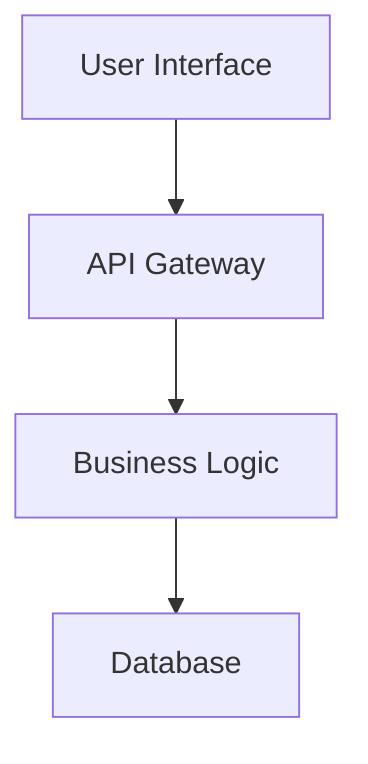

# Architect - Create System Architecture

Design comprehensive system architecture based on PRD requirements.

## Usage
```
/architect-design
```

For module-specific architecture:
```
/architect-design --module=<module-name>
```

For specific architecture types:
```
/architect-design --type=microservices
/architect-design --type=monolith
/architect-design --type=serverless
/architect-design --type=api-integration
```

## Implementation
Switch to Architect persona and execute architecture design:

1. **Load Architect Context**
   - Read `bmad-agent/personas/architect.md`
   - Load `bmad-agent/tasks/create-architecture.md`
   - Apply `bmad-agent/checklists/architect-checklist.md`

2. **Enhanced Requirements Analysis (Multi-Model)**
   - Review PRD from `docs/prd.md`
   - Use `analyze` to comprehensively understand technical requirements and constraints
   - Use `thinkdeep` with Gemini to validate scalability and performance assumptions
   - Identify integration points and dependencies with multi-model feasibility analysis
   - Cross-validate architectural constraints with multiple AI perspectives

3. **Multi-Model Architecture Design**
   - Use `chat` with Gemini to brainstorm system components and architectural patterns
   - Use `thinkdeep` to validate design decisions and trade-offs
   - Define data flow and storage architecture with multi-model optimization analysis
   - Specify API design and communication patterns using `analyze` for best practices
   - Plan security and authentication mechanisms with cross-model security validation

4. **Enhanced Multi-Model Documentation**
   - Use template from `bmad-agent/templates/architecture-tmpl.md`
   - Cross-validate architecture document using `analyze` with multiple AI models
   - Save to `docs/architecture.md` (or module-specific location)
   - Include system diagrams using Mermaid syntax (validated for clarity and accuracy)
   - Document multi-model architectural decisions in `.ai/multi-model-sessions/architecture/`
   - Include consensus levels for critical architectural decisions
   - Use actual current date (YYYY-MM-DD format)

## Architecture Components

### System Architecture
- **Component Diagram**: Major system components and relationships
- **Data Flow**: How data moves through the system
- **Integration Points**: External APIs and services
- **Security Architecture**: Authentication, authorization, data protection

### Technical Specifications
- **Technology Stack**: Languages, frameworks, databases
- **Data Models**: Core entities and relationships
- **API Design**: RESTful endpoints and contracts
- **Deployment Architecture**: Infrastructure and scaling strategy

### Diagrams and Visuals
Use Mermaid diagrams for:


## Enhanced Multi-Model Quality Checklist
Before completion, verify:
- [ ] All PRD requirements addressed in architecture (validated with `analyze`)
- [ ] System components clearly defined (multi-model consensus achieved)
- [ ] Data flow and storage designed (optimized with multi-model analysis)
- [ ] Security considerations included (cross-validated with security experts)
- [ ] Scalability and performance planned (validated with `thinkdeep`)
- [ ] Integration points specified (feasibility confirmed with multiple models)
- [ ] Technology stack decisions validated across multiple AI perspectives
- [ ] Multi-model architectural decisions documented in `.ai/multi-model-sessions/architecture/`
- [ ] Consensus levels indicated for critical design decisions
- [ ] Mermaid diagrams properly formatted and verified for accuracy
- [ ] File saved to correct location with actual date

## Architecture Patterns
Consider appropriate patterns:
- **Layered Architecture**: For well-structured applications
- **Microservices**: For complex, scalable systems
- **Event-Driven**: For reactive, loosely-coupled systems
- **CQRS**: For read/write optimization
- **API Gateway**: For service orchestration

## Enhanced Multi-Model Technology Considerations
Address key technical decisions with multi-model validation:
- **Database Choice**: SQL vs NoSQL, specific technologies (validated with `thinkdeep` for scalability analysis)
- **Caching Strategy**: Redis, Memcached, CDN (optimized with multi-model performance analysis)
- **Message Queues**: RabbitMQ, Kafka, SQS (validated with `chat` for architectural fit)
- **Monitoring**: Logging, metrics, alerting (cross-validated for operational excellence)
- **Security**: Encryption, authentication, authorization (security validated across multiple AI models)
- **Performance Optimization**: Use pattern "Study the architecture deeply, brainstorm with Gemini on potential improvements"

## Next Steps
After completing the architecture:
1. Run `/update-knowledge` to distribute architecture knowledge
2. Execute `/design-architect-frontend` for UI/UX architecture
3. Consider `/platform-engineer-infrastructure` for complex projects
4. Use `/sm-create-stories` to begin implementation planning

## Related Commands
- `/design-architect-frontend` - Create frontend architecture
- `/platform-engineer-infrastructure` - Design platform infrastructure
- `/update-knowledge` - Update agent knowledge with architecture
- `/tech-stack` - Define detailed technology stack