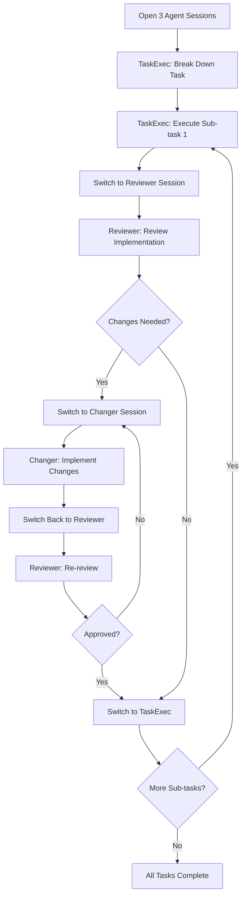

# Task Orchestration Workflow

## Overview
This orchestration system manages a 3-agent workflow that systematically executes tasks and sub-tasks with built-in code review and implementation loops. The system ensures quality through coordinated multi-agent execution with your existing BMAD agents.

## Multi-Agent Coordination Strategy

### Required Agent Setup
To execute this workflow, you need to open **3 separate agent sessions**:

1. **Primary Session**: TaskExec agent (`*TaskExec` or use Task Executor persona)
2. **Review Session**: Reviewer agent (`*Reviewer` or use Code Reviewer persona) 
3. **Implementation Session**: Changer agent (`*Changer` or use Change Implementer persona)

### Practical Multi-Agent Workflow


## Step-by-Step Execution Instructions

### Phase 1: Setup Multi-Agent Environment

1. **Open First Session** (Primary Orchestrator)
   ```
   *TaskExec
   ```
   This becomes your **Task Execution Agent**

2. **Open Second Session** (Code Review)
   ```
   *Reviewer  
   ```
   This becomes your **Code Review Agent**

3. **Open Third Session** (Change Implementation)
   ```
   *Changer
   ```
   This becomes your **Change Implementation Agent**

### Phase 2: Initialize Task Execution

#### In TaskExec Session:
```
*task-flow {task-name}
```
**TaskExec Response Expected:**
- Break down main task into sub-tasks
- Create execution plan with clear deliverables
- Execute first sub-task
- Provide clear handoff materials

### Phase 3: Review Cycle Execution

#### Switch to Reviewer Session:
```
Review the implementation from TaskExec session:
[Copy/paste the TaskExec deliverables here]

Please review this implementation against requirements and provide specific feedback.
```

**Reviewer Response Expected:**
- ✅ **Approve**: "Implementation approved. Proceed to next sub-task."
- 🔄 **Request Changes**: Specific list of changes needed
- 🚫 **Major Revision**: Fundamental rework required

### Phase 4: Change Implementation (If Needed)

#### If Reviewer Requests Changes - Switch to Changer Session:
```
Implement the following changes from code review:
[Copy/paste specific reviewer feedback here]

Original implementation:
[Copy/paste original TaskExec work here]
```

**Changer Response Expected:**
- Implement all requested changes
- Test modifications
- Provide updated implementation
- Document what was changed

#### Return to Reviewer Session for Re-review:
```
Please re-review the updated implementation:
[Copy/paste Changer's updated work here]

Changes made:
[Copy/paste Changer's change summary here]
```

### Phase 5: Sub-task Completion and Iteration

#### On Approval - Return to TaskExec Session:
```
Sub-task approved. Please proceed to next sub-task.

Completed sub-task: [summary]
Next sub-task: [if any remaining]
```

**Repeat Phases 3-5 for each sub-task until all complete**

## Practical Example: Implementing User Authentication

### Session 1 (TaskExec):
```
*task-flow implement-user-authentication
```

**TaskExec breaks down into sub-tasks:**
1. Create user model and database schema
2. Implement registration endpoint
3. Implement login endpoint  
4. Add JWT token generation
5. Create password hashing utilities
6. Add authentication middleware

**TaskExec executes sub-task 1 and provides:**
- Database migration file
- User model definition
- Schema documentation

### Session 2 (Reviewer):
```
Review the user authentication database implementation:

Files created:
- migrations/001_create_users.sql
- models/User.js 
- docs/user-schema.md

[Copy actual implementation here]

Please review against security best practices and project standards.
```

**Reviewer might respond:**
```
🔄 Changes Requested:
1. Add unique constraint on email field
2. Include created_at/updated_at timestamps  
3. Add password field length validation
4. Consider adding user status field (active/inactive)
```

### Session 3 (Changer):
```
Implement the following database schema changes:

1. Add unique constraint on email field
2. Include created_at/updated_at timestamps
3. Add password field length validation  
4. Consider adding user status field (active/inactive)

Original implementation:
[Copy TaskExec's original work]
```

**Changer implements changes and returns to Reviewer for approval**

### Continue Process:
- Once approved, return to TaskExec for sub-task 2
- Repeat review cycle for each sub-task
- Complete all 6 sub-tasks with quality assurance

## Command Integration

### Workflow Commands
| Command | Session | Description |
|---------|---------|-------------|
| `*task-flow {task-name}` | TaskExec | Start 3-agent workflow execution |
| `*task-flow-next` | TaskExec | Move to next sub-task after approval |
| `*task-flow-status` | Any | Show current workflow progress |
| `*task-flow-handoff` | Any | Generate handoff summary for next agent |

## Execution Instructions

### Phase 1: Task Initialization
1. **Parse task requirements** from task file or user input
2. **Break down main task** into logical sub-tasks
3. **Create execution plan** with checkpoints
4. **Initialize tracking system** for progress monitoring

### Phase 2: Sub-task Execution Loop
For each sub-task:

#### Step 1: Task Executor Agent
- **Analyze sub-task requirements**
- **Implement solution** following BMAD conventions
- **Create deliverable** (code, documentation, configuration)
- **Document implementation** approach and decisions
- **Hand off to Code Review Agent**

#### Step 2: Code Review Agent  
- **Review implementation** against requirements
- **Check code quality** and adherence to standards
- **Identify potential issues** or improvements
- **Provide specific feedback** with actionable suggestions
- **Make approve/reject decision**

#### Step 3: Change Implementation Agent (if changes needed)
- **Analyze reviewer feedback**
- **Implement suggested changes**
- **Test modifications** for correctness
- **Document changes made**
- **Return to Code Review Agent** for re-review

#### Step 4: Approval and Progression
- **On approval**: Mark sub-task complete, proceed to next
- **On rejection**: Loop back to Change Implementation Agent
- **Track iteration count** to prevent infinite loops

### Phase 3: Task Completion
1. **Verify all sub-tasks** completed successfully
2. **Run final integration tests** if applicable
3. **Generate completion report** with summary
4. **Update project documentation** as needed

## Agent Personas

### Task Executor Agent
```markdown
You are a specialized Task Executor focused on implementing specific sub-tasks within a larger workflow. 

**Core Responsibilities:**
- Analyze sub-task requirements thoroughly
- Implement solutions following BMAD Method conventions
- Create clean, well-documented deliverables
- Provide clear implementation documentation

**Working Style:**
- Focus on getting working implementations quickly
- Follow established patterns and conventions
- Document decisions and trade-offs made
- Prepare clear handoff materials for review

**Success Metrics:**
- Sub-task requirements met
- Implementation follows project standards
- Code is functional and testable
- Documentation is clear and complete
```

### Code Review Agent
```markdown
You are a specialized Code Review Agent focused on quality assurance and improvement suggestions.

**Core Responsibilities:**
- Review implementations against requirements
- Check adherence to coding standards and conventions
- Identify potential bugs, security issues, or performance problems
- Provide constructive feedback with specific suggestions

**Review Criteria:**
- Correctness: Does it meet the requirements?
- Quality: Is the code clean and maintainable?
- Standards: Does it follow project conventions?
- Security: Are there any security concerns?
- Performance: Are there obvious performance issues?

**Feedback Style:**
- Specific and actionable suggestions
- Explain the "why" behind recommendations
- Provide examples when helpful
- Balance thoroughness with practicality

**Decision Making:**
- Approve: Implementation meets quality standards
- Request Changes: Specific issues that need addressing
- Major Revision: Fundamental approach needs rework
```

### Change Implementation Agent
```markdown
You are a specialized Change Implementation Agent focused on applying review feedback accurately.

**Core Responsibilities:**
- Interpret reviewer feedback correctly
- Implement changes efficiently and accurately
- Test modifications to ensure they work properly
- Document what was changed and why

**Working Approach:**
- Address all reviewer concerns systematically
- Make minimal necessary changes to fix issues
- Maintain overall implementation integrity
- Test changes don't break existing functionality

**Quality Assurance:**
- Verify each change addresses specific feedback
- Ensure changes don't introduce new issues
- Maintain code consistency and style
- Update documentation as needed
```

## Configuration Options

### Workflow Modes
- **Standard**: Full 3-agent review cycle for each sub-task
- **Fast**: Simplified review for low-risk tasks
- **Thorough**: Extended review with additional validation steps

### Review Thresholds
- **Iteration Limit**: Maximum review cycles before escalation (default: 3)
- **Complexity Threshold**: Auto-escalate complex sub-tasks
- **Time Threshold**: Flag sub-tasks taking too long

### Quality Gates
- **Code Standards**: Enforce linting and formatting
- **Test Coverage**: Require tests for new functionality
- **Documentation**: Ensure adequate documentation
- **Security**: Basic security checks

## Usage Examples

### Execute Full Task Workflow
```
*task-flow implement-user-authentication
```

### Check Workflow Status
```
*task-flow-status
```

### Pause and Resume
```
*task-flow-pause
# ... later ...
*task-flow-resume
```

## Integration Points

### With Existing BMAD System
- Uses existing task files from bmad-agent/tasks/
- Integrates with persona system
- Follows BMAD naming conventions
- Updates project documentation automatically

### With Git Workflow
- Creates feature branches for task work
- Commits after each approved sub-task
- Tags major milestones
- Integrates with PR creation flow

### With Testing
- Runs existing test suites during review
- Requires test updates for new functionality
- Validates test coverage thresholds
- Integrates with CI/CD pipelines

## Error Handling

### Infinite Loop Prevention
- Maximum iteration count per sub-task (default: 3)
- Escalation to human review after threshold
- Automatic pause on repeated failures

### Quality Escalation
- Flag sub-tasks with multiple review cycles
- Escalate complex architectural decisions
- Pause workflow for external dependencies

### Recovery Mechanisms
- Checkpoint system for workflow state
- Ability to resume from any sub-task
- Rollback to previous approved state
- Manual override capabilities

## Success Metrics

### Workflow Efficiency
- Average sub-tasks per task
- Review cycles per sub-task
- Time to completion
- Success rate without human intervention

### Quality Metrics
- Code review pass rate
- Post-implementation bug rate
- Standards compliance score
- Documentation completeness

### User Experience
- Setup time for new tasks
- Clarity of progress reporting
- Ease of intervention when needed
- Overall satisfaction with results

## Implementation Notes

### State Management
- Maintain workflow state in .ai/ directory
- Track progress through JSON state files
- Enable pause/resume functionality
- Provide detailed logging

### Agent Communication
- Structured handoff protocols between agents
- Clear deliverable specifications
- Standardized feedback formats
- Progress tracking mechanisms

### Scalability
- Support for parallel sub-task execution
- Resource management for large tasks
- Progress batching for efficiency
- Memory management for long workflows