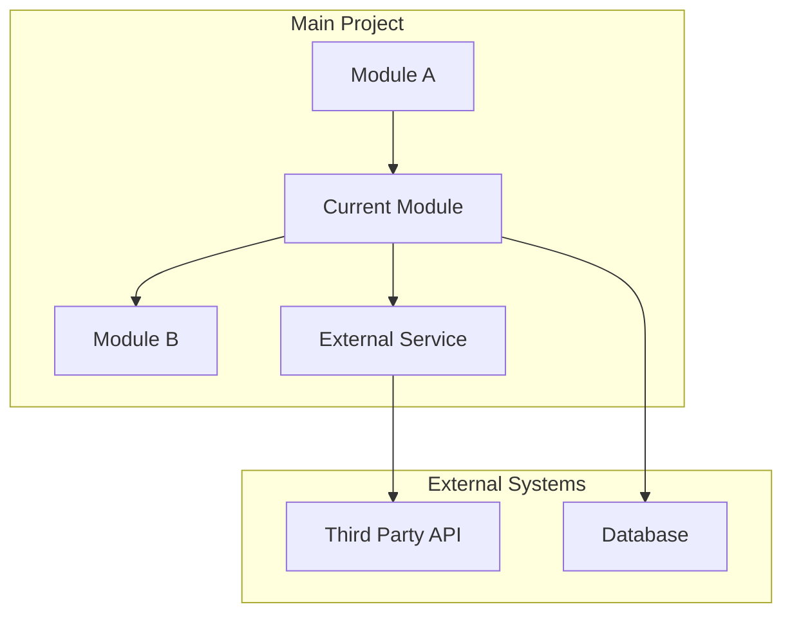
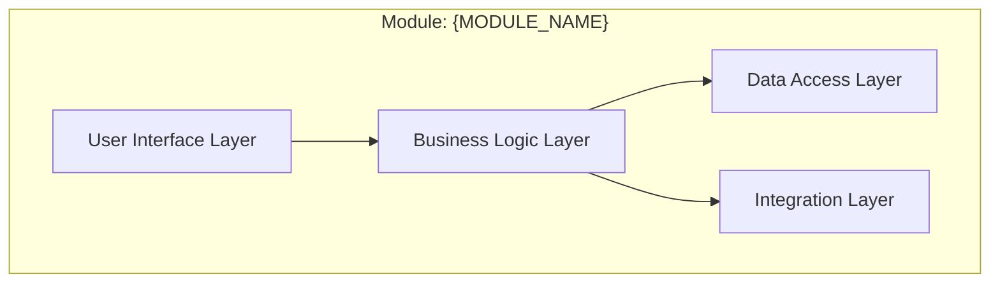
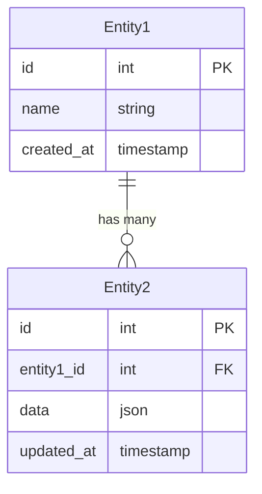
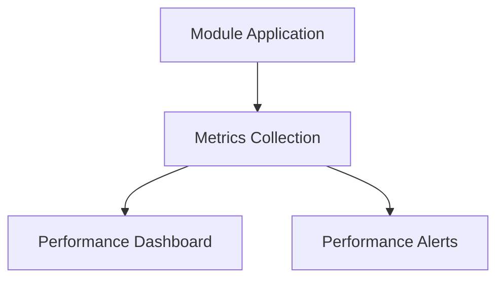

# Module Architecture: {MODULE_NAME}

**Date:** {CURRENT_DATE}  
**Author:** {ARCHITECT_NAME}  
**Version:** 1.0  
**Status:** Draft

## Module Architecture Overview

### Architecture Philosophy
The architectural approach and principles guiding this module's design within the larger project context.

### Module Positioning
- **Module Type:** [Microservice/Component/Library/Integration Layer]
- **Architecture Pattern:** [MVC/Layered/Event-Driven/Modular Monolith]
- **Integration Strategy:** [Synchronous/Asynchronous/Hybrid]

## System Context

### Module Boundaries


### Integration Points
1. **Upstream Dependencies:**
   - Module/Service dependencies
   - Data sources
   - Configuration sources

2. **Downstream Consumers:**
   - Modules that consume this module's services
   - External systems that depend on this module

3. **Side Integrations:**
   - Shared databases
   - Event buses
   - Caching layers

## Module Internal Architecture

### Component Overview


### Component Responsibilities

#### 1. User Interface Layer (if applicable)
- **Purpose:** Handle user interactions and presentation
- **Technologies:** [React/Vue/Angular/Native]
- **Key Components:**
  - Component 1: Purpose and functionality
  - Component 2: Purpose and functionality
  - Component 3: Purpose and functionality

#### 2. Business Logic Layer
- **Purpose:** Implement core module functionality and business rules
- **Technologies:** [Node.js/Python/Java/.NET]
- **Key Components:**
  - Service 1: Business logic description
  - Service 2: Business logic description
  - Service 3: Business logic description

#### 3. Data Access Layer
- **Purpose:** Manage data persistence and retrieval
- **Technologies:** [Database/ORM technologies]
- **Key Components:**
  - Repository 1: Data access pattern
  - Repository 2: Data access pattern
  - Model 1: Data structure

#### 4. Integration Layer
- **Purpose:** Handle external system communications
- **Technologies:** [REST/GraphQL/gRPC/Message Queue]
- **Key Components:**
  - API Client 1: External service integration
  - Event Handler 1: Event processing
  - Message Producer/Consumer: Async communication

## Data Architecture

### Module Data Model


### Data Storage Strategy
- **Primary Database:** [PostgreSQL/MySQL/MongoDB] for [purpose]
- **Caching Layer:** [Redis/Memcached] for [performance optimization]
- **File Storage:** [S3/Local Storage] for [file handling]

### Data Flow Patterns
1. **Input Data Flow:**
   - Source → Validation → Processing → Storage
   
2. **Output Data Flow:**
   - Storage → Business Logic → Formatting → Consumer

3. **Integration Data Flow:**
   - External Source → Transformation → Local Processing → Response

## API Design

### Module API Specification

#### REST Endpoints (if applicable)
```
GET    /api/v1/module/{id}        - Retrieve module data
POST   /api/v1/module             - Create new module item
PUT    /api/v1/module/{id}        - Update module item
DELETE /api/v1/module/{id}        - Delete module item
```

#### GraphQL Schema (if applicable)
```graphql
type ModuleData {
  id: ID!
  name: String!
  data: JSON
  createdAt: DateTime!
}

type Query {
  getModuleData(id: ID!): ModuleData
  listModuleData(filter: ModuleFilter): [ModuleData]
}

type Mutation {
  createModuleData(input: ModuleInput!): ModuleData
  updateModuleData(id: ID!, input: ModuleInput!): ModuleData
}
```

#### Event Schema (if applicable)
```json
{
  "eventType": "module.data.created",
  "payload": {
    "id": "string",
    "data": "object",
    "timestamp": "ISO8601"
  }
}
```

## Technology Stack

### Core Technologies
- **Runtime:** [Node.js/Python/Java]
- **Framework:** [Express/FastAPI/Spring Boot]
- **Database:** [PostgreSQL/MongoDB/Redis]
- **Testing:** [Jest/PyTest/JUnit]

### Module-Specific Technologies
- **Special Libraries:** Any unique dependencies
- **External Services:** Third-party integrations
- **Development Tools:** Module-specific tooling

### Technology Decisions
| Decision | Options Considered | Choice Made | Rationale |
|----------|-------------------|-------------|-----------|
| Database | PostgreSQL vs MongoDB | PostgreSQL | ACID compliance needed |
| API Style | REST vs GraphQL | REST | Simpler integration |
| Caching | Redis vs Memcached | Redis | Advanced features needed |

## Security Architecture

### Authentication & Authorization
- **Authentication Method:** [JWT/OAuth/Session]
- **Authorization Model:** [RBAC/ABAC/Simple]
- **Security Integration:** How module integrates with main project security

### Data Security
- **Encryption:** Data at rest and in transit
- **Sensitive Data Handling:** PII and confidential data protection
- **Access Controls:** Database and API security

### Security Boundaries
- **Input Validation:** Request validation and sanitization
- **Output Filtering:** Response data filtering
- **Cross-Module Security:** Inter-module communication security

## Performance Architecture

### Performance Requirements
- **Response Time:** Target response times
- **Throughput:** Expected requests per second
- **Concurrent Users:** Maximum concurrent users

### Performance Strategies
- **Caching Strategy:** What and how to cache
- **Database Optimization:** Indexing and query optimization
- **Resource Management:** Memory and CPU considerations

### Monitoring and Metrics


## Deployment Architecture

### Environment Strategy
- **Development:** Local development setup
- **Staging:** Pre-production testing environment
- **Production:** Live environment configuration

### Deployment Pattern
- **Containerization:** [Docker/Kubernetes configuration]
- **Service Discovery:** How module is discovered by other services
- **Load Balancing:** Distribution strategy if applicable

### Infrastructure Requirements
- **Compute:** CPU and memory requirements
- **Storage:** Database and file storage needs
- **Network:** Bandwidth and latency requirements

## Quality Attributes

### Scalability
- **Horizontal Scaling:** How module scales out
- **Vertical Scaling:** How module scales up
- **Bottleneck Identification:** Known scaling limitations

### Reliability
- **Error Handling:** Error detection and recovery
- **Fault Tolerance:** Graceful degradation strategies
- **Backup and Recovery:** Data protection strategies

### Maintainability
- **Code Organization:** Module structure and patterns
- **Documentation:** Code and API documentation
- **Testing Strategy:** Unit, integration, and e2e testing

## Migration and Integration Strategy

### Integration Phases
1. **Phase 1:** Core module development and testing
2. **Phase 2:** Integration with main project
3. **Phase 3:** Production deployment and monitoring

### Data Migration (if applicable)
- **Migration Strategy:** How to migrate existing data
- **Rollback Plan:** How to revert if migration fails
- **Validation:** How to verify migration success

### Rollout Strategy
- **Feature Flags:** Gradual feature enablement
- **A/B Testing:** Performance and functionality testing
- **Monitoring:** Success metrics and alerting

## Architecture Decisions Log

### ADR-001: [Decision Title]
- **Date:** {DATE}
- **Status:** [Proposed/Accepted/Superseded]
- **Context:** What is the issue that we're seeing
- **Decision:** What is the change that we're proposing
- **Consequences:** What becomes easier or more difficult

### ADR-002: [Decision Title]
- **Date:** {DATE}
- **Status:** [Proposed/Accepted/Superseded]
- **Context:** What is the issue that we're seeing
- **Decision:** What is the change that we're proposing
- **Consequences:** What becomes easier or more difficult

## Future Considerations

### Technical Debt
- Known shortcuts and their planned resolution
- Architecture improvements for future iterations
- Technology upgrades and migrations

### Scalability Roadmap
- Anticipated scaling challenges
- Performance optimization opportunities
- Infrastructure evolution plans

### Integration Evolution
- Future integration opportunities
- API versioning strategy
- Backward compatibility plans

---

**Related Documents:**
- **Module Brief:** `docs/modules/{MODULE_NAME}/module-brief.md`
- **Module PRD:** `docs/modules/{MODULE_NAME}/module-prd.md`
- **Main Project Architecture:** `docs/architecture.md`
- **Module Tech Stack:** `docs/modules/{MODULE_NAME}/module-tech-stack.md`