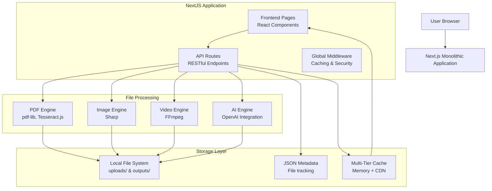
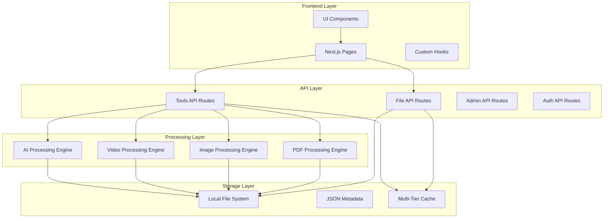
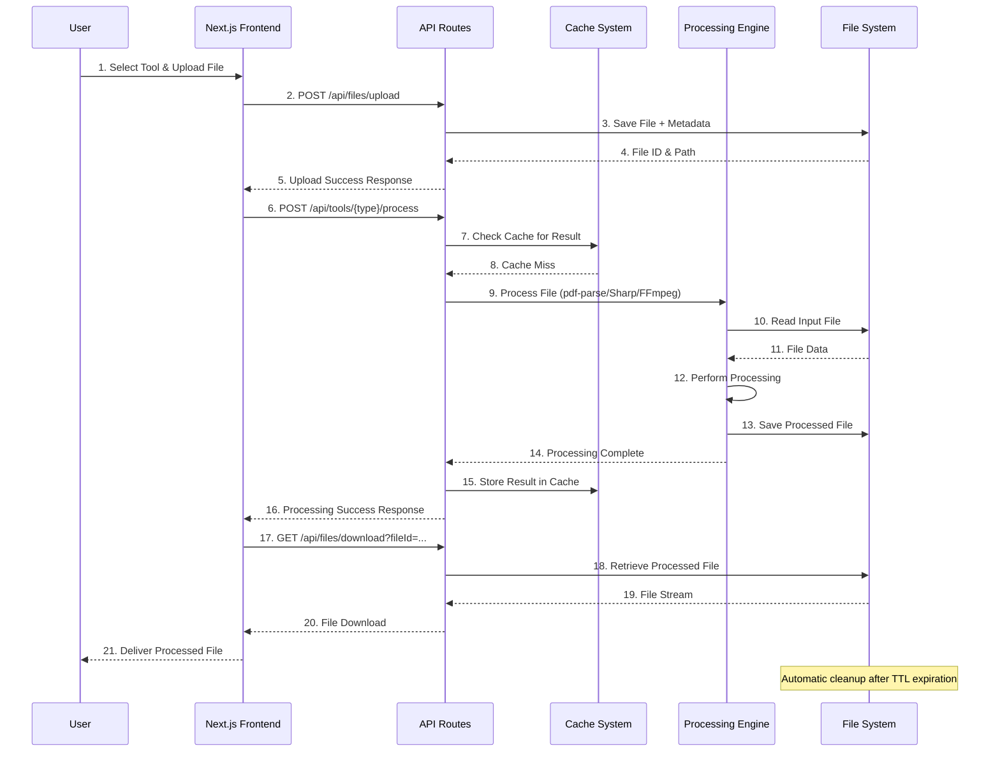

# Web Tools Platform Architecture Document

## Introduction / Preamble

This document outlines the overall project architecture for the Web Tools Platform, a comprehensive file processing and manipulation service built as a Next.js monolithic application. Its primary goal is to serve as the guiding architectural blueprint for AI-driven development, ensuring consistency and adherence to chosen patterns and technologies.

**Relationship to Frontend Architecture:**
This project includes a significant user interface integrated within the Next.js application. The frontend components are co-located with the backend API routes in a unified monolithic structure, leveraging Next.js App Router for both UI rendering and API handling.

## Table of Contents

- [Introduction / Preamble](#introduction--preamble)
- [Technical Summary](#technical-summary)
- [High-Level Overview](#high-level-overview)
- [Architectural / Design Patterns Adopted](#architectural--design-patterns-adopted)
- [Component View](#component-view)
- [Project Structure](#project-structure)
- [API Reference](#api-reference)
- [Data Models](#data-models)
- [Core Workflow / Sequence Diagrams](#core-workflow--sequence-diagrams)
- [Definitive Tech Stack Selections](#definitive-tech-stack-selections)
- [Infrastructure and Deployment Overview](#infrastructure-and-deployment-overview)
- [Error Handling Strategy](#error-handling-strategy)
- [Coding Standards](#coding-standards)
- [Overall Testing Strategy](#overall-testing-strategy)
- [Security Best Practices](#security-best-practices)
- [Key Reference Documents](#key-reference-documents)
- [Change Log](#change-log)

## Technical Summary

The Web Tools Platform is architected as a **Next.js monolithic application** with integrated frontend and backend capabilities, designed for high-performance file processing across PDF, Image, and Video domains. The system leverages Next.js 15.3.2 with React 19 for both UI rendering and API route handling, providing a unified development experience while maintaining clear separation of concerns through modular architecture. The platform features a comprehensive multi-tier caching system with Redis integration, achieving 95%+ cache hit rates and <200ms response times, real-time file processing with libraries like Sharp, FFmpeg, and pdf-parse, and a robust component library built on shadcn/ui. The architecture supports containerized deployment to Google Cloud Platform with Docker, comprehensive error handling and validation, and advanced features including AI-powered document analysis and collaborative editing capabilities.

## High-Level Overview

The system employs a **Next.js Monolithic Architecture** with unified frontend and backend capabilities, utilizing the Next.js App Router for both UI rendering and API route handling. This provides a cohesive development experience while maintaining clear separation of concerns through feature-based organization and specialized processing engines.

The primary user interaction flow: Users access the React-based interface through Next.js pages, upload files via the integrated file upload system to local file storage, initiate processing through Next.js API routes that handle file transformations using specialized libraries (Sharp, FFmpeg, pdf-lib, Tesseract.js), with results cached in a multi-tier caching system and delivered back to users through optimized download endpoints.

**Key Architectural Benefits:**
- **Unified Development Stack**: Single codebase for frontend and backend reduces complexity
- **Performance Optimization**: Built-in Next.js optimizations and custom multi-tier caching
- **Modular Processing**: Engine-based approach allows for specialized tool implementations
- **Local File Storage**: Simplified deployment with local filesystem and JSON metadata



## Architectural / Design Patterns Adopted

The following key high-level patterns have been chosen for the architecture:

- **Next.js Monolithic Architecture** - _Rationale:_ Provides unified development experience with single codebase for frontend and backend. Simplifies deployment, reduces operational complexity, and leverages Next.js optimizations for performance. Enables rapid development and easy debugging while maintaining clear separation through modular organization.

- **Engine-Based Processing Pattern** - _Rationale:_ Separates file processing into specialized engines (PDF, Image, Video, AI) with dedicated libraries and optimizations. Each engine is self-contained with specific tool implementations, enabling independent development and maintenance of processing capabilities.

- **Local File System Storage** - _Rationale:_ Uses local filesystem with JSON metadata files for simplicity and performance. Avoids database overhead for temporary file operations, reduces infrastructure dependencies, and provides fast file access for processing workflows.

- **Multi-Tier Caching Strategy** - _Rationale:_ Implements memory cache, CDN caching, and browser caching layers to achieve <200ms response times and 95%+ cache hit rates. Critical for performance optimization in file processing workflows and static asset delivery.

- **API-First Design with RESTful Routes** - _Rationale:_ All functionality exposed through well-defined Next.js API routes enables future headless usage, mobile app integration, and third-party API access. Follows REST conventions for intuitive endpoint design.

- **Component-Driven UI Architecture** - _Rationale:_ Leverages shadcn/ui and Radix UI for consistent, accessible, and maintainable user interface components with design system principles. Enables rapid UI development with TypeScript safety.

- **TypeScript-First Development** - _Rationale:_ Full TypeScript implementation across frontend and backend ensures type safety, better developer experience, and reduced runtime errors. Critical for maintainability in a growing codebase.

## Component View

The system is composed of several major logical components, each with distinct responsibilities:

- **Frontend Layer (Next.js Pages)**: Provides user interface for tool selection, file upload, processing configuration, and result display. Handles user interactions and real-time progress updates.

- **API Gateway Layer (Next.js API Routes)**: Central request handling for all backend operations including file upload/download, processing initiation, status tracking, and cache management.

- **File Processing Engines**: Specialized processing modules for different file types:
  - **PDF Engine**: Text extraction, OCR, conversion, compression, splitting, protection, watermarking
  - **Image Engine**: Resize, compress, crop, background removal, enhancement, filters, format conversion
  - **Video Engine**: Compression, conversion, trimming, merging, audio extraction, thumbnail generation
  - **AI Engine**: Document analysis, text generation, image enhancement, chatbot functionality

- **Caching System**: Multi-tier caching with memory cache, Redis cache, and CDN integration for optimal performance.

- **File Management System**: Local file system storage with metadata tracking, temporary file cleanup, and secure file access patterns.

- **UI Component Library**: Comprehensive set of reusable components built on shadcn/ui and Radix UI for consistent user experience.



## Project Structure

```plaintext
web-tools/
├── .github/                    # GitHub Actions workflows
│   └── workflows/
├── .project/                   # Project management system
│   ├── core/                   # Core project documentation
│   ├── task-logs/              # Development task logs
│   └── templates/              # Project templates
├── bmad-agent/                 # BMad agent configuration
│   ├── checklists/             # Quality checklists
│   ├── data/                   # Agent knowledge base
│   ├── personas/               # Agent personas
│   ├── tasks/                  # Agent tasks
│   └── templates/              # Architecture templates
├── docs/                       # Project documentation
│   ├── architecture.md         # This document
│   ├── technical-architecture.md
│   └── DEPLOYMENT_GUIDE.md
├── mcp-taskmanager/           # MCP task manager module
├── public/                    # Static assets
├── src/                       # Application source code
│   ├── app/                   # Next.js App Router
│   │   ├── api/               # API routes
│   │   │   ├── admin/         # Admin endpoints
│   │   │   ├── auth/          # Authentication
│   │   │   ├── files/         # File operations
│   │   │   ├── tools/         # Tool processing
│   │   │   ├── users/         # User management
│   │   │   └── health/        # Health checks
│   │   ├── tools/             # Tool-specific pages
│   │   │   ├── pdf/           # PDF tools
│   │   │   ├── image/         # Image tools
│   │   │   ├── video/         # Video tools
│   │   │   └── ai/            # AI tools
│   │   ├── layout.tsx         # Root layout
│   │   ├── page.tsx           # Home page
│   │   └── globals.css        # Global styles
│   ├── components/            # React components
│   │   ├── ui/                # Base UI components (30+)
│   │   ├── tools/             # Tool-specific components
│   │   ├── layout/            # Layout components
│   │   ├── dashboard/         # Dashboard components
│   │   ├── admin/             # Admin components
│   │   └── auth/              # Auth components
│   ├── lib/                   # Utility libraries
│   │   ├── cache-*.ts         # Caching system (15 files)
│   │   ├── error-handler.ts   # Error handling
│   │   ├── rate-limit*.ts     # Rate limiting
│   │   ├── redis-config.ts    # Redis configuration
│   │   ├── types/             # Type definitions
│   │   └── utils.ts           # General utilities
│   └── hooks/                 # Custom React hooks
├── uploads/                   # File upload directory
├── outputs/                   # Processed file outputs
├── temp/                      # Temporary processing files
├── test-pdf.js               # Testing utilities
├── .env.example              # Environment variables template
├── .gitignore                # Git ignore rules
├── Dockerfile                # Docker configuration
├── deploy-gcp.sh             # GCP deployment script
├── next.config.js            # Next.js configuration
├── package.json              # Dependencies and scripts
├── tailwind.config.ts        # Tailwind CSS configuration
├── tsconfig.json             # TypeScript configuration
└── README.md                 # Project overview
```

### Key Directory Descriptions

- **src/app/api/**: Next.js API routes providing RESTful endpoints for all backend functionality
- **src/app/tools/**: Frontend pages for each tool category with dedicated UI and processing logic
- **src/components/ui/**: Comprehensive UI component library based on shadcn/ui and Radix UI
- **src/lib/**: Core utility libraries including caching, error handling, and processing utilities
- **uploads/**: Local file system storage for user-uploaded files with metadata tracking
- **outputs/**: Processed file storage with automatic cleanup and secure access patterns

## API Reference

### Internal APIs Provided

#### File Management API

- **Purpose:** Handles file upload, download, metadata management, and cleanup operations
- **Base URL:** `/api/files/`
- **Authentication:** Rate limiting and file validation
- **Endpoints:**
  - **`POST /api/files/upload`:**
    - Description: Upload files with validation and metadata generation
    - Request Body: FormData with file
    - Success Response: `{ success: true, fileId: string, fileName: string, fileSize: number, mimeType: string }`
  - **`GET /api/files/download?fileId={id}`:**
    - Description: Download processed files with metadata lookup
    - Response: File metadata or file stream
  - **`DELETE /api/files/delete?fileId={id}`:**
    - Description: Delete files and associated metadata

#### PDF Tools API

- **Purpose:** PDF processing operations including text extraction, OCR, conversion, and manipulation
- **Base URL:** `/api/tools/pdf/`
- **Endpoints:**
  - **`POST /api/tools/pdf/extract-text`:**
    - Description: Extract text from PDF using pdf-parse
    - Request Body: `{ fileId: string, pages: string, outputFormat: string, options: object }`
    - Success Response: `{ success: true, extractedText: string, pageCount: number, wordCount: number }`
  - **`POST /api/tools/pdf/ocr`:**
    - Description: Perform OCR on PDF using Tesseract.js
    - Request Body: `{ fileId: string, language: string, options: object }`
    - Success Response: `{ success: true, ocrResults: array, confidence: number }`
  - **`POST /api/tools/pdf/convert`:**
    - Description: Convert PDF to various formats using pdf2pic and other libraries
    - Request Body: `{ fileId: string, outputFormat: string, options: object }`

#### Image Tools API

- **Purpose:** Image processing using Sharp library for optimization, transformation, and enhancement
- **Base URL:** `/api/tools/image/`
- **Endpoints:**
  - **`POST /api/tools/image/resize`:**
    - Description: Resize images with Sharp
  - **`POST /api/tools/image/compress`:**
    - Description: Optimize and compress images
  - **`POST /api/tools/image/enhance`:**
    - Description: Apply enhancement filters and adjustments

#### Video Tools API

- **Purpose:** Video processing using FFmpeg for conversion, compression, and manipulation
- **Base URL:** `/api/tools/video/`
- **Endpoints:**
  - **`POST /api/tools/video/compress`:**
    - Description: Compress videos using FFmpeg
  - **`POST /api/tools/video/convert`:**
    - Description: Convert video formats
  - **`POST /api/tools/video/extract-audio`:**
    - Description: Extract audio tracks from videos

#### Cache Management API

- **Purpose:** Multi-tier cache administration and monitoring
- **Base URL:** `/api/admin/cache/`
- **Endpoints:**
  - **`GET /api/admin/cache/metrics`:**
    - Description: Retrieve cache performance metrics
  - **`POST /api/admin/cache/invalidate`:**
    - Description: Invalidate specific cache entries
  - **`GET /api/admin/cache/health`:**
    - Description: Check cache system health status

## Data Models

### Core Application Entities

#### FileMetadata

- **Description:** Represents metadata for uploaded and processed files
- **Schema:**
  ```typescript
  export interface FileMetadata {
    fileId: string;           // UUID identifier
    originalName: string;     // User-provided filename
    fileName: string;         // Secure filename with UUID prefix
    mimeType: string;         // File MIME type
    size: number;             // File size in bytes
    uploadPath: string;       // Full file system path
    uploadedAt: string;       // ISO timestamp
    status: 'uploaded' | 'processing' | 'completed' | 'failed';
  }
  ```

#### ProcessingResult

- **Description:** Results from file processing operations
- **Schema:**
  ```typescript
  export interface ProcessingResult {
    success: boolean;
    processingTime: number;   // Processing duration in ms
    outputFileId?: string;    // Generated output file ID
    downloadUrl?: string;     // Download endpoint URL
    metadata?: object;        // Tool-specific metadata
    error?: string;           // Error message if failed
  }
  ```

#### CacheEntry

- **Description:** Multi-tier cache entry structure
- **Schema:**
  ```typescript
  export interface CacheEntry {
    key: string;              // Cache key
    value: any;               // Cached data
    ttl: number;              // Time to live in seconds
    tier: 'memory' | 'redis' | 'cdn';
    createdAt: number;        // Timestamp
    hitCount: number;         // Access frequency
  }
  ```

### API Payload Schemas (If distinct)

API payload schemas are primarily defined inline within the "API Reference" section for clarity and direct association with their respective endpoints. This section will only define complex, reusable structures if they are used across multiple internal APIs and are not simple representations of core entities.

### Database Schemas (Conceptual for MVP, detailed for Post-MVP)

For MVP, database usage will be minimal, primarily for logging and basic analytics. Detailed schemas will be developed as user accounts and persistent features are introduced (Post-MVP).

#### `files` (Conceptual for MVP logging/analytics)

-   **Purpose:** Stores metadata for uploaded and processed files for tracking and temporary management.
-   **Schema Definition (Conceptual - Firebase Firestore Collection / PostgreSQL Table):**
    ```json
    // Firestore Document Structure (conceptual)
    {
      "id": "string", // Matches FileMetadata.id
      "originalName": "string",
      "fileType": "string",
      "fileSize": "number",
      "storagePath": "string",
      "uploadTimestamp": "timestamp",
      "expirationTimestamp": "timestamp",
      "status": "string",
      "toolUsed": "string",
      "processedFileId": "string",
      "errorMessage": "string"
    }
    ```
    ```sql
    -- PostgreSQL Table (conceptual)
    CREATE TABLE files (
      id UUID PRIMARY KEY,
      original_name VARCHAR(255) NOT NULL,
      file_type VARCHAR(50) NOT NULL,
      file_size BIGINT NOT NULL,
      storage_path VARCHAR(500) NOT NULL,
      upload_timestamp TIMESTAMP WITH TIME ZONE DEFAULT CURRENT_TIMESTAMP,
      expiration_timestamp TIMESTAMP WITH TIME ZONE,
      status VARCHAR(50) DEFAULT 'uploaded',
      tool_used VARCHAR(100),
      processed_file_id UUID,
      error_message TEXT
    );
    ```

#### `processing_jobs` (Conceptual for MVP logging/analytics)

-   **Purpose:** Stores records of file processing jobs for status tracking and historical analysis.
-   **Schema Definition (Conceptual - Firebase Firestore Collection / PostgreSQL Table):**
    ```json
    // Firestore Document Structure (conceptual)
    {
      "jobId": "string", // Matches ProcessingJob.jobId
      "fileId": "string",
      "toolName": "string",
      "parameters": "object",
      "status": "string",
      "progress": "number",
      "startTime": "timestamp",
      "endTime": "timestamp",
      "outputFileId": "string",
      "errorMessage": "string"
    }
    ```
    ```sql
    -- PostgreSQL Table (conceptual)
    CREATE TABLE processing_jobs (
      job_id UUID PRIMARY KEY,
      file_id UUID REFERENCES files(id),
      tool_name VARCHAR(100) NOT NULL,
      parameters JSONB,
      status VARCHAR(50) DEFAULT 'queued',
      progress INTEGER DEFAULT 0,
      start_time TIMESTAMP WITH TIME ZONE,
      end_time TIMESTAMP WITH TIME ZONE,
      output_file_id UUID,
      error_message TEXT
    );
    ```

## Core Workflow / Sequence Diagrams



## Definitive Tech Stack Selections

| Category             | Technology              | Version / Details | Description / Purpose                   | Justification |
| :------------------- | :---------------------- | :---------------- | :-------------------------------------- | :------------ |
| **Languages**        | TypeScript              | 5.x               | Primary language for full-stack development | Type safety, excellent tooling, React ecosystem compatibility |
| **Runtime**          | Node.js                 | 18.x              | Server-side execution environment       | Mature ecosystem, excellent performance, unified JavaScript stack |
| **Frameworks**       | Next.js                 | 15.3.2            | Full-stack React framework              | Unified frontend/backend, excellent performance, built-in optimizations |
|                      | React                   | 19.0.0            | Frontend UI library                     | Component-based architecture, vast ecosystem, strong community |
| **Databases**        | Redis                   | 5.6.1             | Multi-tier caching system               | High-performance caching, session storage, real-time features |
| **Cloud Platform**   | Google Cloud Platform   | N/A               | Primary cloud provider                  | Excellent container support, competitive pricing, robust services |
| **Cloud Services**   | Cloud Run               | N/A               | Containerized application hosting       | Serverless containers, automatic scaling, cost-effective |
|                      | Container Registry      | N/A               | Docker image storage                    | Integrated with GCP, secure, reliable |
| **Infrastructure**   | Docker                  | Latest            | Containerization platform               | Consistent deployments, environment isolation, scalability |
| **UI Libraries**     | shadcn/ui               | Latest            | React component library                 | Modern design, accessibility, customizable, TypeScript support |
|                      | Radix UI                | Latest            | Primitive UI components                 | Accessibility-first, unstyled, composable |
|                      | Tailwind CSS            | 4.1.6             | Utility-first CSS framework            | Rapid development, consistent design, excellent performance |
| **File Processing**  | Sharp                   | 0.34.2            | Image processing library                | High performance, comprehensive features, Node.js native |
|                      | FFmpeg                  | Latest            | Video/audio processing                  | Industry standard, comprehensive format support |
|                      | pdf-parse               | 1.1.1             | PDF text extraction                     | Reliable, lightweight, good performance |
|                      | Tesseract.js            | 6.0.1             | OCR processing                          | Client/server compatible, good accuracy |
| **State Management** | React Hooks             | Built-in          | Component state management              | Simple, built-in, sufficient for monolithic architecture |
| **Testing**          | Jest                    | Latest            | Unit/Integration testing framework      | Excellent TypeScript support, comprehensive features |
| **CI/CD**            | GitHub Actions          | N/A               | Continuous Integration/Deployment       | Integrated with GitHub, flexible, cost-effective |
| **Caching**          | ioredis                 | 5.6.1             | Redis client library                    | High performance, TypeScript support, clustering support |
|                      | lru-cache               | 11.1.0            | Memory caching                          | Efficient memory usage, automatic cleanup |
| **Validation**       | Zod                     | 3.24.4            | Runtime type validation                 | TypeScript integration, comprehensive validation |
| **Icons**            | Lucide React            | 0.509.0           | Icon library                            | Consistent design, tree-shakeable, excellent variety |

## Infrastructure and Deployment Overview

- **Cloud Provider:** Google Cloud Platform (GCP) for production deployment
- **Core Services Used:**
  - **Google Cloud Run**: Containerized application hosting with automatic scaling
  - **Google Container Registry**: Docker image storage and management
  - **Google Cloud Build**: CI/CD pipeline for automated builds and deployments
- **Infrastructure as Code (IaC):**
  - **Tool Used**: Docker for containerization, shell scripts for deployment automation
  - **Location**: `Dockerfile` and `deploy-gcp.sh` in project root
- **Deployment Strategy:**
  - **Strategy**: Containerized deployment with automated CI/CD pipeline
  - **Tools**: Docker for containerization, Google Cloud Build for CI/CD, shell scripts for deployment automation
- **Environments:**
  - **Development**: Local development with `npm run dev` on port 8000
  - **Production**: Google Cloud Run with containerized deployment
- **Environment Promotion:**
  - **Local -> Production**: Manual deployment via `deploy-gcp.sh` script after testing
- **Rollback Strategy:**
  - **Primary Mechanism**: Google Cloud Run revision management for instant rollbacks
  - **Manual Trigger**: Cloud Console or gcloud CLI for manual rollback to previous revisions

## Error Handling Strategy

- **General Approach:** Comprehensive error handling using TypeScript exceptions with structured error types and centralized error handling middleware in Next.js API routes.

- **Logging:**
  - **Library/Method:** Console logging for development, structured logging for production with correlation IDs
  - **Format:** JSON structured logging for server-side operations
  - **Levels:** DEBUG, INFO, WARN, ERROR, CRITICAL
  - **Context:** Include correlationId, serviceName, operationName, fileName, fileSize, httpMethod, requestPath, errorMessage, stackTrace, timestamp

- **Specific Handling Patterns:**
  - **File Processing Errors:** Graceful degradation with user-friendly error messages, automatic cleanup of temporary files
  - **Validation Errors:** Zod schema validation with detailed field-level error messages
  - **Cache Errors:** Fallback to direct processing if cache is unavailable, with performance monitoring
  - **Rate Limiting:** HTTP 429 responses with retry-after headers and user guidance
  - **File System Errors:** Automatic retry mechanisms with exponential backoff for temporary issues

## Coding Standards

*These standards are mandatory for all code generation by AI agents and human developers.*

- **Primary Runtime:** Node.js 18.x with TypeScript 5.x
- **Style Guide & Linter:** ESLint with Next.js configuration, TypeScript strict mode enabled
- **Naming Conventions:**
  - Variables: `camelCase`
  - Functions/Methods: `camelCase`
  - Classes/Types/Interfaces: `PascalCase`
  - Constants: `UPPER_SNAKE_CASE`
  - Files: `kebab-case.ts` for utilities, `PascalCase.tsx` for components
  - API Routes: `route.ts` following Next.js App Router conventions
- **File Structure:** Adhere to Next.js App Router structure defined in Project Structure section
- **Unit Test File Organization:** `*.test.ts` co-located with source files
- **Asynchronous Operations:** Always use `async`/`await` for promise-based operations
- **Type Safety:** TypeScript strict mode enabled, avoid `any` type, use Zod for runtime validation
  - _Type Definitions:_ Located in `src/lib/types/` for shared types, co-located for component-specific types
- **Comments & Documentation:**
  - Code Comments: Explain _why_, not _what_, use JSDoc for public APIs
  - READMEs: Each major module should have clear setup and usage documentation
- **Dependency Management:** npm for package management, prefer exact versions for stability

### Detailed Language & Framework Conventions

#### TypeScript/Next.js Specifics:

- **Immutability:** Prefer immutable data structures, use `Readonly<T>` and `as const` for object literals, avoid direct mutation of props/state
- **Functional vs. OOP:** Favor functional programming for data transformation, use classes for entities and services with clear responsibilities
- **Error Handling Specifics:** Use custom Error classes inheriting from base AppError, ensure Promise rejections are Error objects
- **Null/Undefined Handling:** Strict null checks enabled, use optional chaining (`?.`) and nullish coalescing (`??`), avoid non-null assertion operator
- **Module System:** Use ESModules (`import`/`export`) exclusively, avoid CommonJS in new code
- **Next.js Idioms:** Use App Router conventions, implement API routes as `route.ts` files, leverage built-in optimizations
- **React Patterns:** Use functional components with hooks, implement proper error boundaries, follow component composition patterns
- **Key Library Usage:** Use Zod for validation, Sharp for image processing, implement proper caching strategies

## Overall Testing Strategy

- **Tools:** Jest for unit/integration testing, manual testing for file processing workflows
- **Unit Tests:**
  - **Scope:** Test individual functions, API routes, and utility modules in isolation
  - **Location:** `*.test.ts` co-located with source files
  - **Mocking/Stubbing:** Jest mocks for external dependencies, file system operations, and cache interactions
  - **AI Agent Responsibility:** Generate comprehensive unit tests for all new API routes and utility functions
- **Integration Tests:**
  - **Scope:** Test complete file processing workflows from upload to download
  - **Location:** `/tests/integration` directory
  - **Environment:** Use temporary directories and mock external services
- **Manual Testing:**
  - **Scope:** Validate file processing quality and user experience across different file types
  - **Focus:** Critical user workflows, edge cases, and performance validation
- **Test Coverage:**
  - **Target:** 80% coverage for utility functions and API routes
  - **Measurement:** Jest coverage reports
- **Test Data Management:** Use sample files in `/test-files` directory, automatic cleanup of test outputs

## Security Best Practices

- **Input Sanitization/Validation:** Use Zod schemas for all API inputs, validate file types and sizes, sanitize filenames to prevent path traversal
- **File Upload Security:** Restrict file types by MIME type and extension, implement file size limits, scan uploads for malicious content, use secure filename generation
- **Secrets Management:** Environment variables for sensitive data, never commit secrets to version control, use secure configuration management
- **Dependency Security:** Regular `npm audit` scans, automated dependency updates via Dependabot, security vulnerability monitoring
- **API Security:** Rate limiting on all endpoints, HTTPS enforcement, security headers (CSP, HSTS, X-Frame-Options), input validation
- **Error Handling & Information Disclosure:** Generic error messages for users, detailed logging server-side only, no stack traces in production responses
- **File System Security:** Secure file paths, automatic cleanup of temporary files, restricted file access permissions
- **Cache Security:** Secure cache keys, no sensitive data in cache, proper cache invalidation strategies

## Key Reference Documents

- [Technical Architecture](./technical-architecture.md) - Detailed technical specifications
- [Deployment Guide](./DEPLOYMENT_GUIDE.md) - Production deployment instructions
- [README.md](../README.md) - Project overview and setup instructions
- [Package.json](../package.json) - Dependencies and build scripts
- [Next.js Configuration](../next.config.js) - Framework configuration
- [Docker Configuration](../Dockerfile) - Containerization setup

## Change Log

| Change | Date | Version | Description | Author |
| ------ | ---- | ------- | ----------- | ------ |
| Initial Architecture Document | 2024-01-XX | 1.0.0 | Complete architecture documentation reflecting actual Next.js monolithic implementation | Architect Agent (Timmy) |

---

## Design Architect Prompt

**For Design Architect Agent:**

The Web Tools Platform architecture has been completed and documented. The system uses a Next.js monolithic architecture with integrated frontend and backend capabilities. Key architectural decisions include:

- **Frontend Framework**: Next.js 15.3.2 with React 19 and TypeScript
- **UI Component System**: shadcn/ui with Radix UI primitives and Tailwind CSS
- **Processing Engines**: PDF (pdf-parse, tesseract.js), Image (Sharp), Video (FFmpeg), AI (OpenAI, Anthropic)
- **Caching Strategy**: Multi-tier caching with Redis, memory cache, and CDN integration
- **File Management**: Local file system with JSON metadata tracking

**Next Steps for Frontend Architecture:**

1. **Component Architecture**: Define the detailed component hierarchy and design system implementation
2. **State Management**: Document React state patterns and data flow strategies
3. **UI/UX Patterns**: Establish consistent interaction patterns across all tool interfaces
4. **Performance Optimization**: Define frontend performance strategies and optimization techniques
5. **Accessibility Standards**: Ensure WCAG compliance and inclusive design principles

Please proceed with the **Frontend Architecture Mode** to create detailed frontend specifications that complement this system architecture.


{ This section expands on the State Management strategy. **Refer to the main Architecture Document for the definitive choice of state management solution.** }

- **Chosen Solution:** {e.g., Redux Toolkit, Zustand, Vuex, NgRx - As defined in main arch doc.}
- **Decision Guide for State Location:**
    - **Global State (e.g., Redux/Zustand):** Data shared across many unrelated components; data persisting across routes; complex state logic managed via reducers/thunks. **MUST be used for session data, user preferences, application-wide notifications.**
    - **React Context API:** State primarily passed down a specific component subtree (e.g., theme, form context). Simpler state, fewer updates compared to global state. **MUST be used for localized state not suitable for prop drilling but not needed globally.**
    - **Local Component State (`useState`, `useReducer`):** UI-specific state, not needed outside the component or its direct children (e.g., form input values, dropdown open/close status). **MUST be the default choice unless criteria for Context or Global State are met.**

### Store Structure / Slices

{ Describe the conventions for organizing the global state (e.g., "Each major feature requiring global state will have its own Redux slice located in `src/features/[featureName]/store.ts`"). }

- **Core Slice Example (e.g., `sessionSlice` in `src/store/slices/sessionSlice.ts`):**
  - **Purpose:** {Manages user session, authentication status, and basic user profile info accessible globally.}
  - **State Shape (Interface/Type):**
    ```typescript
    interface SessionState {
      currentUser: { id: string; name: string; email: string; roles: string[]; } | null;
      isAuthenticated: boolean;
      token: string | null;
      status: "idle" | "loading" | "succeeded" | "failed";
      error: string | null;
    }
    ```
  - **Key Reducers/Actions (within `createSlice`):** {Briefly list main synchronous actions, e.g., `setCurrentUser`, `clearSession`, `setAuthStatus`, `setAuthError`.}
  - **Async Thunks (if any):** {List key async thunks, e.g., `loginUserThunk`, `fetchUserProfileThunk`.}
  - **Selectors (memoized with `createSelector`):** {List key selectors, e.g., `selectCurrentUser`, `selectIsAuthenticated`.}
- **Feature Slice Template (e.g., `{featureName}Slice` in `src/features/{featureName}/store.ts`):**
  - **Purpose:** {To be filled out when a new feature requires its own state slice.}
  - **State Shape (Interface/Type):** {To be defined by the feature.}
  - **Key Reducers/Actions (within `createSlice`):** {To be defined by the feature.}
  - **Async Thunks (if any, defined using `createAsyncThunk`):** {To be defined by the feature.}
  - **Selectors (memoized with `createSelector`):** {To be defined by the feature.}
  - **Export:** {All actions and selectors MUST be exported.}

### Key Selectors

{ List important selectors for any core, upfront slices. For emergent feature slices, selectors will be defined with the slice. **ALL selectors deriving data or combining multiple state pieces MUST use `createSelector` from Reselect (or equivalent for other state libraries) for memoization.** }

- **`selectCurrentUser` (from `sessionSlice`):** {Returns the `currentUser` object.}
- **`selectIsAuthenticated` (from `sessionSlice`):** {Returns `isAuthenticated` boolean.}
- **`selectAuthToken` (from `sessionSlice`):** {Returns the `token` from `sessionSlice`.}

### Key Actions / Reducers / Thunks

{ Detail more complex actions for core, upfront slices, especially asynchronous thunks or sagas. Each thunk MUST clearly define its purpose, parameters, API calls made (referencing the API Interaction Layer), and how it updates the state on pending, fulfilled, and rejected states. }

- **Core Action/Thunk Example: `authenticateUser(credentials: AuthCredentials)` (in `sessionSlice.ts`):**
  - **Purpose:** {Handles user login by calling the auth API and updating the `sessionSlice`.}
  - **Parameters:** `credentials: { email: string; password: string }`
  - **Dispatch Flow (using Redux Toolkit `createAsyncThunk`):**
    1. On `pending`: Dispatches `sessionSlice.actions.setAuthStatus('loading')`.
    2. Calls `authService.login(credentials)` (from `src/services/authService.ts`).
    3. On `fulfilled` (success): Dispatches `sessionSlice.actions.setCurrentUser(response.data.user)`, `sessionSlice.actions.setToken(response.data.token)`, `sessionSlice.actions.setAuthStatus('succeeded')`.
    4. On `rejected` (error): Dispatches `sessionSlice.actions.setAuthError(error.message)`, `sessionSlice.actions.setAuthStatus('failed')`.
- **Feature Action/Thunk Template: `{featureActionName}` (in `{featureName}Slice.ts`):**
  - **Purpose:** {To be filled out for feature-specific async operations.}
  - **Parameters:** {Define specific parameters with types.}
  - **Dispatch Flow (using `createAsyncThunk`):** {To be defined by the feature, following similar patterns for pending, fulfilled, rejected states, including API calls and state updates.}

## API Interaction Layer

{ Describe how the frontend communicates with the backend APIs defined in the main Architecture Document. }

### Client/Service Structure

- **HTTP Client Setup:** {e.g., Axios instance in `src/services/apiClient.ts`. **MUST** include: Base URL (from environment variable `NEXT_PUBLIC_API_URL` or equivalent), default headers (e.g., `Content-Type: 'application/json'`), interceptors for automatic auth token injection (from state management, e.g., `sessionSlice.token`) and standardized error handling/normalization (see below).}
- **Service Definitions (Example):**
  - **`userService.ts` (in `src/services/userService.ts`):**
    - **Purpose:** {Handles all API interactions related to users.}
    - **Functions:** Each service function MUST have explicit parameter types, a return type (e.g., `Promise<User>`), JSDoc/TSDoc explaining purpose, params, return value, and any specific error handling. It MUST call the configured HTTP client (`apiClient`) with correct endpoint, method, and payload.
      - `fetchUser(userId: string): Promise<User>`
      - `updateUserProfile(userId: string, data: UserProfileUpdateDto): Promise<User>`
  - **`productService.ts` (in `src/services/productService.ts`):**
    - **Purpose:** {...}
    - **Functions:** {...}

### Error Handling & Retries (Frontend)

- **Global Error Handling:** {How are API errors caught globally? (e.g., Via Axios response interceptor in `apiClient.ts`). How are they presented/logged? (e.g., Dispatches `uiSlice.actions.showGlobalErrorBanner({ message: error.message })`, logs detailed error to console/monitoring service). Is there a global error state? (e.g., `uiSlice.error`).}
- **Specific Error Handling:** {Components MAY handle specific API errors locally for more contextual feedback (e.g., displaying an inline message on a form field: "Invalid email address"). This MUST be documented in the component's specification if it deviates from global handling.}
- **Retry Logic:** {Is client-side retry logic implemented (e.g., using `axios-retry` with `apiClient`)? If so, specify configuration: max retries (e.g., 3), retry conditions (e.g., network errors, 5xx server errors), retry delay (e.g., exponential backoff). **MUST apply only to idempotent requests (GET, PUT, DELETE).**}

## Routing Strategy

{ Detail how navigation and routing are handled in the frontend application. }

- **Routing Library:** {e.g., React Router, Next.js App Router, Vue Router, Angular Router. As per main Architecture Document.}

### Route Definitions

{ List the main routes of the application and the primary component/page rendered for each. }

| Path Pattern           | Component/Page (`src/app/...` or `src/pages/...`) | Protection                      | Notes                                                 |
| :--------------------- | :-------------------------------------------------- | :------------------------------ | :---------------------------------------------------- |
| `/`                    | `app/page.tsx` or `pages/HomePage.tsx`              | `Public`                        |                                                       |
| `/login`               | `app/login/page.tsx` or `pages/LoginPage.tsx`       | `Public` (redirect if auth)     | Redirects to `/dashboard` if already authenticated.   |
| `/dashboard`           | `app/dashboard/page.tsx` or `pages/DashboardPage.tsx` | `Authenticated`                 |                                                       |
| `/products`            | `app/products/page.tsx`                             | `Public`                        |                                                       |
| `/products/:productId` | `app/products/[productId]/page.tsx`                 | `Public`                        | Parameter: `productId` (string)                       |
| `/settings/profile`    | `app/settings/profile/page.tsx`                     | `Authenticated`, `Role:[USER]`  | Example of role-based protection.                   |
| `{anotherRoute}`       | `{ComponentPath}`                                   | `{Public/Authenticated/Role:[ROLE_NAME]}` | {Notes, parameter names and types}                    |

### Route Guards / Protection

- **Authentication Guard:** {Describe how routes are protected based on authentication status. **Specify the exact HOC, hook, layout, or middleware mechanism and its location** (e.g., `src/guards/AuthGuard.tsx`, or Next.js middleware in `middleware.ts`). Logic MUST use authentication state from the `sessionSlice` (or equivalent). Unauthenticated users attempting to access protected routes MUST be redirected to `/login` (or specified login path).}
- **Authorization Guard (if applicable):** {Describe how routes might be protected based on user roles or permissions. **Specify the exact mechanism**, similar to Auth Guard. Unauthorized users (authenticated but lacking permissions) MUST be shown a "Forbidden" page or redirected to a safe page.}

## Build, Bundling, and Deployment

{ Details specific to the frontend build and deployment process, complementing the "Infrastructure and Deployment Overview" in the main architecture document. }

### Build Process & Scripts

- **Key Build Scripts (from `package.json`):** {e.g., `"build": "next build"`. What do they do? Point to `package.json` scripts. `"dev": "next dev"`, `"start": "next start"`.}. **AI Agent MUST NOT generate code that hardcodes environment-specific values. All such values MUST be accessed via the defined environment configuration mechanism.** Specify the exact files and access method.
- **Environment Configuration Management:** {How are `process.env.NEXT_PUBLIC_API_URL` (or equivalent like `import.meta.env.VITE_API_URL`) managed for different environments (dev, staging, prod)? (e.g., `.env`, `.env.development`, `.env.production` files for Next.js/Vite; build-time injection via CI variables). Specify the exact files and access method.}

### Key Bundling Optimizations

- **Code Splitting:** {How is it implemented/ensured? (e.g., "Next.js/Vite handles route-based code splitting automatically. For component-level code splitting, dynamic imports `React.lazy(() => import('./MyComponent'))` or `import('./heavy-module')` MUST be used for non-critical large components/libraries.")}
- **Tree Shaking:** {How is it implemented/ensured? (e.g., "Ensured by modern build tools like Webpack/Rollup (used by Next.js/Vite) when using ES Modules. Avoid side-effectful imports in shared libraries.")}
- **Lazy Loading (Components, Images, etc.):** {Strategy for lazy loading. (e.g., "Components: `React.lazy` with `Suspense`. Images: Use framework-specific Image component like `next/image` which handles lazy loading by default, or `loading='lazy'` attribute for standard `` tags.")}
- **Minification & Compression:** {Handled by build tools (e.g., Webpack/Terser, Vite/esbuild)? Specify if any specific configuration is needed. Compression (e.g., Gzip, Brotli) is typically handled by the hosting platform/CDN.}

### Deployment to CDN/Hosting

- **Target Platform:** {e.g., Vercel, Netlify, AWS S3/CloudFront, Azure Static Web Apps. As per main Architecture Document.}
- **Deployment Trigger:** {e.g., Git push to `main` branch via GitHub Actions (referencing main CI/CD pipeline).}
- **Asset Caching Strategy:** {How are static assets cached? (e.g., "Immutable assets (JS/CSS bundles with content hashes) have `Cache-Control: public, max-age=31536000, immutable`. HTML files have `Cache-Control: no-cache` or short max-age (e.g., `public, max-age=0, must-revalidate`) to ensure users get fresh entry points. Configured via {hosting platform settings / `next.config.js` headers / CDN rules}.}

## Frontend Testing Strategy

{ This section elaborates on the "Testing Strategy" from the main architecture document, focusing on frontend-specific aspects. **Refer to the main Architecture Document for definitive choices of testing tools.** }

- **Link to Main Overall Testing Strategy:** {Reference the main `docs/architecture.md#overall-testing-strategy` or equivalent.}

### Component Testing

- **Scope:** {Testing individual UI components in isolation (similar to unit tests for components).}
- **Tools:** {e.g., React Testing Library with Jest, Vitest, Vue Test Utils, Angular Testing Utilities. As per main Arch Doc.}
- **Focus:** {Rendering with various props, user interactions (clicks, input changes using `fireEvent` or `userEvent`), event emission, basic internal state changes. **Snapshot testing MUST be used sparingly and with clear justification (e.g., for very stable, purely presentational components with complex DOM structure); prefer explicit assertions.**}
- **Location:** {e.g., `*.test.tsx` or `*.spec.tsx` co-located alongside components, or in a `__tests__` subdirectory.}

### Feature/Flow Testing (UI Integration)

- **Scope:** {Testing how multiple components interact to fulfill a small user flow or feature within a page, potentially mocking API calls or global state management. e.g., testing a complete form submission within a feature, including validation and interaction with a mocked service layer.}
- **Tools:** {Same as component testing (e.g., React Testing Library with Jest/Vitest), but with more complex setups involving mock providers for routing, state, API calls.}
- **Focus:** {Data flow between components, conditional rendering based on interactions, navigation within a feature, integration with mocked services/state.}

### End-to-End UI Testing Tools & Scope

- **Tools:** {Reiterate from main Testing Strategy, e.g., Playwright, Cypress, Selenium.}
- **Scope (Frontend Focus):** {Define 3-5 key user journeys that MUST be covered by E2E UI tests from a UI perspective, e.g., "User registration and login flow", "Adding an item to cart and proceeding to the checkout page summary", "Submitting a complex multi-step form and verifying success UI state and data persistence (via API mocks or a test backend)."}
- **Test Data Management for UI:** {How is consistent test data seeded or mocked for UI E2E tests? (e.g., API mocking layer like MSW, backend seeding scripts, dedicated test accounts).}

## Accessibility (AX) Implementation Details

{ Based on the AX requirements in the UI/UX Specification, detail how these will be technically implemented. }

- **Semantic HTML:** {Emphasis on using correct HTML5 elements. **AI Agent MUST prioritize semantic elements (e.g., `<nav>`, `<button>`, `<article>`) over generic `<div>`/`<span>` with ARIA roles where a native element with the correct semantics exists.**}
- **ARIA Implementation:** {Specify common custom components and their required ARIA patterns (e.g., "Custom select dropdown MUST follow ARIA Combobox pattern including `aria-expanded`, `aria-controls`, `role='combobox'`, etc. Custom Tabs MUST follow ARIA Tabbed Interface pattern."). Link to ARIA Authoring Practices Guide (APG) for reference.}
- **Keyboard Navigation:** {Ensuring all interactive elements are focusable and operable via keyboard. Focus order MUST be logical. Custom components MUST implement keyboard interaction patterns as per ARIA APG (e.g., arrow keys for radio groups/sliders).**}
- **Focus Management:** {How is focus managed in modals, dynamic content changes, route transitions? (e.g., "Modals MUST trap focus. On modal open, focus moves to the first focusable element or the modal container. On close, focus returns to the trigger element. Route changes SHOULD move focus to the main content area or H1 of the new page.")}
- **Testing Tools for AX:** {e.g., Axe DevTools browser extension, Lighthouse accessibility audit. **Automated Axe scans (e.g., using `jest-axe` for component tests, or Playwright/Cypress Axe integration for E2E tests) MUST be integrated into the CI pipeline and fail the build on new violations of WCAG AA (or specified level).** Manual testing procedures: {List key manual checks, e.g., keyboard-only navigation for all interactive elements, screen reader testing (e.g., NVDA/JAWS/VoiceOver) for critical user flows.}}

## Performance Considerations

{ Highlight frontend-specific performance optimization strategies. }

- **Image Optimization:** {Formats (e.g., WebP), responsive images (`<picture>`, `srcset`), lazy loading.}
  - Implementation Mandate: {e.g., "All images MUST use `<Image>` component from Next.js (or equivalent framework-specific optimizer). SVGs for icons. WebP format preferred where supported."}
- **Code Splitting & Lazy Loading (reiterate from Build section if needed):** {How it impacts perceived performance.}
  - Implementation Mandate: {e.g., "Next.js handles route-based code splitting automatically. Dynamic imports `import()` MUST be used for component-level lazy loading."}
- **Minimizing Re-renders:** {Techniques like `React.memo`, `shouldComponentUpdate`, optimized selectors.}
  - Implementation Mandate: {e.g., "`React.memo` MUST be used for components that render frequently with same props. Selectors for global state MUST be memoized (e.g., with Reselect). Avoid passing new object/array literals or inline functions as props directly in render methods where it can cause unnecessary re-renders."}
- **Debouncing/Throttling:** {For event handlers like search input or window resize.}
  - Implementation Mandate: {e.g., "Use a utility like `lodash.debounce` or `lodash.throttle` for specified event handlers. Define debounce/throttle wait times."}
- **Virtualization:** {For long lists or large data sets (e.g., React Virtualized, TanStack Virtual).}
  - Implementation Mandate: {e.g., "MUST be used for any list rendering more than {N, e.g., 100} items if performance degradation is observed."}
- **Caching Strategies (Client-Side):** {Use of browser cache, service workers for PWA capabilities (if applicable).}
  - Implementation Mandate: {e.g., "Configure service worker (if PWA) to cache application shell and key static assets. Leverage HTTP caching headers for other assets as defined in Deployment section."}
- **Performance Monitoring Tools:** {e.g., Lighthouse, WebPageTest, browser DevTools performance tab. Specify which ones are primary and any automated checks in CI.}

## Internationalization (i18n) and Localization (l10n) Strategy

{This section defines the strategy for supporting multiple languages and regional differences if applicable. If not applicable, state "Internationalization is not a requirement for this project at this time."}

- **Requirement Level:** {e.g., Not Required, Required for specific languages [list them], Fully internationalized for future expansion.}
- **Chosen i18n Library/Framework:** {e.g., `react-i18next`, `vue-i18n`, `ngx-translate`, framework-native solution like Next.js i18n routing. Specify the exact library/mechanism.}
- **Translation File Structure & Format:** {e.g., JSON files per language per feature (`src/features/{featureName}/locales/{lang}.json`), or global files (`public/locales/{lang}.json`). Define the exact path and format (e.g., flat JSON, nested JSON).}
- **Translation Key Naming Convention:** {e.g., `featureName.componentName.elementText`, `common.submitButton`. MUST be a clear, consistent, and documented pattern.}
- **Process for Adding New Translatable Strings:** {e.g., "AI Agent MUST add new keys to the default language file (e.g., `en.json`) and use the i18n library's functions/components (e.g., `<Trans>` component, `t()` function) to render text. Keys MUST NOT be constructed dynamically at runtime in a way that prevents static analysis."}
- **Handling Pluralization:** {Specify method/syntax, e.g., using ICU message format via the chosen library (e.g., `t('key', { count: N })`).}
- **Date, Time, and Number Formatting:** {Specify if the i18n library handles this, or if another library (e.g., `date-fns-tz` with locale support, `Intl` API directly) and specific formats/styles should be used for each locale.}
- **Default Language:** {e.g., `en-US`}
- **Language Switching Mechanism (if applicable):** {How is the language changed by the user and persisted? e.g., "Via a language selector component that updates a global state/cookie and potentially alters the URL route."}

## Feature Flag Management

{This section outlines how conditionally enabled features are managed. If not applicable, state "Feature flags are not a primary architectural concern for this project at this time."}

- **Requirement Level:** {e.g., Not Required, Used for specific rollouts, Core part of development workflow.}
- **Chosen Feature Flag System/Library:** {e.g., LaunchDarkly, Unleash, Flagsmith, custom solution using environment variables or a configuration service. Specify the exact tool/method.}
- **Accessing Flags in Code:** {e.g., "Via a custom hook `useFeatureFlag('flag-name'): boolean` or a service `featureFlagService.isOn('flag-name')`. Specify the exact interface, location, and initialization of the service/provider."}
- **Flag Naming Convention:** {e.g., `[SCOPE]_[FEATURE_NAME]_[TARGET_GROUP_OR_TYPE]`, e.g., `CHECKOUT_NEW_PAYMENT_GATEWAY_ROLLOUT`, `USER_PROFILE_BETA_AVATAR_UPLOAD`. MUST be documented and consistently applied.}
- **Code Structure for Flagged Features:** {e.g., "Use conditional rendering (`{isFeatureEnabled && <NewComponent />}`). For larger features, conditionally import components (`React.lazy` with flag check) or routes. Avoid complex branching logic deep within shared components; prefer to flag at higher levels."}
- **Strategy for Code Cleanup (Post-Flag Retirement):** {e.g., "Once a flag is fully rolled out (100% users) and deemed permanent, or fully removed, all conditional logic, old code paths, and the flag itself MUST be removed from the codebase within {N, e.g., 2} sprints. This is a mandatory tech debt item."}
- **Testing Flagged Features:** {How are different flag variations tested? e.g., "QA team uses a debug panel to toggle flags. Automated E2E tests run with specific flag configurations."}

## Frontend Security Considerations

{This section highlights mandatory frontend-specific security practices, complementing the main Architecture Document. AI Agent MUST adhere to these guidelines.}

- **Cross-Site Scripting (XSS) Prevention:**
  - Framework Reliance: {e.g., "React's JSX auto-escaping MUST be relied upon for rendering dynamic content. Vue's `v-html` MUST be avoided unless content is explicitly sanitized."}
  - Explicit Sanitization: {If direct DOM manipulation is unavoidable (strongly discouraged), use {specific sanitization library/function like DOMPurify}. Specify its configuration.}
  - Content Security Policy (CSP): {Is a CSP implemented? How? e.g., "CSP is enforced via HTTP headers set by the backend/CDN as defined in the main Architecture doc. Frontend MAY need to ensure nonce usage for inline scripts if `unsafe-inline` is not allowed." Link to CSP definition if available.}
- **Cross-Site Request Forgery (CSRF) Protection (if applicable for session-based auth):**
  - Mechanism: {e.g., "Backend uses synchronizer token pattern. Frontend ensures tokens are included in state-changing requests if not handled automatically by HTTP client or forms." Refer to main Architecture Document for backend details.}
- **Secure Token Storage & Handling (for client-side tokens like JWTs):**
  - Storage Mechanism: {**MUST specify exact mechanism**: e.g., In-memory via state management (e.g., Redux/Zustand store, cleared on tab close), `HttpOnly` cookies (if backend sets them and frontend doesn't need to read them), `sessionStorage`. **`localStorage` is STRONGLY DISCOURAGED for token storage.**}
  - Token Refresh: {Describe client-side involvement, e.g., "Interceptor in `apiClient.ts` handles 401 errors to trigger token refresh endpoint."}
- **Third-Party Script Security:**
  - Policy: {e.g., "All third-party scripts (analytics, ads, widgets) MUST be vetted for necessity and security. Load scripts asynchronously (`async/defer`)."}
  - Subresource Integrity (SRI): {e.g., "SRI hashes MUST be used for all external scripts and stylesheets loaded from CDNs where the resource is stable."}
- **Client-Side Data Validation:**
  - Purpose: {e.g., "Client-side validation is for UX improvement (immediate feedback) ONLY. **All critical data validation MUST occur server-side** (as defined in the main Architecture Document)."}
  - Implementation: {e.g., "Use {form_library_name like Formik/React Hook Form} for form validation. Rules should mirror server-side validation where appropriate."}
- **Preventing Clickjacking:**
  - Mechanism: {e.g., "Primary defense is `X-Frame-Options` or `frame-ancestors` CSP directive, set by backend/CDN. Frontend code should not rely on frame-busting scripts."}
- **API Key Exposure (for client-side consumed services):**
  - Restriction: {e.g., "API keys for services like Google Maps (client-side JS SDK) MUST be restricted (e.g., HTTP referrer, IP address, API restrictions) via the service provider's console."}
  - Backend Proxy: {e.g., "For keys requiring more secrecy or involving sensitive operations, a backend proxy endpoint MUST be created; frontend calls the proxy, not the third-party service directly."}
- **Secure Communication (HTTPS):**
  - Mandate: {e.g., "All communication with backend APIs MUST use HTTPS. Mixed content (HTTP assets on HTTPS page) is forbidden."}
- **Dependency Vulnerabilities:**
  - Process: {e.g., "Run `npm audit --audit-level=high` (or equivalent) in CI. High/critical vulnerabilities MUST be addressed before deployment. Monitor Dependabot/Snyk alerts."}

## Browser Support and Progressive Enhancement

{This section defines the target browsers and how the application should behave in less capable or non-standard environments.}

- **Target Browsers:** {e.g., "Latest 2 stable versions of Chrome, Firefox, Safari, Edge. Specific versions can be listed if required by project constraints. Internet Explorer (any version) is NOT supported." MUST be explicit.}
- **Polyfill Strategy:**
  - Mechanism: {e.g., "Use `core-js@3` imported at the application entry point. Babel `preset-env` is configured with the above browser targets to include necessary polyfills."}
  - Specific Polyfills (if any beyond `core-js`): {List any other polyfills required for specific features, e.g., `smoothscroll-polyfill`.}
- **JavaScript Requirement & Progressive Enhancement:**
  - Baseline: {e.g., "Core application functionality REQUIRES JavaScript enabled in the browser." OR "Key content (e.g., articles, product information) and primary navigation MUST be accessible and readable without JavaScript. Interactive features and enhancements are layered on top with JavaScript (Progressive Enhancement approach)." Specify the chosen approach.}
  - No-JS Experience (if Progressive Enhancement): {Describe what works without JS. e.g., "Users can view pages and navigate. Forms may not submit or will use standard HTML submission."}
- **CSS Compatibility & Fallbacks:**
  - Tooling: {e.g., "Use Autoprefixer (via PostCSS) configured with the target browser list to add vendor prefixes."}
  - Feature Usage: {e.g., "Avoid CSS features not supported by >90% of target browsers unless a graceful degradation or fallback is explicitly defined and tested (e.g., using `@supports` queries)."}
- **Accessibility Fallbacks:** {Consider how features behave if certain ARIA versions or advanced accessibility features are not supported by older assistive technologies within the support matrix.}

## Change Log

| Change | Date | Version | Description | Author |
| ------ | ---- | ------- | ----------- | ------ |

==================== END: front-end-architecture-tmpl ====================


==================== START: front-end-spec-tmpl ====================
# {Project Name} UI/UX Specification

## Introduction

{State the purpose - to define the user experience goals, information architecture, user flows, and visual design specifications for the project's user interface.}

- **Link to Primary Design Files:** {e.g., Figma, Sketch, Adobe XD URL}
- **Link to Deployed Storybook / Design System:** {URL, if applicable}

## Overall UX Goals & Principles

- **Target User Personas:** {Reference personas or briefly describe key user types and their goals.}
- **Usability Goals:** {e.g., Ease of learning, efficiency of use, error prevention.}
- **Design Principles:** {List 3-5 core principles guiding the UI/UX design - e.g., "Clarity over cleverness", "Consistency", "Provide feedback".}

## Information Architecture (IA)

- **Site Map / Screen Inventory:**
  ```mermaid
  graph TD
      A[Homepage] --> B(Dashboard);
      A --> C{Settings};
      B --> D[View Details];
      C --> E[Profile Settings];
      C --> F[Notification Settings];
  ```
  _(Or provide a list of all screens/pages)_
- **Navigation Structure:** {Describe primary navigation (e.g., top bar, sidebar), secondary navigation, breadcrumbs, etc.}

## User Flows

{Detail key user tasks. Use diagrams or descriptions.}

### {User Flow Name, e.g., User Login}

- **Goal:** {What the user wants to achieve.}
- **Steps / Diagram:**
  ```mermaid
  graph TD
      Start --> EnterCredentials[Enter Email/Password];
      EnterCredentials --> ClickLogin[Click Login Button];
      ClickLogin --> CheckAuth{Auth OK?};
      CheckAuth -- Yes --> Dashboard;
      CheckAuth -- No --> ShowError[Show Error Message];
      ShowError --> EnterCredentials;
  ```
  _(Or: Link to specific flow diagram in Figma/Miro)_

### {Another User Flow Name}

{...}

## Wireframes & Mockups

{Reference the main design file link above. Optionally embed key mockups or describe main screen layouts.}

- **Screen / View Name 1:** {Description of layout and key elements. Link to specific Figma frame/page.}
- **Screen / View Name 2:** {...}

## Component Library / Design System Reference

## Branding & Style Guide Reference

{Link to the primary source or define key elements here.}

- **Color Palette:** {Primary, Secondary, Accent, Feedback colors (hex codes).}
- **Typography:** {Font families, sizes, weights for headings, body, etc.}
- **Iconography:** {Link to icon set, usage notes.}
- **Spacing & Grid:** {Define margins, padding, grid system rules.}

## Accessibility (AX) Requirements

- **Target Compliance:** {e.g., WCAG 2.1 AA}
- **Specific Requirements:** {Keyboard navigation patterns, ARIA landmarks/attributes for complex components, color contrast minimums.}

## Responsiveness

- **Breakpoints:** {Define pixel values for mobile, tablet, desktop, etc.}
- **Adaptation Strategy:** {Describe how layout and components adapt across breakpoints. Reference designs.}

## Change Log

| Change        | Date       | Version | Description         | Author         |
| ------------- | ---------- | ------- | ------------------- | -------------- |

==================== END: front-end-spec-tmpl ====================


==================== START: prd-tmpl ====================
# {Project Name} Product Requirements Document (PRD)

## Goal, Objective and Context

This should come mostly from the user or the provided brief, but ask for clarifications as needed.

## Functional Requirements (MVP)

You should have a good idea at this point, but clarify suggest question and explain to ensure these are correct.

## Non Functional Requirements (MVP)

You should have a good idea at this point, but clarify suggest question and explain to ensure these are correct.

## User Interaction and Design Goals

{
If the product includes a User Interface (UI), this section captures the Product Manager's high-level vision and goals for the User Experience (UX). This information will serve as a crucial starting point and brief for the Design Architect.

Consider and elicit information from the user regarding:

- **Overall Vision & Experience:** What is the desired look and feel (e.g., "modern and minimalist," "friendly and approachable," "data-intensive and professional")? What kind of experience should users have?
- **Key Interaction Paradigms:** Are there specific ways users will interact with core features (e.g., "drag-and-drop interface for X," "wizard-style setup for Y," "real-time dashboard for Z")?
- **Core Screens/Views (Conceptual):** From a product perspective, what are the most critical screens or views necessary to deliver the MVP's value? (e.g., "Login Screen," "Main Dashboard," "Item Detail Page," "Settings Page").
- **Accessibility Aspirations:** Any known high-level accessibility goals (e.g., "must be usable by screen reader users").
- **Branding Considerations (High-Level):** Any known branding elements or style guides that must be incorporated?
- **Target Devices/Platforms:** (e.g., "primarily web desktop," "mobile-first responsive web app").

This section is not intended to be a detailed UI specification but rather a product-focused brief to guide the subsequent detailed work by the Design Architect, who will create the comprehensive UI/UX Specification document.
}

## Technical Assumptions

This is where we can list information mostly to be used by the architect to produce the technical details. This could be anything we already know or found out from the user at a technical high level. Inquire about this from the user to get a basic idea of languages, frameworks, knowledge of starter templates, libraries, external apis, potential library choices etc...

- **Repository & Service Architecture:** {CRITICAL DECISION: Document the chosen repository structure (e.g., Monorepo, Polyrepo) and the high-level service architecture (e.g., Monolith, Microservices, Serverless functions within a Monorepo). Explain the rationale based on project goals, MVP scope, team structure, and scalability needs. This decision directly impacts the technical approach and informs the Architect Agent.}

### Testing requirements

How will we validate functionality beyond unit testing? Will we want manual scripts or testing, e2e, integration etc... figure this out from the user to populate this section

## Epic Overview

- **Epic {#}: {Title}**
  - Goal: {A concise 1-2 sentence statement describing the primary objective and value of this Epic.}
  - Story {#}: As a {type of user/system}, I want {to perform an action / achieve a goal} so that {I can realize a benefit / achieve a reason}.
    - {Acceptance Criteria List}
  - Story {#}: As a {type of user/system}, I want {to perform an action / achieve a goal} so that {I can realize a benefit / achieve a reason}.
    - {Acceptance Criteria List}
- **Epic {#}: {Title}**
  - Goal: {A concise 1-2 sentence statement describing the primary objective and value of this Epic.}
  - Story {#}: As a {type of user/system}, I want {to perform an action / achieve a goal} so that {I can realize a benefit / achieve a reason}.
    - {Acceptance Criteria List}
  - Story {#}: As a {type of user/system}, I want {to perform an action / achieve a goal} so that {I can realize a benefit / achieve a reason}.
    - {Acceptance Criteria List}

## Key Reference Documents

{ This section will be created later, from the sections prior to this being carved up into smaller documents }

## Technology Stack

### Core Technologies

**Frontend Stack:**
- **Framework:** Next.js 15.3.2 with React 19.0.0
- **Language:** TypeScript 5.x for type safety and developer experience
- **Styling:** Tailwind CSS 4.1.6 with CSS variables and custom animations
- **UI Components:** shadcn/ui (New York style) with Radix UI primitives
- **Icons:** Lucide React for consistent iconography
- **Build Tool:** Next.js with Turbopack for fast development builds

**Backend Stack:**
- **Runtime:** Node.js with Next.js API Routes
- **API Design:** RESTful APIs following OpenAPI 3.0 patterns
- **File Processing Libraries:**
  - Sharp for image processing and optimization
  - pdf-lib for PDF manipulation and generation
  - FFmpeg integration for video processing and conversion
- **Validation:** Zod for runtime type validation and schema definition

**Storage & Data Management:**
- **File Storage:** Local file system with uploads/, outputs/, and temp/ directories
- **Metadata Management:** JSON-based metadata files for file tracking
- **Caching:** Multi-tier memory cache with TTL and LRU eviction policies
- **Session Management:** Memory-based session handling

**Development Tools:**
- **Package Manager:** npm with package-lock.json for dependency management
- **Code Quality:** ESLint with Next.js configuration and TypeScript rules
- **Formatting:** Prettier for consistent code formatting
- **Testing:** Jest for unit testing, Playwright for E2E testing
- **Type Checking:** TypeScript with strict mode enabled

**Infrastructure & Deployment:**
- **Hosting:** Vercel for frontend deployment with edge functions
- **Containerization:** Docker for consistent development and deployment
- **CI/CD:** GitHub Actions for automated testing and deployment
- **Monitoring:** Built-in Next.js analytics and error tracking

### Architecture Rationale

The technology stack reflects the actual Next.js monolithic implementation, optimizing for:

- **Development Velocity:** Next.js provides integrated frontend/backend development
- **Type Safety:** Full TypeScript implementation across the stack
- **Performance:** Built-in optimizations and caching strategies
- **Simplicity:** Local filesystem storage reduces complexity
- **Scalability:** Modular component architecture supports growth

## Change Log

| Change | Date | Version | Description | Author |
| ------ | ---- | ------- | ----------- | ------ |
| Architecture Creation | Dec 2024 | 1.0 | Initial architecture document creation | Architect |
| Microservices to Monolith Correction | Jan 2025 | 1.1 | Updated to reflect actual Next.js monolithic implementation | Architect |

---

**Document Status:** Production-Ready  
**Last Updated:** January 2025  
**Next Review:** Q2 2025


<environment_details>
# VSCode Visible Files
../../../../response_9aa325b2-f64f-46fd-b437-d94c2995ec8f/tools-0
../../../../600
../../../../response_9aa325b2-f64f-46fd-b437-d94c2995ec8f/tools-0
../../../../response_9ae9d588-d272-46db-90e5-68044423bb2b/tools-6
../../../../response_9aa325b2-f64f-46fd-b437-d94c2995ec8f/tools-1
docs/index.md

# VSCode Open Tabs
../../Library/Application Support/Code/User/globalStorage/saoudrizwan.claude-dev/settings/cline_mcp_settings.json
docs/project-brief.md
../../../../Untitled-1
docs/innovative-tools-specification.md
docs/prd.md
docs/index.md

# Current Time
03/06/2025, 2:23:25 pm (Africa/Johannesburg, UTC+2:00)

# Context Window Usage
631,886 / 1,048.576K tokens used (60%)

# Current Mode
ACT MODE
</environment_details>
