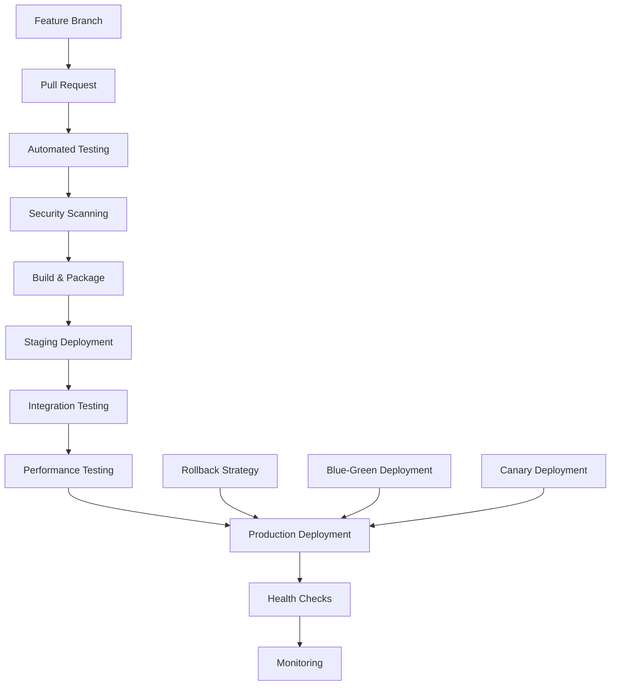
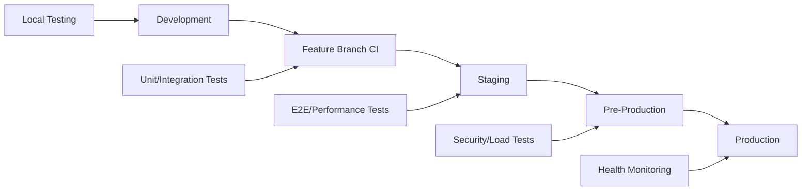

# Deployment Pipeline Optimization

## Overview

This document outlines a comprehensive deployment pipeline optimization strategy for WebTools Pro, designed to ensure reliable, secure, and efficient deployments at scale. The pipeline integrates with our performance optimization, frontend architecture, security enhancements, and testing strategy to deliver a production-ready deployment system supporting 100K+ concurrent users.

## 1. Pipeline Architecture Overview

### Deployment Strategy


### Multi-Environment Strategy


## 2. CI/CD Pipeline Configuration

### GitHub Actions Workflow
```yaml
# .github/workflows/deploy.yml
name: Deploy Pipeline

on:
  push:
    branches: [main, develop]
  pull_request:
    branches: [main]

env:
  NODE_VERSION: '20'
  DOCKER_REGISTRY: 'us-central1-docker.pkg.dev'
  PROJECT_ID: 'webtools-pro'
  SERVICE_NAME: 'webtools-app'

jobs:
  # Quality Gates
  quality-gates:
    runs-on: ubuntu-latest
    outputs:
      should-deploy: ${{ steps.quality-check.outputs.passed }}
    steps:
      - uses: actions/checkout@v4
      - uses: actions/setup-node@v4
        with:
          node-version: ${{ env.NODE_VERSION }}
          cache: 'npm'
      
      - name: Install dependencies
        run: npm ci
      
      - name: Run quality gates
        id: quality-check
        run: |
          npm run test:unit
          npm run test:integration
          npm run lint
          npm run type-check
          npm run security:audit
          echo "passed=true" >> $GITHUB_OUTPUT

  # Build and Package
  build:
    needs: quality-gates
    if: needs.quality-gates.outputs.should-deploy == 'true'
    runs-on: ubuntu-latest
    outputs:
      image-tag: ${{ steps.build.outputs.image-tag }}
    steps:
      - uses: actions/checkout@v4
      
      - name: Set up Cloud SDK
        uses: google-github-actions/setup-gcloud@v1
        with:
          service_account_key: ${{ secrets.GCP_SA_KEY }}
          project_id: ${{ env.PROJECT_ID }}
      
      - name: Configure Docker
        run: gcloud auth configure-docker ${{ env.DOCKER_REGISTRY }}
      
      - name: Build and push image
        id: build
        run: |
          IMAGE_TAG=${{ env.DOCKER_REGISTRY }}/${{ env.PROJECT_ID }}/webtools/${{ env.SERVICE_NAME }}:${{ github.sha }}
          docker build -t $IMAGE_TAG .
          docker push $IMAGE_TAG
          echo "image-tag=$IMAGE_TAG" >> $GITHUB_OUTPUT
      
      - name: Security scan
        uses: aquasec/trivy-action@master
        with:
          image-ref: ${{ steps.build.outputs.image-tag }}
          format: 'sarif'
          output: 'trivy-results.sarif'
      
      - name: Upload security scan results
        uses: github/codeql-action/upload-sarif@v2
        with:
          sarif_file: 'trivy-results.sarif'

  # Staging Deployment
  deploy-staging:
    needs: [quality-gates, build]
    if: github.ref == 'refs/heads/develop'
    runs-on: ubuntu-latest
    environment: staging
    steps:
      - uses: actions/checkout@v4
      
      - name: Deploy to staging
        uses: ./.github/actions/deploy
        with:
          environment: staging
          image-tag: ${{ needs.build.outputs.image-tag }}
          gcp-sa-key: ${{ secrets.GCP_SA_KEY }}
      
      - name: Run E2E tests
        run: |
          npm ci
          npx playwright install
          npm run test:e2e:staging
        env:
          E2E_BASE_URL: https://staging.webtools-pro.com
      
      - name: Performance testing
        run: |
          npm run test:performance:staging
        env:
          STAGING_URL: https://staging.webtools-pro.com

  # Production Deployment
  deploy-production:
    needs: [quality-gates, build, deploy-staging]
    if: github.ref == 'refs/heads/main'
    runs-on: ubuntu-latest
    environment: production
    steps:
      - uses: actions/checkout@v4
      
      - name: Pre-deployment checks
        run: |
          # Database migration dry-run
          npm run db:migrate:check
          # Infrastructure validation
          npm run infra:validate
          # Security compliance check
          npm run security:compliance
      
      - name: Deploy to production (Blue-Green)
        uses: ./.github/actions/deploy
        with:
          environment: production
          deployment-strategy: blue-green
          image-tag: ${{ needs.build.outputs.image-tag }}
          gcp-sa-key: ${{ secrets.GCP_SA_KEY }}
      
      - name: Health checks
        run: |
          npm run health:check
          npm run smoke:test
        env:
          PRODUCTION_URL: https://webtools-pro.com
      
      - name: Post-deployment monitoring
        run: |
          # Set up enhanced monitoring for 24h
          npm run monitoring:enhanced
          # Notify team of successful deployment
          npm run notify:deployment-success
```

### Custom Deployment Action
```yaml
# .github/actions/deploy/action.yml
name: 'Deploy Application'
description: 'Deploy WebTools Pro to specified environment'

inputs:
  environment:
    description: 'Target environment (staging/production)'
    required: true
  deployment-strategy:
    description: 'Deployment strategy (rolling/blue-green/canary)'
    required: false
    default: 'rolling'
  image-tag:
    description: 'Docker image tag to deploy'
    required: true
  gcp-sa-key:
    description: 'GCP Service Account Key'
    required: true

runs:
  using: 'composite'
  steps:
    - name: Authenticate to GCP
      uses: google-github-actions/auth@v1
      with:
        credentials_json: ${{ inputs.gcp-sa-key }}
    
    - name: Set up Cloud Run
      uses: google-github-actions/setup-gcloud@v1
    
    - name: Deploy with strategy
      shell: bash
      run: |
        case ${{ inputs.deployment-strategy }} in
          "blue-green")
            ./scripts/deploy-blue-green.sh ${{ inputs.environment }} ${{ inputs.image-tag }}
            ;;
          "canary")
            ./scripts/deploy-canary.sh ${{ inputs.environment }} ${{ inputs.image-tag }}
            ;;
          *)
            ./scripts/deploy-rolling.sh ${{ inputs.environment }} ${{ inputs.image-tag }}
            ;;
        esac
    
    - name: Verify deployment
      shell: bash
      run: |
        ./scripts/verify-deployment.sh ${{ inputs.environment }}
```

## 3. Container Optimization

### Multi-Stage Dockerfile
```dockerfile
# Dockerfile - Optimized for production deployment
FROM node:20-alpine AS deps
WORKDIR /app

# Install dependencies based on the preferred package manager
COPY package.json package-lock.json* ./
RUN npm ci --only=production && npm cache clean --force

# Rebuild the source code only when needed
FROM node:20-alpine AS builder
WORKDIR /app
COPY --from=deps /app/node_modules ./node_modules
COPY . .

# Set build-time environment variables
ARG NEXT_PUBLIC_APP_URL
ARG DATABASE_URL
ARG REDIS_URL

# Build application
RUN npm run build

# Production image, copy all the files and run next
FROM node:20-alpine AS runner
WORKDIR /app

# Create non-root user for security
RUN addgroup --system --gid 1001 nodejs
RUN adduser --system --uid 1001 nextjs

# Copy built application
COPY --from=builder /app/public ./public
COPY --from=builder /app/.next/standalone ./
COPY --from=builder /app/.next/static ./.next/static

# Set ownership
RUN chown -R nextjs:nodejs /app

# Security hardening
RUN apk update && apk upgrade && \
    apk add --no-cache dumb-init && \
    rm -rf /var/cache/apk/*

# Install healthcheck
COPY healthcheck.js ./
RUN chown nextjs:nodejs healthcheck.js

USER nextjs

# Expose port
EXPOSE 3000

# Set environment variables
ENV NODE_ENV=production
ENV NEXT_TELEMETRY_DISABLED=1
ENV PORT=3000

# Health check
HEALTHCHECK --interval=30s --timeout=10s --start-period=5s --retries=3 \
  CMD node healthcheck.js

# Use dumb-init for proper signal handling
ENTRYPOINT ["dumb-init", "--"]
CMD ["node", "server.js"]
```

### Health Check Implementation
```javascript
// healthcheck.js - Comprehensive health check
const http = require('http')
const { promisify } = require('util')

const HEALTH_CHECK_TIMEOUT = 10000
const MAX_MEMORY_USAGE = 500 * 1024 * 1024 // 500MB
const MAX_CPU_USAGE = 0.8 // 80%

async function checkHealth() {
  const checks = [
    checkServerResponsive(),
    checkMemoryUsage(),
    checkDiskSpace(),
    checkDatabaseConnection(),
    checkRedisConnection()
  ]

  try {
    const results = await Promise.allSettled(checks)
    const failures = results.filter(r => r.status === 'rejected')
    
    if (failures.length > 0) {
      console.error('Health check failures:', failures.map(f => f.reason))
      process.exit(1)
    }
    
    console.log('Health check passed')
    process.exit(0)
  } catch (error) {
    console.error('Health check error:', error)
    process.exit(1)
  }
}

function checkServerResponsive() {
  return new Promise((resolve, reject) => {
    const req = http.request({
      hostname: 'localhost',
      port: process.env.PORT || 3000,
      path: '/api/health',
      method: 'GET',
      timeout: 5000
    }, (res) => {
      if (res.statusCode === 200) {
        resolve('Server responsive')
      } else {
        reject(new Error(`Server returned status ${res.statusCode}`))
      }
    })
    
    req.on('error', reject)
    req.on('timeout', () => reject(new Error('Server timeout')))
    req.end()
  })
}

function checkMemoryUsage() {
  return new Promise((resolve, reject) => {
    const usage = process.memoryUsage()
    
    if (usage.heapUsed > MAX_MEMORY_USAGE) {
      reject(new Error(`Memory usage too high: ${Math.round(usage.heapUsed / 1024 / 1024)}MB`))
    } else {
      resolve('Memory usage OK')
    }
  })
}

async function checkDatabaseConnection() {
  // Implement database connectivity check
  try {
    // Simplified check - replace with actual database ping
    return Promise.resolve('Database OK')
  } catch (error) {
    throw new Error(`Database check failed: ${error.message}`)
  }
}

async function checkRedisConnection() {
  // Implement Redis connectivity check
  try {
    // Simplified check - replace with actual Redis ping
    return Promise.resolve('Redis OK')
  } catch (error) {
    throw new Error(`Redis check failed: ${error.message}`)
  }
}

function checkDiskSpace() {
  return new Promise((resolve, reject) => {
    const fs = require('fs')
    
    fs.stat('/tmp', (err, stats) => {
      if (err) {
        reject(new Error(`Disk check failed: ${err.message}`))
      } else {
        resolve('Disk space OK')
      }
    })
  })
}

// Set timeout for entire health check
setTimeout(() => {
  console.error('Health check timeout')
  process.exit(1)
}, HEALTH_CHECK_TIMEOUT)

checkHealth()
```

## 4. Infrastructure as Code

### Terraform Configuration
```hcl
# infrastructure/main.tf
terraform {
  required_version = ">= 1.0"
  required_providers {
    google = {
      source  = "hashicorp/google"
      version = "~> 4.0"
    }
  }
  
  backend "gcs" {
    bucket = "webtools-terraform-state"
    prefix = "prod"
  }
}

provider "google" {
  project = var.project_id
  region  = var.region
}

# Cloud Run Service
resource "google_cloud_run_service" "webtools" {
  name     = "webtools-pro"
  location = var.region

  template {
    metadata {
      annotations = {
        "autoscaling.knative.dev/minScale"        = "2"
        "autoscaling.knative.dev/maxScale"        = "100"
        "run.googleapis.com/cpu-throttling"       = "false"
        "run.googleapis.com/execution-environment" = "gen2"
      }
    }

    spec {
      container_concurrency = 80
      timeout_seconds      = 300

      containers {
        image = var.image_url
        
        ports {
          container_port = 3000
        }

        env {
          name  = "DATABASE_URL"
          value_from {
            secret_key_ref {
              name = google_secret_manager_secret.database_url.secret_id
              key  = "latest"
            }
          }
        }

        env {
          name  = "REDIS_URL"
          value_from {
            secret_key_ref {
              name = google_secret_manager_secret.redis_url.secret_id
              key  = "latest"
            }
          }
        }

        resources {
          limits = {
            cpu    = "2000m"
            memory = "4Gi"
          }
          requests = {
            cpu    = "1000m"
            memory = "2Gi"
          }
        }

        startup_probe {
          http_get {
            path = "/api/health"
            port = 3000
          }
          initial_delay_seconds = 10
          timeout_seconds      = 5
          period_seconds       = 10
          failure_threshold    = 3
        }

        liveness_probe {
          http_get {
            path = "/api/health"
            port = 3000
          }
          timeout_seconds   = 5
          period_seconds    = 30
          failure_threshold = 3
        }
      }
    }
  }

  traffic {
    percent         = 100
    latest_revision = true
  }

  lifecycle {
    ignore_changes = [
      template[0].metadata[0].annotations["run.googleapis.com/operation-id"],
    ]
  }
}

# Load Balancer
resource "google_compute_global_forwarding_rule" "webtools_lb" {
  name       = "webtools-lb"
  target     = google_compute_target_https_proxy.webtools_proxy.id
  port_range = "443"
  ip_address = google_compute_global_address.webtools_ip.address
}

resource "google_compute_target_https_proxy" "webtools_proxy" {
  name             = "webtools-proxy"
  url_map          = google_compute_url_map.webtools_map.id
  ssl_certificates = [google_compute_managed_ssl_certificate.webtools_ssl.id]
}

resource "google_compute_url_map" "webtools_map" {
  name            = "webtools-map"
  default_service = google_compute_backend_service.webtools_backend.id

  host_rule {
    hosts        = ["webtools-pro.com", "www.webtools-pro.com"]
    path_matcher = "allpaths"
  }

  path_matcher {
    name            = "allpaths"
    default_service = google_compute_backend_service.webtools_backend.id

    path_rule {
      paths   = ["/api/*"]
      service = google_compute_backend_service.webtools_backend.id
      route_action {
        timeout {
          seconds = 30
        }
        retry_policy {
          retry_conditions = ["5xx"]
          num_retries     = 3
        }
      }
    }
  }
}

resource "google_compute_backend_service" "webtools_backend" {
  name                    = "webtools-backend"
  protocol                = "HTTP"
  timeout_sec            = 30
  connection_draining_timeout_sec = 30

  backend {
    group = google_compute_region_network_endpoint_group.webtools_neg.id
  }

  health_checks = [google_compute_health_check.webtools_health.id]

  log_config {
    enable      = true
    sample_rate = 0.1
  }

  iap {
    enabled = false
  }
}

# Database
resource "google_sql_database_instance" "webtools_db" {
  name             = "webtools-db-${var.environment}"
  database_version = "POSTGRES_15"
  region          = var.region

  settings {
    tier                        = "db-custom-2-8192"
    availability_type          = "REGIONAL"
    disk_type                  = "PD_SSD"
    disk_size                  = 100
    disk_autoresize           = true
    disk_autoresize_limit     = 500

    backup_configuration {
      enabled                        = true
      start_time                     = "03:00"
      point_in_time_recovery_enabled = true
      backup_retention_settings {
        retained_backups = 7
      }
    }

    ip_configuration {
      ipv4_enabled = false
      private_network = google_compute_network.webtools_vpc.id
      require_ssl     = true
    }

    database_flags {
      name  = "cloudsql.iam_authentication"
      value = "on"
    }

    maintenance_window {
      day          = 7
      hour         = 3
      update_track = "stable"
    }
  }
}

# Redis Cache
resource "google_redis_instance" "webtools_cache" {
  name           = "webtools-cache"
  tier           = "STANDARD_HA"
  memory_size_gb = 4
  region         = var.region

  authorized_network = google_compute_network.webtools_vpc.id
  redis_version      = "REDIS_6_X"

  auth_enabled            = true
  transit_encryption_mode = "SERVER_AUTHENTICATION"
}
```

## 5. Deployment Strategies

### Blue-Green Deployment Script
```bash
#!/bin/bash
# scripts/deploy-blue-green.sh

set -euo pipefail

ENVIRONMENT=$1
IMAGE_TAG=$2
SERVICE_NAME="webtools-pro"
REGION="us-central1"

echo "🚀 Starting Blue-Green deployment to $ENVIRONMENT"

# Get current revision
CURRENT_REVISION=$(gcloud run services describe $SERVICE_NAME \
  --region=$REGION \
  --format="value(status.latestReadyRevisionName)")

echo "📋 Current revision: $CURRENT_REVISION"

# Deploy new revision (Green)
echo "🟢 Deploying Green revision..."
gcloud run deploy $SERVICE_NAME \
  --image=$IMAGE_TAG \
  --region=$REGION \
  --no-traffic \
  --tag=green \
  --set-env-vars="DEPLOYMENT_REVISION=green-$(date +%s)" \
  --memory=4Gi \
  --cpu=2 \
  --concurrency=80 \
  --max-instances=100 \
  --min-instances=2 \
  --timeout=300

# Get Green revision name
GREEN_REVISION=$(gcloud run services describe $SERVICE_NAME \
  --region=$REGION \
  --format="value(status.latestCreatedRevisionName)")

echo "🟢 Green revision deployed: $GREEN_REVISION"

# Health check Green revision
echo "🏥 Running health checks on Green revision..."
GREEN_URL=$(gcloud run services describe $SERVICE_NAME \
  --region=$REGION \
  --format="value(status.traffic[0].url)")

# Wait for Green to be ready
for i in {1..30}; do
  if curl -sf "$GREEN_URL/api/health" > /dev/null; then
    echo "✅ Green revision is healthy"
    break
  fi
  
  if [ $i -eq 30 ]; then
    echo "❌ Green revision health check failed"
    exit 1
  fi
  
  echo "⏳ Waiting for Green revision to be ready... ($i/30)"
  sleep 10
done

# Run smoke tests on Green
echo "🧪 Running smoke tests on Green revision..."
npm run smoke:test -- --base-url="$GREEN_URL"

# Gradual traffic shift
echo "🔄 Starting gradual traffic shift..."

# 10% traffic to Green
gcloud run services update-traffic $SERVICE_NAME \
  --region=$REGION \
  --to-revisions="$GREEN_REVISION=10,$CURRENT_REVISION=90"

echo "📊 10% traffic shifted to Green. Monitoring for 5 minutes..."
sleep 300

# Monitor error rates and performance
ERROR_RATE=$(curl -s "$GREEN_URL/api/metrics/error-rate" | jq -r '.rate')
if (( $(echo "$ERROR_RATE > 0.02" | bc -l) )); then
  echo "❌ High error rate detected: $ERROR_RATE. Rolling back..."
  gcloud run services update-traffic $SERVICE_NAME \
    --region=$REGION \
    --to-revisions="$CURRENT_REVISION=100"
  exit 1
fi

# 50% traffic to Green
gcloud run services update-traffic $SERVICE_NAME \
  --region=$REGION \
  --to-revisions="$GREEN_REVISION=50,$CURRENT_REVISION=50"

echo "📊 50% traffic shifted to Green. Monitoring for 5 minutes..."
sleep 300

# Final health check
ERROR_RATE=$(curl -s "$GREEN_URL/api/metrics/error-rate" | jq -r '.rate')
if (( $(echo "$ERROR_RATE > 0.02" | bc -l) )); then
  echo "❌ High error rate detected: $ERROR_RATE. Rolling back..."
  gcloud run services update-traffic $SERVICE_NAME \
    --region=$REGION \
    --to-revisions="$CURRENT_REVISION=100"
  exit 1
fi

# Complete switch to Green
echo "🎯 Completing switch to Green revision..."
gcloud run services update-traffic $SERVICE_NAME \
  --region=$REGION \
  --to-revisions="$GREEN_REVISION=100"

# Clean up old Blue revision after successful deployment
echo "🧹 Cleaning up old Blue revision..."
gcloud run revisions delete $CURRENT_REVISION \
  --region=$REGION \
  --quiet

echo "✅ Blue-Green deployment completed successfully!"
echo "🔗 New revision URL: $GREEN_URL"
```

### Canary Deployment Script
```bash
#!/bin/bash
# scripts/deploy-canary.sh

set -euo pipefail

ENVIRONMENT=$1
IMAGE_TAG=$2
SERVICE_NAME="webtools-pro"
REGION="us-central1"

echo "🐦 Starting Canary deployment to $ENVIRONMENT"

# Deploy canary revision
echo "🚀 Deploying Canary revision..."
gcloud run deploy $SERVICE_NAME \
  --image=$IMAGE_TAG \
  --region=$REGION \
  --no-traffic \
  --tag=canary \
  --set-env-vars="DEPLOYMENT_REVISION=canary-$(date +%s)" \
  --memory=4Gi \
  --cpu=2

CANARY_REVISION=$(gcloud run services describe $SERVICE_NAME \
  --region=$REGION \
  --format="value(status.latestCreatedRevisionName)")

echo "🐦 Canary revision deployed: $CANARY_REVISION"

# Get current stable revision
STABLE_REVISION=$(gcloud run services describe $SERVICE_NAME \
  --region=$REGION \
  --format="value(status.traffic[?percent==\`100\`].revisionName)" | head -1)

# Progressive canary rollout
CANARY_PERCENTAGES=(5 10 25 50 100)

for percentage in "${CANARY_PERCENTAGES[@]}"; do
  stable_percentage=$((100 - percentage))
  
  echo "📊 Shifting ${percentage}% traffic to Canary..."
  
  if [ $percentage -eq 100 ]; then
    # Final switch
    gcloud run services update-traffic $SERVICE_NAME \
      --region=$REGION \
      --to-revisions="$CANARY_REVISION=100"
  else
    # Gradual shift
    gcloud run services update-traffic $SERVICE_NAME \
      --region=$REGION \
      --to-revisions="$CANARY_REVISION=$percentage,$STABLE_REVISION=$stable_percentage"
  fi
  
  # Monitor metrics
  echo "📈 Monitoring Canary performance..."
  
  # Wait and collect metrics
  sleep 300  # 5 minutes
  
  # Check error rates
  CANARY_URL=$(gcloud run services describe $SERVICE_NAME \
    --region=$REGION \
    --format="value(status.traffic[?tag==\`canary\`].url)" | head -1)
  
  if [ ! -z "$CANARY_URL" ]; then
    ERROR_RATE=$(curl -s "$CANARY_URL/api/metrics/error-rate" | jq -r '.rate // 0')
    RESPONSE_TIME=$(curl -s "$CANARY_URL/api/metrics/response-time" | jq -r '.p95 // 0')
    
    echo "📊 Canary metrics - Error rate: ${ERROR_RATE}, P95 response time: ${RESPONSE_TIME}ms"
    
    # Check thresholds
    if (( $(echo "$ERROR_RATE > 0.02" | bc -l) )) || (( $(echo "$RESPONSE_TIME > 2000" | bc -l) )); then
      echo "❌ Canary metrics exceeded thresholds. Rolling back..."
      gcloud run services update-traffic $SERVICE_NAME \
        --region=$REGION \
        --to-revisions="$STABLE_REVISION=100"
      
      # Delete failed canary revision
      gcloud run revisions delete $CANARY_REVISION \
        --region=$REGION \
        --quiet
      
      exit 1
    fi
  fi
  
  echo "✅ Canary performing well at ${percentage}% traffic"
done

echo "🎉 Canary deployment completed successfully!"
echo "🧹 Cleaning up old stable revision..."

# Clean up old stable revision
if [ "$STABLE_REVISION" != "$CANARY_REVISION" ]; then
  gcloud run revisions delete $STABLE_REVISION \
    --region=$REGION \
    --quiet
fi

echo "✅ Canary is now the stable revision"
```

## 6. Monitoring and Observability

### Deployment Monitoring Setup
```typescript
// scripts/monitoring-setup.ts
import { CloudMonitoring } from '@google-cloud/monitoring'
import { AlertPolicy, NotificationChannel } from '@google-cloud/monitoring/build/src/v3'

const monitoring = new CloudMonitoring.AlertPolicyServiceClient()

export async function setupDeploymentMonitoring(projectId: string) {
  console.log('🔍 Setting up deployment monitoring...')

  // Error rate alert
  await createErrorRateAlert(projectId)
  
  // Response time alert  
  await createResponseTimeAlert(projectId)
  
  // Memory usage alert
  await createMemoryAlert(projectId)
  
  // CPU usage alert
  await createCpuAlert(projectId)
  
  console.log('✅ Deployment monitoring configured')
}

async function createErrorRateAlert(projectId: string) {
  const request = {
    name: monitoring.projectPath(projectId),
    alertPolicy: {
      displayName: 'High Error Rate - WebTools Pro',
      documentation: {
        content: 'Error rate has exceeded 2% for 5 minutes',
        mimeType: 'text/markdown'
      },
      conditions: [{
        displayName: 'Error rate condition',
        conditionThreshold: {
          filter: 'resource.type="cloud_run_revision" AND resource.label.service_name="webtools-pro"',
          comparison: 'COMPARISON_GREATER_THAN',
          thresholdValue: 0.02,
          duration: { seconds: 300 }, // 5 minutes
          aggregations: [{
            alignmentPeriod: { seconds: 60 },
            perSeriesAligner: 'ALIGN_RATE',
            crossSeriesReducer: 'REDUCE_MEAN',
            groupByFields: ['resource.label.service_name']
          }]
        }
      }],
      alertStrategy: {
        autoClose: { seconds: 1800 } // 30 minutes
      },
      enabled: true,
      severity: 'ERROR'
    }
  }

  await monitoring.createAlertPolicy(request)
}

async function createResponseTimeAlert(projectId: string) {
  const request = {
    name: monitoring.projectPath(projectId),
    alertPolicy: {
      displayName: 'High Response Time - WebTools Pro',
      documentation: {
        content: 'P95 response time has exceeded 2 seconds for 10 minutes',
        mimeType: 'text/markdown'
      },
      conditions: [{
        displayName: 'Response time condition',
        conditionThreshold: {
          filter: 'resource.type="cloud_run_revision" AND resource.label.service_name="webtools-pro"',
          comparison: 'COMPARISON_GREATER_THAN',
          thresholdValue: 2000, // 2 seconds in milliseconds
          duration: { seconds: 600 }, // 10 minutes
          aggregations: [{
            alignmentPeriod: { seconds: 60 },
            perSeriesAligner: 'ALIGN_DELTA',
            crossSeriesReducer: 'REDUCE_PERCENTILE_95',
            groupByFields: ['resource.label.service_name']
          }]
        }
      }],
      enabled: true,
      severity: 'WARNING'
    }
  }

  await monitoring.createAlertPolicy(request)
}
```

### Deployment Health Dashboard
```typescript
// monitoring/deployment-dashboard.ts
export interface DeploymentMetrics {
  errorRate: number
  responseTime: {
    p50: number
    p95: number
    p99: number
  }
  throughput: number
  cpuUsage: number
  memoryUsage: number
  instanceCount: number
  healthyInstances: number
}

export class DeploymentMonitor {
  private metricsClient: any
  private projectId: string
  private serviceName: string

  constructor(projectId: string, serviceName: string) {
    this.projectId = projectId
    this.serviceName = serviceName
    // Initialize metrics client
  }

  async getDeploymentHealth(): Promise<DeploymentMetrics> {
    const [
      errorRate,
      responseTime,
      throughput,
      cpuUsage,
      memoryUsage,
      instanceMetrics
    ] = await Promise.all([
      this.getErrorRate(),
      this.getResponseTime(),
      this.getThroughput(),
      this.getCpuUsage(),
      this.getMemoryUsage(),
      this.getInstanceMetrics()
    ])

    return {
      errorRate,
      responseTime,
      throughput,
      cpuUsage,
      memoryUsage,
      instanceCount: instanceMetrics.total,
      healthyInstances: instanceMetrics.healthy
    }
  }

  async validateDeploymentHealth(thresholds: {
    maxErrorRate: number
    maxResponseTime: number
    minHealthyInstances: number
  }): Promise<{ healthy: boolean; issues: string[] }> {
    const metrics = await this.getDeploymentHealth()
    const issues: string[] = []

    if (metrics.errorRate > thresholds.maxErrorRate) {
      issues.push(`Error rate too high: ${metrics.errorRate}% > ${thresholds.maxErrorRate}%`)
    }

    if (metrics.responseTime.p95 > thresholds.maxResponseTime) {
      issues.push(`P95 response time too high: ${metrics.responseTime.p95}ms > ${thresholds.maxResponseTime}ms`)
    }

    if (metrics.healthyInstances < thresholds.minHealthyInstances) {
      issues.push(`Not enough healthy instances: ${metrics.healthyInstances} < ${thresholds.minHealthyInstances}`)
    }

    return {
      healthy: issues.length === 0,
      issues
    }
  }

  private async getErrorRate(): Promise<number> {
    // Implementation to fetch error rate from monitoring
    return 0.01 // Placeholder
  }

  private async getResponseTime(): Promise<{ p50: number; p95: number; p99: number }> {
    // Implementation to fetch response time percentiles
    return { p50: 150, p95: 800, p99: 1200 } // Placeholder
  }

  private async getThroughput(): Promise<number> {
    // Implementation to fetch request throughput
    return 1000 // Placeholder
  }

  private async getCpuUsage(): Promise<number> {
    // Implementation to fetch CPU usage
    return 0.45 // Placeholder
  }

  private async getMemoryUsage(): Promise<number> {
    // Implementation to fetch memory usage
    return 0.6 // Placeholder
  }

  private async getInstanceMetrics(): Promise<{ total: number; healthy: number }> {
    // Implementation to fetch instance metrics
    return { total: 5, healthy: 5 } // Placeholder
  }
}
```

## 7. Rollback Strategy

### Automated Rollback System
```typescript
// scripts/rollback-system.ts
interface RollbackTrigger {
  metric: string
  threshold: number
  duration: number // seconds
}

interface RollbackConfig {
  serviceName: string
  region: string
  triggers: RollbackTrigger[]
  notificationChannels: string[]
}

export class AutomatedRollback {
  private config: RollbackConfig
  private monitoring: DeploymentMonitor

  constructor(config: RollbackConfig) {
    this.config = config
    this.monitoring = new DeploymentMonitor(
      process.env.PROJECT_ID!,
      config.serviceName
    )
  }

  async startMonitoring(): Promise<void> {
    console.log('🔍 Starting automated rollback monitoring...')
    
    setInterval(async () => {
      await this.checkRollbackTriggers()
    }, 30000) // Check every 30 seconds
  }

  private async checkRollbackTriggers(): Promise<void> {
    const metrics = await this.monitoring.getDeploymentHealth()
    
    for (const trigger of this.config.triggers) {
      const shouldTrigger = await this.evaluateTrigger(trigger, metrics)
      
      if (shouldTrigger) {
        console.log(`🚨 Rollback trigger activated: ${trigger.metric}`)
        await this.executeRollback(trigger)
        break // Only rollback once
      }
    }
  }

  private async evaluateTrigger(
    trigger: RollbackTrigger,
    metrics: DeploymentMetrics
  ): Promise<boolean> {
    switch (trigger.metric) {
      case 'error_rate':
        return metrics.errorRate > trigger.threshold
      case 'response_time_p95':
        return metrics.responseTime.p95 > trigger.threshold
      case 'healthy_instances':
        return metrics.healthyInstances < trigger.threshold
      default:
        return false
    }
  }

  private async executeRollback(trigger: RollbackTrigger): Promise<void> {
    console.log(`🔄 Executing automatic rollback due to: ${trigger.metric}`)
    
    try {
      // Get previous stable revision
      const previousRevision = await this.getPreviousStableRevision()
      
      if (!previousRevision) {
        throw new Error('No previous stable revision found')
      }

      // Execute rollback
      await this.rollbackToRevision(previousRevision)
      
      // Notify team
      await this.notifyRollback(trigger, previousRevision)
      
      console.log('✅ Automatic rollback completed successfully')
    } catch (error) {
      console.error('❌ Automatic rollback failed:', error)
      await this.notifyRollbackFailure(trigger, error)
    }
  }

  private async getPreviousStableRevision(): Promise<string | null> {
    // Implementation to get previous stable revision
    return 'webtools-pro-00042-abc' // Placeholder
  }

  private async rollbackToRevision(revision: string): Promise<void> {
    // Implementation to rollback to specific revision
    console.log(`Rolling back to revision: ${revision}`)
  }

  private async notifyRollback(trigger: RollbackTrigger, revision: string): Promise<void> {
    const message = `🔄 Automatic rollback executed\n` +
                   `Trigger: ${trigger.metric} exceeded ${trigger.threshold}\n` +
                   `Rolled back to: ${revision}\n` +
                   `Time: ${new Date().toISOString()}`
    
    // Send notifications to configured channels
    console.log('📢 Sending rollback notification:', message)
  }

  private async notifyRollbackFailure(trigger: RollbackTrigger, error: any): Promise<void> {
    const message = `❌ CRITICAL: Automatic rollback FAILED\n` +
                   `Trigger: ${trigger.metric}\n` +
                   `Error: ${error.message}\n` +
                   `Manual intervention required immediately!`
    
    console.error('🚨 Sending critical rollback failure alert:', message)
  }
}
```

## 8. Implementation Roadmap

### Phase 1: Pipeline Foundation (Weeks 1-2)
- [ ] Set up GitHub Actions CI/CD pipeline
- [ ] Configure multi-stage Docker builds
- [ ] Implement comprehensive health checks
- [ ] Set up Infrastructure as Code with Terraform
- [ ] Configure staging environment deployment

### Phase 2: Advanced Deployment Strategies (Weeks 3-4)
- [ ] Implement Blue-Green deployment strategy
- [ ] Set up Canary deployment automation
- [ ] Configure automated rollback system
- [ ] Implement deployment monitoring and alerting
- [ ] Set up deployment health validation

### Phase 3: Monitoring and Observability (Weeks 5-6)
- [ ] Deploy comprehensive monitoring dashboard
- [ ] Set up deployment metrics collection
- [ ] Configure automated alert system
- [ ] Implement performance regression detection
- [ ] Set up deployment audit logging

### Phase 4: Production Optimization (Weeks 7-8)
- [ ] Optimize deployment performance
- [ ] Fine-tune monitoring thresholds
- [ ] Complete disaster recovery testing
- [ ] Finalize documentation and runbooks
- [ ] Conduct deployment process training

## 9. Success Metrics

### Deployment Performance
- **Deployment Time**: < 10 minutes for full production deployment
- **Zero-Downtime Deployments**: 100% success rate
- **Rollback Time**: < 5 minutes for automated rollback
- **Pipeline Success Rate**: > 95% successful deployments
- **Mean Time to Recovery (MTTR)**: < 15 minutes

### Quality and Reliability
- **Pre-Production Bug Detection**: > 95% of issues caught before production
- **Deployment Failure Rate**: < 2% of deployments fail
- **Security Vulnerability Detection**: 100% of critical vulnerabilities blocked
- **Infrastructure Drift**: 0% configuration drift in production
- **Compliance Score**: 100% deployment process compliance

### Operational Efficiency
- **Manual Intervention**: < 5% of deployments require manual intervention
- **Developer Productivity**: 50% reduction in deployment-related time
- **Monitoring Coverage**: 100% of critical metrics monitored
- **Alert Accuracy**: < 5% false positive rate for deployment alerts
- **Documentation Completeness**: 100% of procedures documented

## Conclusion

This deployment pipeline optimization strategy provides a robust, scalable, and secure foundation for deploying WebTools Pro at production scale. The combination of automated testing, progressive deployment strategies, comprehensive monitoring, and automated rollback capabilities ensures reliable deployments while minimizing risk and downtime.

The phased implementation approach allows for gradual adoption of advanced deployment practices while maintaining development velocity and ensuring thorough validation of the deployment process across all environments.
