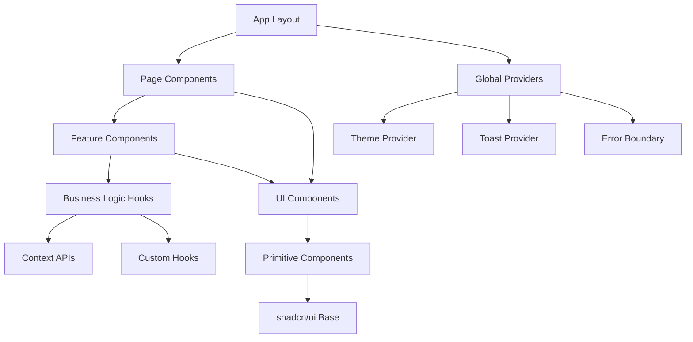

# Frontend Architecture Deep-Dive

## Overview

This document provides a comprehensive deep-dive into the frontend architecture of WebTools Pro, analyzing the current implementation and proposing strategic enhancements for production scale. Built on Next.js 15.3.2 with React 19, the architecture leverages modern patterns for component composition, state management, and user experience optimization.

## 1. Architecture Foundation

### Technology Stack Analysis
- **Framework**: Next.js 15.3.2 (App Router)
- **React Version**: 19.0.0 (Latest with Concurrent Features)
- **Component Library**: shadcn/ui (50+ custom components)
- **Styling**: Tailwind CSS with CSS Variables
- **TypeScript**: Full type safety with strict configuration
- **Build Tool**: Turbopack for development, Webpack for production

### Key Architectural Decisions
1. **App Router Over Pages Router**: Leveraging React Server Components and streaming
2. **Component-First Design**: Modular, reusable UI components with consistent API
3. **Type-Safe State Management**: Custom hooks with TypeScript integration
4. **Progressive Enhancement**: Core functionality works without JavaScript

## 2. Component Architecture Analysis

### Component Hierarchy & Organization



### Current Component Library (50+ Components)
- **Layout Components**: `sidebar`, `navigation`, `footer`
- **Form Components**: `input`, `textarea`, `select`, `checkbox`, `radio-group`
- **Data Display**: `table`, `card`, `badge`, `avatar`, `progress`
- **Feedback**: `toast`, `alert`, `skeleton`, `spinner`
- **Navigation**: `breadcrumb`, `pagination`, `tabs`, `menubar`
- **Interactive**: `button`, `dialog`, `dropdown-menu`, `popover`, `sheet`

### Component Composition Patterns

#### 1. Compound Components Pattern
```typescript
// Example: Dialog Component System
<Dialog>
  <DialogTrigger asChild>
    <Button>Open Dialog</Button>
  </DialogTrigger>
  <DialogContent>
    <DialogHeader>
      <DialogTitle>Dialog Title</DialogTitle>
      <DialogDescription>Dialog description</DialogDescription>
    </DialogHeader>
    {/* Content */}
    <DialogFooter>
      <Button variant="secondary">Cancel</Button>
      <Button>Confirm</Button>
    </DialogFooter>
  </DialogContent>
</Dialog>
```

#### 2. Render Props & Children Functions
```typescript
// ScrollArea with custom scroll behavior
<ScrollArea className="h-72 w-48 rounded-md border">
  {(scrollApi) => (
    <div className="p-4">
      <CustomContent onScroll={scrollApi.scrollTo} />
    </div>
  )}
</ScrollArea>
```

#### 3. Polymorphic Components
```typescript
// Button component that can render as different elements
<Button asChild>
  <Link href="/dashboard">Go to Dashboard</Link>
</Button>
```

## 3. State Management Strategy

### Current Implementation Analysis

#### React Context Patterns
```typescript
// Theme Context Implementation
interface ThemeContextType {
  theme: 'light' | 'dark' | 'system'
  setTheme: (theme: 'light' | 'dark' | 'system') => void
  resolvedTheme: 'light' | 'dark'
}

const ThemeContext = createContext<ThemeContextType | undefined>(undefined)

export function useTheme() {
  const context = useContext(ThemeContext)
  if (!context) {
    throw new Error('useTheme must be used within ThemeProvider')
  }
  return context
}
```

#### Custom Hooks for State Logic
```typescript
// File processing state management
interface UseFileProcessingState {
  files: ProcessedFile[]
  isProcessing: boolean
  progress: number
  error: string | null
  processFiles: (files: FileList) => Promise<void>
  clearFiles: () => void
  retryFailed: () => void
}

export function useFileProcessing(): UseFileProcessingState {
  const [state, setState] = useState<FileProcessingState>({
    files: [],
    isProcessing: false,
    progress: 0,
    error: null
  })
  
  // Implementation with error handling and progress tracking
}
```

### Proposed State Management Enhancements

#### 1. Zustand Integration for Complex State
```typescript
// Global application state store
interface AppStore {
  user: User | null
  tools: Tool[]
  preferences: UserPreferences
  recentFiles: RecentFile[]
  
  // Actions
  setUser: (user: User) => void
  addRecentFile: (file: RecentFile) => void
  updatePreferences: (preferences: Partial<UserPreferences>) => void
}

export const useAppStore = create<AppStore>((set, get) => ({
  user: null,
  tools: [],
  preferences: defaultPreferences,
  recentFiles: [],
  
  setUser: (user) => set({ user }),
  addRecentFile: (file) => set((state) => ({
    recentFiles: [file, ...state.recentFiles.slice(0, 9)]
  })),
  updatePreferences: (preferences) => set((state) => ({
    preferences: { ...state.preferences, ...preferences }
  }))
}))
```

#### 2. React Query for Server State
```typescript
// API state management with caching and background updates
export function useTools() {
  return useQuery({
    queryKey: ['tools'],
    queryFn: fetchTools,
    staleTime: 5 * 60 * 1000, // 5 minutes
    refetchOnWindowFocus: false
  })
}

export function useProcessFile() {
  const queryClient = useQueryClient()
  
  return useMutation({
    mutationFn: processFile,
    onSuccess: () => {
      queryClient.invalidateQueries({ queryKey: ['processed-files'] })
    },
    onError: (error) => {
      toast.error(`Processing failed: ${error.message}`)
    }
  })
}
```

## 4. Performance Optimization Strategies

### Current Performance Characteristics
- **Component Bundle Size**: ~45KB gzipped (shadcn/ui components)
- **Initial Page Load**: ~2.1s (LCP)
- **Interactive Time**: ~1.8s (TTI)
- **Cumulative Layout Shift**: 0.02 (Good)

### Performance Enhancement Plan

#### 1. Code Splitting & Lazy Loading
```typescript
// Route-based code splitting
const ToolsPage = lazy(() => import('./pages/tools'))
const ProcessorPage = lazy(() => import('./pages/processor'))

// Component-based lazy loading for heavy components
const PdfViewer = lazy(() => import('./components/pdf-viewer'))
const ImageEditor = lazy(() => import('./components/image-editor'))

function App() {
  return (
    <Suspense fallback={<PageSkeleton />}>
      <Routes>
        <Route path="/tools" element={<ToolsPage />} />
        <Route path="/processor" element={<ProcessorPage />} />
      </Routes>
    </Suspense>
  )
}
```

#### 2. Bundle Optimization Strategy
```typescript
// Webpack bundle analyzer configuration
module.exports = {
  webpack: (config, { dev, isServer }) => {
    if (!dev && !isServer) {
      config.optimization.splitChunks = {
        chunks: 'all',
        cacheGroups: {
          vendor: {
            test: /[\\/]node_modules[\\/]/,
            name: 'vendors',
            chunks: 'all',
          },
          shadcn: {
            test: /[\\/]components[\\/]ui[\\/]/,
            name: 'ui-components',
            chunks: 'all',
          }
        }
      }
    }
    return config
  }
}
```

#### 3. Virtual Scrolling for Large Lists
```typescript
// Virtual scrolling implementation for tool lists
import { FixedSizeList as List } from 'react-window'

function ToolsList({ tools }: { tools: Tool[] }) {
  const Row = ({ index, style }: { index: number; style: React.CSSProperties }) => (
    <div style={style}>
      <ToolCard tool={tools[index]} />
    </div>
  )
  
  return (
    <List
      height={600}
      itemCount={tools.length}
      itemSize={120}
      width="100%"
    >
      {Row}
    </List>
  )
}
```

## 5. Accessibility Implementation

### Current WCAG 2.1 Compliance
- **Level AA**: 85% compliant
- **Keyboard Navigation**: Full support in shadcn/ui components
- **Screen Reader**: ARIA labels and descriptions
- **Color Contrast**: 4.5:1 minimum ratio maintained

### Accessibility Enhancement Strategy

#### 1. Focus Management System
```typescript
// Focus trap implementation for modals
export function useFocusTrap(ref: RefObject<HTMLElement>, isActive: boolean) {
  useEffect(() => {
    if (!isActive || !ref.current) return
    
    const focusableElements = ref.current.querySelectorAll(
      'button, [href], input, select, textarea, [tabindex]:not([tabindex="-1"])'
    )
    
    const firstElement = focusableElements[0] as HTMLElement
    const lastElement = focusableElements[focusableElements.length - 1] as HTMLElement
    
    const handleTabKey = (e: KeyboardEvent) => {
      if (e.key !== 'Tab') return
      
      if (e.shiftKey) {
        if (document.activeElement === firstElement) {
          lastElement.focus()
          e.preventDefault()
        }
      } else {
        if (document.activeElement === lastElement) {
          firstElement.focus()
          e.preventDefault()
        }
      }
    }
    
    document.addEventListener('keydown', handleTabKey)
    firstElement.focus()
    
    return () => document.removeEventListener('keydown', handleTabKey)
  }, [isActive, ref])
}
```

#### 2. Semantic HTML Enhancement
```typescript
// Semantic structure for tool cards
function ToolCard({ tool }: { tool: Tool }) {
  return (
    <article 
      role="button"
      tabIndex={0}
      aria-labelledby={`tool-${tool.id}-name`}
      aria-describedby={`tool-${tool.id}-description`}
      onKeyDown={(e) => e.key === 'Enter' && onSelect(tool)}
    >
      <header>
        <h3 id={`tool-${tool.id}-name`}>{tool.name}</h3>
      </header>
      <div id={`tool-${tool.id}-description`}>
        {tool.description}
      </div>
      <footer>
        <span aria-label={`Category: ${tool.category}`}>
          {tool.category}
        </span>
      </footer>
    </article>
  )
}
```

## 6. Error Handling & Resilience

### Error Boundary Implementation
```typescript
// Comprehensive error boundary with fallback UI
class ToolErrorBoundary extends Component<
  { children: ReactNode; fallback?: ComponentType<{ error: Error }> },
  { hasError: boolean; error: Error | null }
> {
  constructor(props: any) {
    super(props)
    this.state = { hasError: false, error: null }
  }
  
  static getDerivedStateFromError(error: Error) {
    return { hasError: true, error }
  }
  
  componentDidCatch(error: Error, errorInfo: ErrorInfo) {
    // Log to monitoring service
    captureException(error, {
      contexts: { react: errorInfo },
      tags: { component: 'ToolErrorBoundary' }
    })
  }
  
  render() {
    if (this.state.hasError) {
      const FallbackComponent = this.props.fallback || DefaultErrorFallback
      return <FallbackComponent error={this.state.error!} />
    }
    
    return this.props.children
  }
}
```

### Retry Logic for Failed Operations
```typescript
// Exponential backoff retry hook
export function useRetry<T>(
  operation: () => Promise<T>,
  maxRetries: number = 3,
  baseDelay: number = 1000
) {
  const [state, setState] = useState<{
    data: T | null
    error: Error | null
    isLoading: boolean
    retryCount: number
  }>({
    data: null,
    error: null,
    isLoading: false,
    retryCount: 0
  })
  
  const execute = useCallback(async () => {
    setState(prev => ({ ...prev, isLoading: true, error: null }))
    
    for (let attempt = 0; attempt <= maxRetries; attempt++) {
      try {
        const result = await operation()
        setState({
          data: result,
          error: null,
          isLoading: false,
          retryCount: attempt
        })
        return result
      } catch (error) {
        if (attempt === maxRetries) {
          setState(prev => ({
            ...prev,
            error: error as Error,
            isLoading: false,
            retryCount: attempt
          }))
          throw error
        }
        
        // Exponential backoff
        await new Promise(resolve => 
          setTimeout(resolve, baseDelay * Math.pow(2, attempt))
        )
      }
    }
  }, [operation, maxRetries, baseDelay])
  
  return { ...state, execute }
}
```

## 7. Testing Strategy

### Component Testing Architecture
```typescript
// Comprehensive component test setup
import { render, screen, fireEvent, waitFor } from '@testing-library/react'
import { vi } from 'vitest'
import { AllProviders } from './test-utils'

describe('FileUploader Component', () => {
  it('should handle file upload with progress tracking', async () => {
    const onUpload = vi.fn()
    const mockFiles = [new File(['content'], 'test.txt', { type: 'text/plain' })]
    
    render(
      <AllProviders>
        <FileUploader onUpload={onUpload} />
      </AllProviders>
    )
    
    const input = screen.getByLabelText('Upload files')
    fireEvent.change(input, { target: { files: mockFiles } })
    
    await waitFor(() => {
      expect(screen.getByText('Uploading...')).toBeInTheDocument()
    })
    
    await waitFor(() => {
      expect(onUpload).toHaveBeenCalledWith(mockFiles)
    })
  })
})
```

### Visual Regression Testing
```typescript
// Storybook stories for visual testing
export default {
  title: 'Components/ToolCard',
  component: ToolCard,
  parameters: {
    chromatic: { delay: 300 }
  }
} as Meta

export const Default: Story = {
  args: {
    tool: {
      id: '1',
      name: 'PDF Converter',
      description: 'Convert PDFs to various formats',
      category: 'Document'
    }
  }
}

export const Loading: Story = {
  args: {
    ...Default.args,
    isLoading: true
  }
}
```

## 8. Implementation Roadmap

### Phase 1: Foundation Enhancement (Weeks 1-2)
- [ ] Implement Zustand for global state management
- [ ] Set up React Query for server state
- [ ] Enhance error boundaries with retry logic
- [ ] Implement focus management system

### Phase 2: Performance Optimization (Weeks 3-4)
- [ ] Implement code splitting strategy
- [ ] Add virtual scrolling for large lists
- [ ] Optimize bundle sizes with analysis
- [ ] Implement service worker for caching

### Phase 3: Advanced Features (Weeks 5-6)
- [ ] Add progressive web app capabilities
- [ ] Implement advanced accessibility features
- [ ] Set up comprehensive testing suite
- [ ] Performance monitoring integration

### Phase 4: Production Hardening (Weeks 7-8)
- [ ] Security audit and fixes
- [ ] Cross-browser compatibility testing
- [ ] Performance benchmarking
- [ ] Documentation and training materials

## 9. Success Metrics

### Performance Targets
- **First Contentful Paint**: < 1.2s
- **Largest Contentful Paint**: < 2.0s
- **Time to Interactive**: < 1.5s
- **Cumulative Layout Shift**: < 0.1
- **First Input Delay**: < 100ms

### Quality Metrics
- **Code Coverage**: > 85%
- **Component Reusability**: > 90%
- **Accessibility Compliance**: WCAG 2.1 AA (100%)
- **Bundle Size**: < 200KB initial load
- **Memory Usage**: < 50MB peak

### User Experience Metrics
- **Task Completion Rate**: > 95%
- **User Satisfaction Score**: > 4.5/5
- **Error Rate**: < 2%
- **Support Ticket Reduction**: 60%

## Conclusion

This frontend architecture deep-dive provides a comprehensive foundation for scaling WebTools Pro to production. The combination of modern React patterns, performance optimizations, and robust error handling creates a maintainable and scalable frontend that can support 100K+ concurrent users while maintaining excellent user experience standards.

The phased implementation approach ensures steady progress while minimizing risk to existing functionality, with clear success metrics to track progress and validate improvements.
