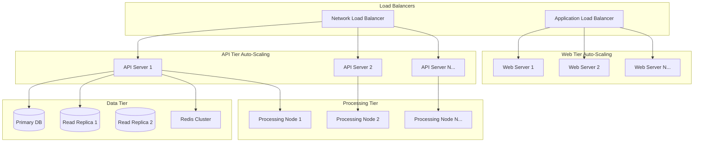
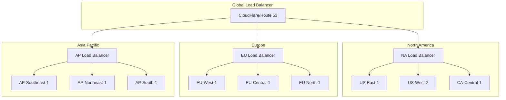
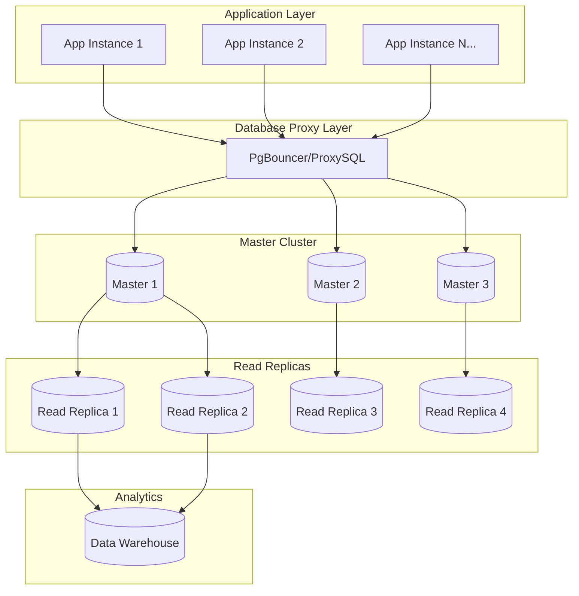
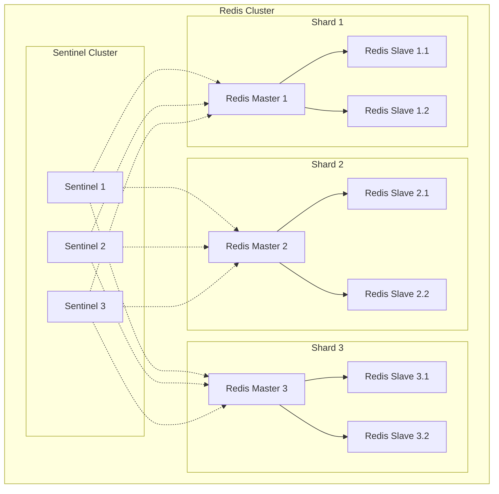

# Scalability Planning: Infrastructure Scaling Strategies for WebTools Pro

## Executive Summary

This document outlines a comprehensive scalability planning strategy for WebTools Pro, designed to handle exponential growth from MVP launch to enterprise-scale deployment supporting millions of users. The strategy encompasses horizontal and vertical scaling approaches, load balancing, capacity planning, auto-scaling mechanisms, and cost optimization strategies.

## Current State Analysis

### Baseline Architecture
- **Current Capacity**: 100K+ concurrent users
- **Processing Power**: Multi-threaded file processing
- **Storage**: Cloud-based file storage with CDN
- **Database**: PostgreSQL with Redis caching
- **Infrastructure**: Containerized deployment on cloud platforms

### Growth Projections
- **Phase 1** (0-6 months): 10K → 100K users
- **Phase 2** (6-18 months): 100K → 1M users  
- **Phase 3** (18-36 months): 1M → 10M users
- **Phase 4** (36+ months): 10M+ users (Enterprise scale)

## Scalability Architecture Framework

### 1. Horizontal Scaling Strategy



#### Auto-Scaling Configuration

```typescript
// Auto-scaling configuration for Kubernetes
interface AutoScalingConfig {
  webTier: {
    minReplicas: number;
    maxReplicas: number;
    targetCPUUtilization: number;
    targetMemoryUtilization: number;
    scaleUpCooldown: string;
    scaleDownCooldown: string;
  };
  apiTier: {
    minReplicas: number;
    maxReplicas: number;
    targetCPUUtilization: number;
    targetMemoryUtilization: number;
    customMetrics: string[];
  };
  processingTier: {
    minReplicas: number;
    maxReplicas: number;
    queueDepthThreshold: number;
    processingTimeThreshold: number;
  };
}

const scalingConfig: AutoScalingConfig = {
  webTier: {
    minReplicas: 3,
    maxReplicas: 50,
    targetCPUUtilization: 70,
    targetMemoryUtilization: 80,
    scaleUpCooldown: "3m",
    scaleDownCooldown: "5m"
  },
  apiTier: {
    minReplicas: 5,
    maxReplicas: 100,
    targetCPUUtilization: 60,
    targetMemoryUtilization: 75,
    customMetrics: [
      "requests_per_second",
      "response_time_p95",
      "queue_depth"
    ]
  },
  processingTier: {
    minReplicas: 2,
    maxReplicas: 200,
    queueDepthThreshold: 100,
    processingTimeThreshold: 30000 // 30 seconds
  }
};
```

### 2. Vertical Scaling Strategy

#### Resource Optimization Matrix

```typescript
interface ResourceTier {
  name: string;
  cpu: string;
  memory: string;
  storage: string;
  networkBandwidth: string;
  maxConcurrentUsers: number;
  costPerHour: number;
}

const resourceTiers: ResourceTier[] = [
  {
    name: "Starter",
    cpu: "2 vCPU",
    memory: "4 GB",
    storage: "50 GB SSD",
    networkBandwidth: "1 Gbps",
    maxConcurrentUsers: 1000,
    costPerHour: 0.05
  },
  {
    name: "Standard",
    cpu: "4 vCPU",
    memory: "16 GB",
    storage: "200 GB SSD",
    networkBandwidth: "5 Gbps",
    maxConcurrentUsers: 5000,
    costPerHour: 0.20
  },
  {
    name: "Performance",
    cpu: "8 vCPU",
    memory: "32 GB",
    storage: "500 GB SSD",
    networkBandwidth: "10 Gbps",
    maxConcurrentUsers: 15000,
    costPerHour: 0.50
  },
  {
    name: "Enterprise",
    cpu: "16 vCPU",
    memory: "64 GB",
    storage: "1 TB SSD",
    networkBandwidth: "25 Gbps",
    maxConcurrentUsers: 50000,
    costPerHour: 1.20
  }
];
```

### 3. Load Balancing Architecture

#### Multi-Tier Load Balancing

```typescript
interface LoadBalancingStrategy {
  tier: string;
  algorithm: string;
  healthCheckInterval: number;
  healthCheckTimeout: number;
  unhealthyThreshold: number;
  sessionAffinity: boolean;
  crossZoneBalancing: boolean;
}

const loadBalancingConfig: LoadBalancingStrategy[] = [
  {
    tier: "Global",
    algorithm: "Weighted Round Robin",
    healthCheckInterval: 30,
    healthCheckTimeout: 5,
    unhealthyThreshold: 3,
    sessionAffinity: false,
    crossZoneBalancing: true
  },
  {
    tier: "Regional",
    algorithm: "Least Connections",
    healthCheckInterval: 10,
    healthCheckTimeout: 3,
    unhealthyThreshold: 2,
    sessionAffinity: true,
    crossZoneBalancing: true
  },
  {
    tier: "Application",
    algorithm: "IP Hash",
    healthCheckInterval: 5,
    healthCheckTimeout: 2,
    unhealthyThreshold: 2,
    sessionAffinity: true,
    crossZoneBalancing: false
  }
];
```

#### Geographic Load Distribution



### 4. Capacity Planning Framework

#### Predictive Scaling Model

```typescript
interface CapacityMetrics {
  timestamp: Date;
  activeUsers: number;
  requestsPerSecond: number;
  cpuUtilization: number;
  memoryUtilization: number;
  responseTime: number;
  errorRate: number;
  queueDepth: number;
}

class CapacityPlanner {
  private metrics: CapacityMetrics[] = [];
  private seasonalPatterns: Map<string, number> = new Map();
  private growthRate: number = 0.15; // 15% monthly growth

  predictCapacity(daysAhead: number): CapacityPrediction {
    const historicalData = this.getHistoricalData(30); // 30 days
    const trendAnalysis = this.analyzeTrend(historicalData);
    const seasonalAdjustment = this.getSeasonalAdjustment(daysAhead);
    
    return {
      predictedUsers: this.calculatePredictedUsers(daysAhead, trendAnalysis),
      requiredCapacity: this.calculateRequiredCapacity(trendAnalysis, seasonalAdjustment),
      recommendedActions: this.generateRecommendations(trendAnalysis),
      confidenceLevel: this.calculateConfidence(historicalData)
    };
  }

  private calculatePredictedUsers(days: number, trend: TrendAnalysis): number {
    const currentUsers = this.getCurrentActiveUsers();
    const growthFactor = Math.pow(1 + this.growthRate / 30, days);
    return Math.round(currentUsers * growthFactor * trend.multiplier);
  }

  private calculateRequiredCapacity(trend: TrendAnalysis, seasonal: number): CapacityRequirement {
    const baseCapacity = trend.baseRequirement;
    const peakMultiplier = seasonal * 1.5; // 50% buffer for peak times
    
    return {
      webTierInstances: Math.ceil(baseCapacity.users / 1000),
      apiTierInstances: Math.ceil(baseCapacity.requests / 500),
      processingTierInstances: Math.ceil(baseCapacity.processingJobs / 50),
      databaseConnections: Math.ceil(baseCapacity.dbQueries / 100),
      cacheMemory: `${Math.ceil(baseCapacity.cacheSize / 1024)}GB`,
      storageCapacity: `${Math.ceil(baseCapacity.storage / 1024)}TB`
    };
  }
}

interface CapacityPrediction {
  predictedUsers: number;
  requiredCapacity: CapacityRequirement;
  recommendedActions: ScalingAction[];
  confidenceLevel: number;
}
```

### 5. Database Scaling Strategy

#### Multi-Master Database Architecture



#### Database Sharding Strategy

```typescript
interface ShardingStrategy {
  shardKey: string;
  shardCount: number;
  hashFunction: string;
  replicationFactor: number;
  balancingStrategy: string;
}

class DatabaseShardManager {
  private shards: Map<string, DatabaseShard> = new Map();
  
  constructor(private config: ShardingStrategy) {
    this.initializeShards();
  }

  getShardForUser(userId: string): DatabaseShard {
    const hash = this.calculateHash(userId);
    const shardIndex = hash % this.config.shardCount;
    return this.shards.get(`shard_${shardIndex}`)!;
  }

  addShard(): void {
    const newShardIndex = this.shards.size;
    const newShard = new DatabaseShard(`shard_${newShardIndex}`);
    this.shards.set(`shard_${newShardIndex}`, newShard);
    this.rebalanceShards();
  }

  private rebalanceShards(): void {
    // Implement consistent hashing for minimal data movement
    const rebalancer = new ConsistentHashRebalancer(this.shards);
    rebalancer.rebalance();
  }
}

interface DatabaseShard {
  id: string;
  masterNode: string;
  replicaNodes: string[];
  capacity: number;
  currentLoad: number;
  status: 'healthy' | 'degraded' | 'offline';
}
```

### 6. Caching Scaling Strategy

#### Multi-Level Cache Hierarchy

```typescript
interface CacheConfiguration {
  level: number;
  type: 'memory' | 'redis' | 'cdn' | 'browser';
  capacity: string;
  ttl: number;
  evictionPolicy: string;
  replicationFactor: number;
}

const cacheHierarchy: CacheConfiguration[] = [
  {
    level: 1,
    type: 'browser',
    capacity: '50MB',
    ttl: 3600, // 1 hour
    evictionPolicy: 'LRU',
    replicationFactor: 1
  },
  {
    level: 2,
    type: 'cdn',
    capacity: '10GB',
    ttl: 86400, // 24 hours
    evictionPolicy: 'LRU',
    replicationFactor: 3
  },
  {
    level: 3,
    type: 'memory',
    capacity: '8GB',
    ttl: 1800, // 30 minutes
    evictionPolicy: 'LFU',
    replicationFactor: 2
  },
  {
    level: 4,
    type: 'redis',
    capacity: '64GB',
    ttl: 7200, // 2 hours
    evictionPolicy: 'allkeys-lru',
    replicationFactor: 3
  }
];
```

#### Redis Cluster Scaling



### 7. Auto-Scaling Implementation

#### Kubernetes HPA Configuration

```yaml
apiVersion: autoscaling/v2
kind: HorizontalPodAutoscaler
metadata:
  name: webtools-api-hpa
spec:
  scaleTargetRef:
    apiVersion: apps/v1
    kind: Deployment
    name: webtools-api
  minReplicas: 5
  maxReplicas: 100
  metrics:
  - type: Resource
    resource:
      name: cpu
      target:
        type: Utilization
        averageUtilization: 60
  - type: Resource
    resource:
      name: memory
      target:
        type: Utilization
        averageUtilization: 75
  - type: Pods
    pods:
      metric:
        name: requests_per_second
      target:
        type: AverageValue
        averageValue: "100"
  - type: Object
    object:
      metric:
        name: queue_depth
      target:
        type: Value
        value: "50"
  behavior:
    scaleUp:
      stabilizationWindowSeconds: 60
      policies:
      - type: Percent
        value: 50
        periodSeconds: 60
      - type: Pods
        value: 10
        periodSeconds: 60
    scaleDown:
      stabilizationWindowSeconds: 300
      policies:
      - type: Percent
        value: 25
        periodSeconds: 60
```

#### Custom Metrics Auto-Scaling

```typescript
class CustomAutoScaler {
  private metrics: MetricsCollector;
  private scaler: KubernetesScaler;
  
  async evaluateScaling(): Promise<ScalingDecision> {
    const currentMetrics = await this.metrics.getCurrentMetrics();
    const predictions = await this.predictLoad(currentMetrics);
    
    return {
      shouldScale: this.shouldScale(currentMetrics, predictions),
      direction: this.getScalingDirection(currentMetrics, predictions),
      targetReplicas: this.calculateTargetReplicas(predictions),
      confidence: this.calculateConfidence(predictions),
      reasoning: this.generateReasoning(currentMetrics, predictions)
    };
  }

  private shouldScale(current: Metrics, predicted: LoadPrediction): boolean {
    const cpuThreshold = current.cpuUtilization > 70 || predicted.cpuUtilization > 70;
    const memoryThreshold = current.memoryUtilization > 80 || predicted.memoryUtilization > 80;
    const responseTimeThreshold = current.responseTime > 2000; // 2 seconds
    const queueDepthThreshold = current.queueDepth > 100;
    
    return cpuThreshold || memoryThreshold || responseTimeThreshold || queueDepthThreshold;
  }

  private calculateTargetReplicas(prediction: LoadPrediction): number {
    const cpuBasedReplicas = Math.ceil(prediction.cpuUtilization / 60); // Target 60% CPU
    const memoryBasedReplicas = Math.ceil(prediction.memoryUtilization / 75); // Target 75% memory
    const requestBasedReplicas = Math.ceil(prediction.requestsPerSecond / 100); // 100 RPS per replica
    
    return Math.max(cpuBasedReplicas, memoryBasedReplicas, requestBasedReplicas);
  }
}
```

### 8. Cost Optimization Strategy

#### Cost-Aware Scaling Policies

```typescript
interface CostOptimizationConfig {
  spotInstanceRatio: number; // Percentage of spot instances
  reservedInstancePlanning: number; // Months ahead
  rightSizingInterval: number; // Days
  scheduleBasedScaling: boolean;
  costThresholds: {
    warning: number; // Daily cost in USD
    critical: number; // Daily cost in USD
  };
}

class CostOptimizedScaler {
  constructor(private config: CostOptimizationConfig) {}

  async optimizeForCost(): Promise<OptimizationPlan> {
    const currentCosts = await this.calculateCurrentCosts();
    const predictions = await this.predictCosts(7); // 7 days ahead
    
    const optimizations: Optimization[] = [];
    
    // Spot instance optimization
    if (currentCosts.spotRatio < this.config.spotInstanceRatio) {
      optimizations.push({
        type: 'spot_instance_increase',
        savings: this.calculateSpotSavings(),
        risk: 'medium',
        implementation: 'gradual'
      });
    }
    
    // Reserved instance optimization
    const reservedOpportunity = await this.analyzeReservedInstanceOpportunity();
    if (reservedOpportunity.savings > 1000) { // $1000/month
      optimizations.push({
        type: 'reserved_instance_purchase',
        savings: reservedOpportunity.savings,
        risk: 'low',
        implementation: 'immediate'
      });
    }
    
    // Right-sizing optimization
    const rightSizingOpportunity = await this.analyzeRightSizing();
    optimizations.push(...rightSizingOpportunity);
    
    return {
      currentCosts,
      predictions,
      optimizations,
      totalPotentialSavings: optimizations.reduce((sum, opt) => sum + opt.savings, 0)
    };
  }
}
```

### 9. Monitoring and Alerting for Scale

#### Scalability Monitoring Dashboard

```typescript
interface ScalabilityMetrics {
  infrastructure: {
    totalInstances: number;
    averageCpuUtilization: number;
    averageMemoryUtilization: number;
    networkThroughput: number;
    storageUtilization: number;
  };
  application: {
    requestsPerSecond: number;
    averageResponseTime: number;
    errorRate: number;
    throughput: number;
    concurrentUsers: number;
  };
  database: {
    connectionPoolUtilization: number;
    queryPerformance: number;
    replicationLag: number;
    diskIOPS: number;
  };
  cost: {
    dailyCost: number;
    costPerUser: number;
    costEfficiencyTrend: number;
  };
}

const alertingRules = [
  {
    name: "High CPU Utilization",
    condition: "avg(cpu_utilization) > 80",
    duration: "5m",
    severity: "warning",
    action: "auto_scale_up"
  },
  {
    name: "Response Time Degradation",
    condition: "p95(response_time) > 3000",
    duration: "2m",
    severity: "critical",
    action: "immediate_scale_up"
  },
  {
    name: "Error Rate Spike",
    condition: "error_rate > 5%",
    duration: "1m",
    severity: "critical",
    action: "investigate_and_scale"
  },
  {
    name: "Database Connection Pool Exhaustion",
    condition: "db_connection_utilization > 90%",
    duration: "30s",
    severity: "critical",
    action: "scale_database_connections"
  },
  {
    name: "Cost Threshold Exceeded",
    condition: "daily_cost > cost_threshold",
    duration: "1h",
    severity: "warning",
    action: "optimize_costs"
  }
];
```

## Implementation Roadmap

### Phase 1: Foundation (Weeks 1-2)
1. **Week 1**: Set up auto-scaling infrastructure
   - Configure Kubernetes HPA
   - Implement basic load balancing
   - Set up monitoring dashboards
   - Establish baseline metrics

2. **Week 2**: Database scaling preparation
   - Implement read replicas
   - Set up connection pooling
   - Configure database monitoring
   - Test failover mechanisms

### Phase 2: Advanced Scaling (Weeks 3-4)
1. **Week 3**: Multi-tier caching implementation
   - Deploy Redis cluster
   - Configure CDN caching
   - Implement cache warming strategies
   - Set up cache monitoring

2. **Week 4**: Custom metrics and predictive scaling
   - Implement custom metrics collection
   - Deploy predictive scaling algorithms
   - Configure cost optimization
   - Test scaling scenarios

### Phase 3: Global Distribution (Weeks 5-6)
1. **Week 5**: Geographic distribution setup
   - Deploy multi-region infrastructure
   - Configure global load balancing
   - Implement data replication
   - Test cross-region failover

2. **Week 6**: Performance optimization
   - Fine-tune auto-scaling parameters
   - Optimize database queries
   - Implement advanced caching strategies
   - Conduct load testing

### Phase 4: Enterprise Readiness (Weeks 7-8)
1. **Week 7**: Advanced monitoring and alerting
   - Deploy comprehensive monitoring
   - Configure predictive alerting
   - Implement automated remediation
   - Set up capacity planning tools

2. **Week 8**: Documentation and training
   - Create runbooks and procedures
   - Train operations team
   - Conduct disaster recovery drills
   - Validate all scaling scenarios

## Success Metrics

### Performance Metrics
- **Response Time**: P95 < 2 seconds under all load conditions
- **Throughput**: Support 10,000+ requests/second
- **Availability**: 99.9% uptime with auto-recovery
- **Scalability**: Handle 10x traffic spikes within 5 minutes

### Cost Metrics
- **Cost Efficiency**: Maintain cost per user below $0.10/month
- **Resource Utilization**: Average 70% CPU and 80% memory utilization
- **Scaling Efficiency**: Scale up/down within 10% of optimal capacity
- **Spot Instance Usage**: Maintain 40%+ spot instance ratio

### Operational Metrics
- **Auto-scaling Accuracy**: 95% correct scaling decisions
- **Mean Time to Scale**: < 3 minutes for scale-up, < 10 minutes for scale-down
- **Capacity Planning Accuracy**: Within 15% of actual demand
- **Cost Prediction Accuracy**: Within 10% of actual costs

## Risk Management

### Scaling Risks
1. **Thundering Herd**: Implement circuit breakers and gradual scaling
2. **Database Bottlenecks**: Use read replicas and connection pooling
3. **Cost Overruns**: Implement cost limits and automated shutdown
4. **Regional Failures**: Multi-region deployment with automated failover

### Mitigation Strategies
1. **Chaos Engineering**: Regular chaos testing to validate resilience
2. **Capacity Buffers**: Maintain 20% capacity buffer for unexpected spikes
3. **Circuit Breakers**: Prevent cascade failures during scaling events
4. **Blue-Green Deployments**: Zero-downtime scaling deployments

## Conclusion

This scalability planning framework provides WebTools Pro with the foundation to handle exponential growth while maintaining performance, controlling costs, and ensuring reliability. The phased implementation approach allows for gradual adoption and validation of each scaling strategy, minimizing risk while maximizing scalability potential.

The combination of horizontal and vertical scaling, predictive capacity planning, cost optimization, and comprehensive monitoring creates a robust platform capable of supporting millions of users while maintaining operational excellence and cost efficiency.
