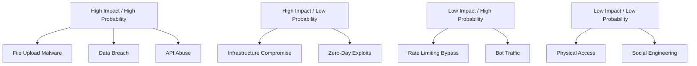

# Security Architecture Enhancement

## Overview

This document outlines a comprehensive security architecture enhancement strategy for WebTools Pro, designed to protect user data, prevent security vulnerabilities, and ensure compliance with industry standards. The architecture addresses the unique security challenges of a file processing platform handling sensitive user documents.

## 1. Security Threat Landscape Analysis

### Platform-Specific Threats
1. **File Upload Vulnerabilities**: Malicious file uploads, file type spoofing, zip bombs
2. **Data Exposure**: Sensitive document content, user personal information
3. **Processing Pipeline Attacks**: Code injection through document processing
4. **API Security**: Rate limiting bypass, authentication vulnerabilities
5. **Infrastructure Attacks**: Server compromise, network intrusion
6. **Client-Side Attacks**: XSS, CSRF, clickjacking

### Risk Assessment Matrix


## 2. Zero-Trust Security Architecture

### Core Principles Implementation

#### 1. Never Trust, Always Verify
```typescript
// Authentication middleware with continuous verification
export class ZeroTrustMiddleware {
  async verifyRequest(req: Request): Promise<SecurityContext> {
    const context: SecurityContext = {
      user: null,
      permissions: [],
      riskScore: 0,
      deviceFingerprint: null,
      geolocation: null
    }
    
    // Multi-factor authentication verification
    const authResult = await this.verifyAuthentication(req)
    if (!authResult.valid) {
      throw new UnauthorizedError('Authentication failed')
    }
    
    // Device fingerprinting and behavioral analysis
    const deviceContext = await this.analyzeDeviceContext(req)
    context.deviceFingerprint = deviceContext.fingerprint
    context.riskScore = deviceContext.riskScore
    
    // Geolocation and IP reputation check
    const geoContext = await this.verifyGeolocation(req)
    if (geoContext.isHighRisk) {
      context.riskScore += 50
    }
    
    // Dynamic permission evaluation
    context.permissions = await this.evaluatePermissions(
      authResult.user,
      context.riskScore
    )
    
    return context
  }
  
  private async evaluatePermissions(
    user: User,
    riskScore: number
  ): Promise<Permission[]> {
    let permissions = user.basePermissions
    
    // Reduce permissions for high-risk contexts
    if (riskScore > 70) {
      permissions = permissions.filter(p => p.level !== 'admin')
    }
    
    if (riskScore > 90) {
      permissions = permissions.filter(p => p.level === 'read')
    }
    
    return permissions
  }
}
```

#### 2. Least Privilege Access Control
```typescript
// Role-based access control with dynamic permissions
interface SecurityPolicy {
  resource: string
  action: string
  conditions: Condition[]
}

export class AccessControlManager {
  async evaluateAccess(
    context: SecurityContext,
    resource: string,
    action: string
  ): Promise<AccessDecision> {
    const policies = await this.getPoliciesForUser(context.user)
    
    for (const policy of policies) {
      if (this.matchesResource(policy.resource, resource) &&
          this.matchesAction(policy.action, action)) {
        
        const conditionResult = await this.evaluateConditions(
          policy.conditions,
          context
        )
        
        if (conditionResult.allow) {
          return {
            allow: true,
            permissions: conditionResult.permissions,
            auditLog: this.createAuditEntry(context, policy, 'ALLOW')
          }
        }
      }
    }
    
    return {
      allow: false,
      reason: 'No matching policy found',
      auditLog: this.createAuditEntry(context, null, 'DENY')
    }
  }
  
  private async evaluateConditions(
    conditions: Condition[],
    context: SecurityContext
  ): Promise<ConditionResult> {
    for (const condition of conditions) {
      switch (condition.type) {
        case 'time_of_day':
          if (!this.isWithinTimeWindow(condition.value)) {
            return { allow: false, reason: 'Outside allowed time window' }
          }
          break
          
        case 'risk_score':
          if (context.riskScore > condition.threshold) {
            return { allow: false, reason: 'Risk score too high' }
          }
          break
          
        case 'file_size':
          if (condition.fileSize > condition.maxSize) {
            return { allow: false, reason: 'File size exceeds limit' }
          }
          break
      }
    }
    
    return { allow: true, permissions: condition.permissions }
  }
}
```

## 3. File Processing Security

### Secure File Upload Pipeline
```typescript
// Multi-layer file validation and sanitization
export class SecureFileProcessor {
  private readonly maxFileSize = 100 * 1024 * 1024 // 100MB
  private readonly allowedMimeTypes = new Set([
    'application/pdf',
    'image/jpeg',
    'image/png',
    'image/webp',
    'text/plain',
    'application/msword',
    'application/vnd.openxmlformats-officedocument.wordprocessingml.document'
  ])
  
  async processUpload(
    file: File,
    context: SecurityContext
  ): Promise<ProcessedFile> {
    // Phase 1: Basic validation
    await this.validateFileBasics(file)
    
    // Phase 2: Deep content inspection
    const scanResult = await this.performDeepScan(file)
    
    // Phase 3: Sandboxed processing
    const processedFile = await this.processInSandbox(file, scanResult)
    
    // Phase 4: Output sanitization
    const sanitizedFile = await this.sanitizeOutput(processedFile)
    
    // Phase 5: Audit logging
    await this.logProcessingEvent(file, context, sanitizedFile)
    
    return sanitizedFile
  }
  
  private async validateFileBasics(file: File): Promise<void> {
    // File size check
    if (file.size > this.maxFileSize) {
      throw new ValidationError('File size exceeds maximum limit')
    }
    
    // MIME type validation
    const detectedMimeType = await this.detectMimeType(file)
    if (!this.allowedMimeTypes.has(detectedMimeType)) {
      throw new ValidationError('File type not allowed')
    }
    
    // File name sanitization
    const sanitizedName = this.sanitizeFileName(file.name)
    if (sanitizedName !== file.name) {
      throw new ValidationError('Invalid characters in filename')
    }
  }
  
  private async performDeepScan(file: File): Promise<ScanResult> {
    const results: ScanResult = {
      isMalicious: false,
      threats: [],
      metadata: {},
      extractedText: ''
    }
    
    // Magic number verification
    const actualType = await this.verifyMagicNumbers(file)
    if (actualType !== file.type) {
      results.threats.push('MIME type spoofing detected')
    }
    
    // Embedded content analysis
    const embeddedContent = await this.analyzeEmbeddedContent(file)
    if (embeddedContent.hasExecutableCode) {
      results.threats.push('Executable content detected')
      results.isMalicious = true
    }
    
    // Metadata extraction and sanitization
    results.metadata = await this.extractAndSanitizeMetadata(file)
    
    // Content extraction for text analysis
    results.extractedText = await this.extractTextContent(file)
    
    // Pattern matching for suspicious content
    const suspiciousPatterns = await this.scanForSuspiciousPatterns(
      results.extractedText
    )
    
    if (suspiciousPatterns.length > 0) {
      results.threats.push(...suspiciousPatterns)
    }
    
    return results
  }
  
  private async processInSandbox(
    file: File,
    scanResult: ScanResult
  ): Promise<ProcessedFile> {
    // Create isolated processing environment
    const sandbox = await this.createSandbox()
    
    try {
      // Process file in isolated environment
      const result = await sandbox.process(file, {
        timeout: 30000, // 30 second timeout
        memoryLimit: '512MB',
        networkAccess: false,
        fileSystemAccess: 'read-only'
      })
      
      return result
    } catch (error) {
      await this.logSandboxError(file, error)
      throw new ProcessingError('File processing failed in sandbox')
    } finally {
      await sandbox.cleanup()
    }
  }
}
```

### Content Security Policy (CSP) Implementation
```typescript
// Comprehensive CSP configuration
export const securityHeaders = {
  'Content-Security-Policy': [
    "default-src 'self'",
    "script-src 'self' 'unsafe-inline' 'unsafe-eval' https://cdn.jsdelivr.net",
    "style-src 'self' 'unsafe-inline' https://fonts.googleapis.com",
    "font-src 'self' https://fonts.gstatic.com",
    "img-src 'self' data: blob: https:",
    "media-src 'self' blob:",
    "object-src 'none'",
    "base-uri 'self'",
    "form-action 'self'",
    "frame-ancestors 'none'",
    "upgrade-insecure-requests"
  ].join('; '),
  
  'X-Content-Type-Options': 'nosniff',
  'X-Frame-Options': 'DENY',
  'X-XSS-Protection': '1; mode=block',
  'Referrer-Policy': 'strict-origin-when-cross-origin',
  'Permissions-Policy': [
    'accelerometer=()',
    'camera=()',
    'geolocation=()',
    'gyroscope=()',
    'magnetometer=()',
    'microphone=()',
    'payment=()',
    'usb=()'
  ].join(', ')
}
```

## 4. Data Protection & Privacy

### Encryption at Rest and in Transit
```typescript
// End-to-end encryption implementation
export class EncryptionManager {
  private readonly algorithm = 'aes-256-gcm'
  private readonly keyDerivation = 'pbkdf2'
  
  async encryptFile(
    file: Buffer,
    userKey: string
  ): Promise<EncryptedFile> {
    // Generate unique salt and IV
    const salt = crypto.randomBytes(32)
    const iv = crypto.randomBytes(16)
    
    // Derive encryption key from user key
    const derivedKey = await this.deriveKey(userKey, salt)
    
    // Encrypt file content
    const cipher = crypto.createCipher(this.algorithm, derivedKey, iv)
    const encrypted = Buffer.concat([
      cipher.update(file),
      cipher.final()
    ])
    
    // Get authentication tag
    const authTag = cipher.getAuthTag()
    
    return {
      encryptedData: encrypted,
      salt: salt.toString('base64'),
      iv: iv.toString('base64'),
      authTag: authTag.toString('base64'),
      algorithm: this.algorithm
    }
  }
  
  async decryptFile(
    encryptedFile: EncryptedFile,
    userKey: string
  ): Promise<Buffer> {
    // Reconstruct encryption components
    const salt = Buffer.from(encryptedFile.salt, 'base64')
    const iv = Buffer.from(encryptedFile.iv, 'base64')
    const authTag = Buffer.from(encryptedFile.authTag, 'base64')
    
    // Derive the same key
    const derivedKey = await this.deriveKey(userKey, salt)
    
    // Decrypt file content
    const decipher = crypto.createDecipher(this.algorithm, derivedKey, iv)
    decipher.setAuthTag(authTag)
    
    try {
      const decrypted = Buffer.concat([
        decipher.update(encryptedFile.encryptedData),
        decipher.final()
      ])
      
      return decrypted
    } catch (error) {
      throw new DecryptionError('Failed to decrypt file - invalid key or corrupted data')
    }
  }
  
  private async deriveKey(userKey: string, salt: Buffer): Promise<Buffer> {
    return new Promise((resolve, reject) => {
      crypto.pbkdf2(userKey, salt, 100000, 32, 'sha256', (err, derivedKey) => {
        if (err) reject(err)
        else resolve(derivedKey)
      })
    })
  }
}
```

### Data Retention and Deletion
```typescript
// Automated data lifecycle management
export class DataLifecycleManager {
  private readonly retentionPolicies = new Map([
    ['processed_files', { days: 7, autoDelete: true }],
    ['user_sessions', { days: 30, autoDelete: true }],
    ['audit_logs', { days: 2555, autoDelete: false }], // 7 years
    ['error_logs', { days: 90, autoDelete: true }]
  ])
  
  async scheduleDataCleanup(): Promise<void> {
    // Run cleanup every 24 hours
    setInterval(async () => {
      await this.performCleanup()
    }, 24 * 60 * 60 * 1000)
  }
  
  private async performCleanup(): Promise<void> {
    for (const [dataType, policy] of this.retentionPolicies) {
      if (policy.autoDelete) {
        await this.deleteExpiredData(dataType, policy.days)
      }
    }
  }
  
  private async deleteExpiredData(
    dataType: string,
    retentionDays: number
  ): Promise<void> {
    const cutoffDate = new Date()
    cutoffDate.setDate(cutoffDate.getDate() - retentionDays)
    
    switch (dataType) {
      case 'processed_files':
        await this.secureDeleteFiles(cutoffDate)
        break
      case 'user_sessions':
        await this.cleanupExpiredSessions(cutoffDate)
        break
      case 'error_logs':
        await this.archiveErrorLogs(cutoffDate)
        break
    }
  }
  
  private async secureDeleteFiles(cutoffDate: Date): Promise<void> {
    const expiredFiles = await this.findExpiredFiles(cutoffDate)
    
    for (const file of expiredFiles) {
      // Cryptographic erasure - delete encryption keys
      await this.deleteEncryptionKeys(file.keyId)
      
      // Secure file deletion with multiple overwrites
      await this.secureFileErase(file.path)
      
      // Remove database references
      await this.removeFileRecord(file.id)
      
      // Log deletion for audit
      await this.logSecureDeletion(file)
    }
  }
}
```

## 5. API Security Implementation

### Rate Limiting and DDoS Protection
```typescript
// Advanced rate limiting with adaptive thresholds
export class RateLimitManager {
  private readonly redis: Redis
  private readonly baseLimits = {
    anonymous: { requests: 10, window: 60 }, // 10 requests per minute
    authenticated: { requests: 100, window: 60 }, // 100 requests per minute
    premium: { requests: 1000, window: 60 } // 1000 requests per minute
  }
  
  async checkRateLimit(
    identifier: string,
    userTier: string,
    endpoint: string
  ): Promise<RateLimitResult> {
    const key = `rate_limit:${identifier}:${endpoint}`
    const limit = this.baseLimits[userTier] || this.baseLimits.anonymous
    
    // Get current usage
    const current = await this.redis.get(key)
    const requests = current ? parseInt(current) : 0
    
    // Apply adaptive thresholds based on system load
    const adaptedLimit = await this.adaptLimitToSystemLoad(limit)
    
    if (requests >= adaptedLimit.requests) {
      // Apply progressive penalties for repeat offenders
      const penaltyMultiplier = await this.calculatePenalty(identifier)
      const penaltyDuration = limit.window * penaltyMultiplier
      
      await this.redis.setex(
        `penalty:${identifier}`,
        penaltyDuration,
        penaltyMultiplier.toString()
      )
      
      return {
        allowed: false,
        remaining: 0,
        resetTime: Date.now() + (penaltyDuration * 1000),
        penaltyApplied: true
      }
    }
    
    // Increment counter
    await this.redis.multi()
      .incr(key)
      .expire(key, limit.window)
      .exec()
    
    return {
      allowed: true,
      remaining: adaptedLimit.requests - requests - 1,
      resetTime: Date.now() + (limit.window * 1000),
      penaltyApplied: false
    }
  }
  
  private async adaptLimitToSystemLoad(
    baseLimit: RateLimit
  ): Promise<RateLimit> {
    const systemLoad = await this.getSystemLoad()
    
    // Reduce limits during high load
    if (systemLoad > 0.8) {
      return {
        requests: Math.floor(baseLimit.requests * 0.5),
        window: baseLimit.window
      }
    } else if (systemLoad > 0.6) {
      return {
        requests: Math.floor(baseLimit.requests * 0.75),
        window: baseLimit.window
      }
    }
    
    return baseLimit
  }
}
```

### JWT Security Enhancement
```typescript
// Secure JWT implementation with rotation and validation
export class JWTSecurityManager {
  private readonly keyRotationInterval = 24 * 60 * 60 * 1000 // 24 hours
  private readonly maxTokenAge = 15 * 60 * 1000 // 15 minutes
  private readonly refreshTokenAge = 7 * 24 * 60 * 60 * 1000 // 7 days
  
  async generateTokenPair(
    user: User,
    context: SecurityContext
  ): Promise<TokenPair> {
    const currentKey = await this.getCurrentSigningKey()
    
    // Generate access token with short expiry
    const accessToken = jwt.sign(
      {
        sub: user.id,
        iat: Math.floor(Date.now() / 1000),
        exp: Math.floor((Date.now() + this.maxTokenAge) / 1000),
        scope: user.permissions.join(' '),
        jti: crypto.randomUUID(), // Unique token ID
        device: context.deviceFingerprint,
        risk: context.riskScore
      },
      currentKey.private,
      {
        algorithm: 'RS256',
        keyid: currentKey.id,
        issuer: 'webtools-pro',
        audience: 'webtools-pro-api'
      }
    )
    
    // Generate refresh token with longer expiry
    const refreshToken = await this.generateRefreshToken(user, context)
    
    return { accessToken, refreshToken }
  }
  
  async validateToken(token: string): Promise<TokenValidationResult> {
    try {
      // Decode header to get key ID
      const decoded = jwt.decode(token, { complete: true })
      if (!decoded || typeof decoded === 'string') {
        throw new Error('Invalid token format')
      }
      
      // Get the appropriate public key
      const key = await this.getPublicKey(decoded.header.kid)
      if (!key) {
        throw new Error('Unknown signing key')
      }
      
      // Verify token signature and claims
      const payload = jwt.verify(token, key, {
        algorithms: ['RS256'],
        issuer: 'webtools-pro',
        audience: 'webtools-pro-api'
      }) as JWTPayload
      
      // Check if token is revoked
      const isRevoked = await this.isTokenRevoked(payload.jti)
      if (isRevoked) {
        throw new Error('Token has been revoked')
      }
      
      // Validate device fingerprint if present
      if (payload.device) {
        const isValidDevice = await this.validateDevice(
          payload.sub,
          payload.device
        )
        if (!isValidDevice) {
          throw new Error('Device fingerprint mismatch')
        }
      }
      
      return {
        valid: true,
        payload,
        user: await this.getUserById(payload.sub)
      }
    } catch (error) {
      return {
        valid: false,
        error: error.message
      }
    }
  }
  
  async revokeToken(tokenId: string, reason: string): Promise<void> {
    // Add token to revocation list
    await this.redis.setex(
      `revoked_token:${tokenId}`,
      this.maxTokenAge / 1000,
      JSON.stringify({ reason, revokedAt: Date.now() })
    )
    
    // Log revocation for audit
    await this.auditLogger.log({
      event: 'token_revoked',
      tokenId,
      reason,
      timestamp: new Date()
    })
  }
}
```

## 6. Infrastructure Security

### Container Security
```dockerfile
# Secure Dockerfile configuration
FROM node:20-alpine AS base

# Create non-root user
RUN addgroup -g 1001 -S nodejs && \
    adduser -S nextjs -u 1001

# Install security updates
RUN apk update && apk upgrade && \
    apk add --no-cache dumb-init && \
    rm -rf /var/cache/apk/*

# Set security-focused environment
ENV NODE_ENV=production
ENV NEXT_TELEMETRY_DISABLED=1

WORKDIR /app

# Copy package files with proper ownership
COPY --chown=nextjs:nodejs package*.json ./

# Install dependencies with security audit
RUN npm ci --only=production && \
    npm audit fix && \
    npm cache clean --force

# Copy application code
COPY --chown=nextjs:nodejs . .

# Remove unnecessary files and set permissions
RUN rm -rf .git .gitignore README.md && \
    chmod -R 755 /app && \
    chmod 500 /app/next.config.js

# Use non-root user
USER nextjs

# Expose port (non-privileged)
EXPOSE 3000

# Use dumb-init for proper signal handling
ENTRYPOINT ["dumb-init", "--"]
CMD ["npm", "start"]

# Health check
HEALTHCHECK --interval=30s --timeout=10s --start-period=5s --retries=3 \
    CMD node healthcheck.js
```

### Network Security Configuration
```yaml
# Kubernetes network policies
apiVersion: networking.k8s.io/v1
kind: NetworkPolicy
metadata:
  name: webtools-network-policy
spec:
  podSelector:
    matchLabels:
      app: webtools-pro
  policyTypes:
  - Ingress
  - Egress
  ingress:
  - from:
    - namespaceSelector:
        matchLabels:
          name: ingress-nginx
    ports:
    - protocol: TCP
      port: 3000
  egress:
  - to:
    - namespaceSelector:
        matchLabels:
          name: database
    ports:
    - protocol: TCP
      port: 5432
  - to: []
    ports:
    - protocol: TCP
      port: 443 # HTTPS only
```

## 7. Security Monitoring & Incident Response

### Real-time Security Monitoring
```typescript
// Security event monitoring and alerting
export class SecurityMonitor {
  private readonly alertThresholds = {
    failedLogins: { count: 5, window: 300 }, // 5 failed logins in 5 minutes
    suspiciousFiles: { count: 3, window: 600 }, // 3 suspicious files in 10 minutes
    apiAbuse: { count: 100, window: 60 }, // 100 requests per minute
    dataExfiltration: { bytes: 100 * 1024 * 1024, window: 3600 } // 100MB in 1 hour
  }
  
  async monitorSecurityEvents(): Promise<void> {
    // Monitor failed authentication attempts
    this.monitorFailedLogins()
    
    // Monitor suspicious file uploads
    this.monitorSuspiciousFiles()
    
    // Monitor API abuse patterns
    this.monitorAPIAbuse()
    
    // Monitor potential data exfiltration
    this.monitorDataExfiltration()
  }
  
  private async monitorFailedLogins(): Promise<void> {
    const recentFailures = await this.getRecentFailedLogins(
      this.alertThresholds.failedLogins.window
    )
    
    // Group by IP address
    const failuresByIP = this.groupBy(recentFailures, 'ipAddress')
    
    for (const [ip, failures] of Object.entries(failuresByIP)) {
      if (failures.length >= this.alertThresholds.failedLogins.count) {
        await this.triggerSecurityAlert({
          type: 'brute_force_attempt',
          severity: 'high',
          source: ip,
          details: {
            attemptCount: failures.length,
            timeWindow: this.alertThresholds.failedLogins.window,
            targetAccounts: failures.map(f => f.username)
          }
        })
        
        // Automatically block IP for 24 hours
        await this.blockIP(ip, 24 * 60 * 60)
      }
    }
  }
  
  private async triggerSecurityAlert(alert: SecurityAlert): Promise<void> {
    // Log to security information and event management (SIEM)
    await this.siemLogger.log(alert)
    
    // Send notification to security team
    await this.notificationService.sendSecurityAlert(alert)
    
    // Execute automated response if configured
    if (alert.severity === 'critical') {
      await this.executeIncidentResponse(alert)
    }
  }
  
  private async executeIncidentResponse(alert: SecurityAlert): Promise<void> {
    switch (alert.type) {
      case 'data_breach_suspected':
        // Immediately lock down affected systems
        await this.emergencyLockdown(alert.details.affectedSystems)
        break
        
      case 'malware_detected':
        // Quarantine affected files and systems
        await this.quarantineFiles(alert.details.files)
        await this.isolateSystem(alert.details.system)
        break
        
      case 'unauthorized_access':
        // Revoke all tokens for affected user
        await this.revokeAllUserTokens(alert.details.userId)
        // Force password reset
        await this.forcePasswordReset(alert.details.userId)
        break
    }
  }
}
```

## 8. Compliance & Audit Framework

### GDPR Compliance Implementation
```typescript
// GDPR compliance management
export class GDPRComplianceManager {
  async handleDataSubjectRequest(
    request: DataSubjectRequest
  ): Promise<ComplianceResponse> {
    switch (request.type) {
      case 'access':
        return await this.handleAccessRequest(request)
      case 'rectification':
        return await this.handleRectificationRequest(request)
      case 'erasure':
        return await this.handleErasureRequest(request)
      case 'portability':
        return await this.handlePortabilityRequest(request)
      case 'restriction':
        return await this.handleRestrictionRequest(request)
      case 'objection':
        return await this.handleObjectionRequest(request)
    }
  }
  
  private async handleErasureRequest(
    request: DataSubjectRequest
  ): Promise<ComplianceResponse> {
    // Verify identity
    const identityVerified = await this.verifyDataSubjectIdentity(request)
    if (!identityVerified) {
      throw new ComplianceError('Identity verification failed')
    }
    
    // Check for legal basis to retain data
    const retentionRequirements = await this.checkRetentionRequirements(
      request.subjectId
    )
    
    if (retentionRequirements.mustRetain) {
      return {
        status: 'denied',
        reason: retentionRequirements.legalBasis,
        retentionPeriod: retentionRequirements.period
      }
    }
    
    // Execute data erasure
    const erasureResult = await this.executeDataErasure(request.subjectId)
    
    // Log compliance action
    await this.logComplianceAction({
      type: 'data_erasure',
      subjectId: request.subjectId,
      requestId: request.id,
      executedAt: new Date(),
      result: erasureResult
    })
    
    return {
      status: 'completed',
      details: erasureResult,
      completedAt: new Date()
    }
  }
}
```

## 9. Implementation Roadmap

### Phase 1: Foundation Security (Weeks 1-2)
- [ ] Implement zero-trust authentication middleware
- [ ] Deploy comprehensive input validation
- [ ] Set up secure file processing pipeline
- [ ] Configure security headers and CSP
- [ ] Implement rate limiting and DDoS protection

### Phase 2: Data Protection (Weeks 3-4)
- [ ] Deploy end-to-end encryption system
- [ ] Implement data lifecycle management
- [ ] Set up secure backup and recovery
- [ ] Configure audit logging infrastructure
- [ ] Deploy GDPR compliance framework

### Phase 3: Advanced Security (Weeks 5-6)
- [ ] Implement behavioral analysis and anomaly detection
- [ ] Deploy real-time security monitoring
- [ ] Set up incident response automation
- [ ] Configure vulnerability scanning
- [ ] Implement threat intelligence integration

### Phase 4: Compliance & Hardening (Weeks 7-8)
- [ ] Complete security audit and penetration testing
- [ ] Finalize compliance documentation
- [ ] Deploy security awareness training
- [ ] Set up continuous security monitoring
- [ ] Establish security governance framework

## 10. Success Metrics

### Security KPIs
- **Incident Response Time**: < 15 minutes for critical alerts
- **Vulnerability Patching**: 100% critical vulnerabilities patched within 24 hours
- **Security Compliance Score**: > 95% across all frameworks
- **False Positive Rate**: < 5% for security alerts
- **Data Breach Prevention**: 0 successful data breaches

### Technical Metrics
- **Authentication Success Rate**: > 99.9%
- **File Processing Security**: 100% files scanned and validated
- **API Security Coverage**: 100% endpoints protected
- **Encryption Coverage**: 100% data encrypted at rest and in transit
- **Access Control Effectiveness**: 100% unauthorized access attempts blocked

## Conclusion

This security architecture enhancement provides comprehensive protection for WebTools Pro, addressing the unique challenges of a file processing platform while maintaining usability and performance. The multi-layered approach ensures defense in depth, while automated monitoring and response capabilities provide rapid threat detection and mitigation.

The implementation roadmap delivers security improvements incrementally, allowing for thorough testing and validation at each phase while minimizing disruption to existing functionality.
