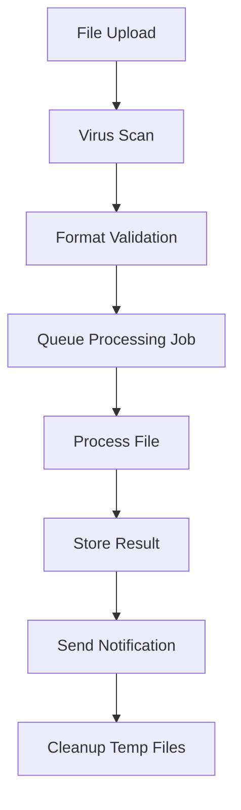

# Technical Architecture Design

## Executive Summary

Our technical architecture employs a modern microservices approach optimized for file processing, AI integration, and scalability. Built on Next.js with Node.js backend services, the system supports 200+ tools while maintaining sub-3-second processing times and enterprise-grade security.

**Architecture Principles:**
- **Microservices**: Independently deployable, scalable services
- **Event-Driven**: Asynchronous processing with message queues
- **Cloud-Native**: Containerized deployment with auto-scaling
- **Security-First**: Zero-trust architecture with end-to-end encryption
- **AI-Ready**: Integrated AI services with intelligent optimization

## System Architecture Overview

### High-Level Architecture
```
┌─────────────────┐    ┌──────────────────┐    ┌─────────────────┐
│   Frontend      │    │   API Gateway    │    │   Load Balancer │
│   (Next.js)     │◄──►│   (Kong/Nginx)   │◄──►│   (Nginx)       │
└─────────────────┘    └──────────────────┘    └─────────────────┘
                                │
                ┌───────────────┼───────────────┐
                │               │               │
        ┌───────▼──────┐ ┌──────▼──────┐ ┌─────▼──────┐
        │ Auth Service │ │File Service │ │ AI Service │
        │ (Node.js)    │ │ (Node.js)   │ │ (Python)   │
        └──────────────┘ └─────────────┘ └────────────┘
                │               │               │
        ┌───────▼──────┐ ┌──────▼──────┐ ┌─────▼──────┐
        │  PostgreSQL  │ │   AWS S3    │ │  Redis     │
        │  (Users)     │ │  (Files)    │ │  (Cache)   │
        └──────────────┘ └─────────────┘ └────────────┘
```

### Core Services Architecture

#### 1. Frontend Layer (Next.js 15)
```typescript
// API Route Structure
/api/
├── auth/           // Authentication endpoints
├── files/          // File upload/download
├── tools/          // Tool-specific processing
├── ai/             // AI service integration
└── webhooks/       // External service callbacks
```

**Features:**
- Server-side rendering for SEO optimization
- API routes for backend integration
- Real-time updates via WebSockets
- Progressive Web App capabilities

#### 2. API Gateway (Kong/Nginx)
**Responsibilities:**
- Request routing and load balancing
- Rate limiting (1000 req/min per user)
- Authentication token validation
- Request/response transformation
- API versioning (v1, v2)

**Configuration:**
```yaml
# Kong Gateway Config
services:
  - name: file-service
    url: http://file-service:3001
    plugins:
      - name: rate-limiting
        config:
          minute: 1000
      - name: jwt
        config:
          secret_is_base64: false
```

#### 3. Authentication Service
**Technology Stack:**
- Node.js with Express.js
- JWT with refresh token rotation
- Argon2 password hashing
- OAuth2 integration (Google, GitHub)

**Database Schema:**
```sql
-- Users table
CREATE TABLE users (
  id UUID PRIMARY KEY DEFAULT gen_random_uuid(),
  email VARCHAR(255) UNIQUE NOT NULL,
  password_hash VARCHAR(255),
  created_at TIMESTAMP DEFAULT NOW(),
  last_login TIMESTAMP,
  subscription_tier VARCHAR(50) DEFAULT 'free'
);

-- Sessions table
CREATE TABLE user_sessions (
  id UUID PRIMARY KEY DEFAULT gen_random_uuid(),
  user_id UUID REFERENCES users(id),
  refresh_token VARCHAR(255),
  expires_at TIMESTAMP,
  created_at TIMESTAMP DEFAULT NOW()
);
```

#### 4. File Processing Service
**Technology Stack:**
- Node.js with Fastify (high performance)
- Multer for file uploads
- Sharp for image processing
- pdf-lib for PDF manipulation
- FFmpeg for video processing

**Processing Pipeline:**
```typescript
interface FileProcessingPipeline {
  upload: (file: File) => Promise<UploadResult>;
  validate: (file: FileMetadata) => Promise<ValidationResult>;
  process: (file: FileMetadata, options: ProcessingOptions) => Promise<ProcessedFile>;
  store: (file: ProcessedFile) => Promise<StorageResult>;
  cleanup: (tempFiles: string[]) => Promise<void>;
}
```

**Supported Operations:**
- **PDF**: Merge, split, compress, convert, OCR, watermark
- **Images**: Resize, convert, compress, background removal, enhancement
- **Videos**: Convert, compress, trim, extract audio/thumbnails
- **Documents**: Convert between formats (DOCX, PDF, TXT, RTF)

## Database Design

### Primary Database (PostgreSQL)
```sql
-- File metadata
CREATE TABLE files (
  id UUID PRIMARY KEY DEFAULT gen_random_uuid(),
  user_id UUID REFERENCES users(id),
  original_name VARCHAR(255) NOT NULL,
  file_type VARCHAR(50) NOT NULL,
  file_size BIGINT NOT NULL,
  storage_path VARCHAR(500) NOT NULL,
  processing_status VARCHAR(50) DEFAULT 'pending',
  created_at TIMESTAMP DEFAULT NOW(),
  expires_at TIMESTAMP,
  INDEX idx_user_files (user_id, created_at),
  INDEX idx_processing_status (processing_status)
);

-- Processing jobs
CREATE TABLE processing_jobs (
  id UUID PRIMARY KEY DEFAULT gen_random_uuid(),
  file_id UUID REFERENCES files(id),
  tool_type VARCHAR(100) NOT NULL,
  parameters JSONB,
  status VARCHAR(50) DEFAULT 'queued',
  progress INTEGER DEFAULT 0,
  error_message TEXT,
  started_at TIMESTAMP,
  completed_at TIMESTAMP,
  created_at TIMESTAMP DEFAULT NOW()
);

-- User analytics
CREATE TABLE user_analytics (
  id UUID PRIMARY KEY DEFAULT gen_random_uuid(),
  user_id UUID REFERENCES users(id),
  tool_used VARCHAR(100) NOT NULL,
  file_size BIGINT,
  processing_time_ms INTEGER,
  success BOOLEAN,
  created_at TIMESTAMP DEFAULT NOW()
);
```

### Caching Layer (Redis)
```typescript
// Cache structure
interface CacheStructure {
  'user:sessions:{userId}': UserSession;
  'file:metadata:{fileId}': FileMetadata;
  'processing:queue': ProcessingJob[];
  'rate_limit:{userId}': number;
  'ai:responses:{hash}': AIResponse;
}
```

**Cache Strategies:**
- User sessions: 24-hour TTL
- File metadata: 1-hour TTL
- AI responses: 7-day TTL for common queries
- Rate limiting: Sliding window counters

## File Storage Strategy

### AWS S3 Configuration
```typescript
// S3 bucket structure
const bucketStructure = {
  'user-uploads': {
    encryption: 'AES256',
    lifecycle: '30 days → Glacier',
    versioning: true,
    publicAccess: false
  },
  'processed-files': {
    encryption: 'KMS',
    lifecycle: '7 days → delete',
    versioning: false,
    publicAccess: false
  },
  'ai-training-data': {
    encryption: 'KMS',
    lifecycle: 'permanent',
    versioning: true,
    publicAccess: false
  }
};
```

**Security Measures:**
- Pre-signed URLs for secure uploads (15-minute expiry)
- Server-side encryption with AWS KMS
- Bucket policies blocking public access
- CloudTrail logging for all operations
- Cross-region replication for disaster recovery

### File Processing Workflow


## AI Service Integration

### AI Service Architecture
```typescript
interface AIServiceConfig {
  openai: {
    apiKey: string;
    model: 'gpt-4-turbo';
    maxTokens: 4096;
    temperature: 0.7;
  };
  anthropic: {
    apiKey: string;
    model: 'claude-3-sonnet';
    maxTokens: 4096;
  };
  stability: {
    apiKey: string;
    model: 'stable-diffusion-xl';
  };
}
```

**AI Integration Points:**
1. **Document Analysis**: Content extraction, summarization, classification
2. **Image Enhancement**: Background removal, upscaling, style transfer
3. **Smart Recommendations**: Tool suggestions based on file content
4. **Quality Optimization**: Automatic compression and format selection
5. **Content Moderation**: Inappropriate content detection

### AI Security & Privacy
- API keys stored in AWS Secrets Manager
- Request/response logging with PII redaction
- Content filtering before AI processing
- Usage monitoring and cost controls
- Data retention policies (24-hour max for AI processing)

## Scalability Planning

### Horizontal Scaling Strategy
```yaml
# Kubernetes deployment
apiVersion: apps/v1
kind: Deployment
metadata:
  name: file-service
spec:
  replicas: 3
  selector:
    matchLabels:
      app: file-service
  template:
    spec:
      containers:
      - name: file-service
        image: file-service:latest
        resources:
          requests:
            memory: "512Mi"
            cpu: "250m"
          limits:
            memory: "1Gi"
            cpu: "500m"
        env:
        - name: DATABASE_URL
          valueFrom:
            secretKeyRef:
              name: db-secret
              key: url
```

**Auto-scaling Triggers:**
- CPU utilization > 70%
- Memory utilization > 80%
- Queue depth > 100 jobs
- Response time > 3 seconds

### Performance Optimization
- **Connection Pooling**: PostgreSQL (max 20 connections per service)
- **CDN Integration**: CloudFront for static assets and processed files
- **Compression**: Gzip/Brotli for API responses
- **Lazy Loading**: On-demand service initialization
- **Circuit Breakers**: Prevent cascade failures

## Security Implementation

### Zero-Trust Architecture
```typescript
// Security middleware
const securityMiddleware = {
  helmet: {
    contentSecurityPolicy: {
      directives: {
        defaultSrc: ["'self'"],
        scriptSrc: ["'self'", "'unsafe-inline'"],
        styleSrc: ["'self'", "'unsafe-inline'"],
        imgSrc: ["'self'", "data:", "https:"],
      },
    },
  },
  cors: {
    origin: process.env.ALLOWED_ORIGINS?.split(','),
    credentials: true,
  },
  rateLimit: {
    windowMs: 15 * 60 * 1000, // 15 minutes
    max: 1000, // limit each IP to 1000 requests per windowMs
  },
};
```

**Security Layers:**
1. **Network**: VPC with private subnets, WAF protection
2. **Application**: Input validation, SQL injection prevention
3. **Data**: Encryption at rest and in transit
4. **Access**: RBAC with principle of least privilege
5. **Monitoring**: Real-time threat detection with AWS GuardDuty

### Compliance & Auditing
- **GDPR**: Data portability and deletion capabilities
- **SOC 2**: Audit logging and access controls
- **HIPAA**: PHI handling for healthcare documents
- **PCI DSS**: Secure payment processing integration

## Monitoring & Observability

### Metrics Collection
```typescript
// Prometheus metrics
const metrics = {
  fileProcessingDuration: new Histogram({
    name: 'file_processing_duration_seconds',
    help: 'Duration of file processing operations',
    labelNames: ['tool_type', 'file_size_category'],
  }),
  apiRequestsTotal: new Counter({
    name: 'api_requests_total',
    help: 'Total number of API requests',
    labelNames: ['method', 'route', 'status_code'],
  }),
  activeUsers: new Gauge({
    name: 'active_users',
    help: 'Number of active users',
  }),
};
```

**Monitoring Stack:**
- **Metrics**: Prometheus + Grafana
- **Logging**: ELK Stack (Elasticsearch, Logstash, Kibana)
- **Tracing**: Jaeger for distributed tracing
- **Alerting**: PagerDuty integration for critical issues

### Health Checks
```typescript
// Health check endpoints
app.get('/health', (req, res) => {
  const health = {
    status: 'healthy',
    timestamp: new Date().toISOString(),
    services: {
      database: checkDatabaseConnection(),
      redis: checkRedisConnection(),
      s3: checkS3Connection(),
      ai_services: checkAIServices(),
    },
  };
  res.json(health);
});
```

## Deployment Strategy

### CI/CD Pipeline
```yaml
# GitHub Actions workflow
name: Deploy to Production
on:
  push:
    branches: [main]
jobs:
  test:
    runs-on: ubuntu-latest
    steps:
      - uses: actions/checkout@v3
      - name: Run tests
        run: npm test
      - name: Security scan
        run: npm audit
  
  deploy:
    needs: test
    runs-on: ubuntu-latest
    steps:
      - name: Deploy to Kubernetes
        run: kubectl apply -f k8s/
      - name: Health check
        run: ./scripts/health-check.sh
```

**Deployment Environments:**
- **Development**: Feature branches, auto-deployed
- **Staging**: Main branch, manual promotion
- **Production**: Tagged releases, blue-green deployment

## Performance Targets

### Service Level Objectives (SLOs)
- **Availability**: 99.9% uptime (8.76 hours downtime/year)
- **Response Time**: 95% of requests < 2 seconds
- **File Processing**: 99% of files processed < 30 seconds
- **Error Rate**: < 0.1% of requests result in 5xx errors

### Capacity Planning
- **Concurrent Users**: 10,000 active users
- **File Processing**: 1,000 files/minute peak capacity
- **Storage**: 100TB initial capacity with auto-scaling
- **Bandwidth**: 10Gbps with CDN acceleration

## Conclusion

This technical architecture provides a robust, scalable foundation for our file processing platform. The microservices approach enables independent scaling and deployment, while the security-first design ensures enterprise-grade protection. The AI integration points position us for advanced features that differentiate from competitors, and the comprehensive monitoring ensures reliable operation at scale.
